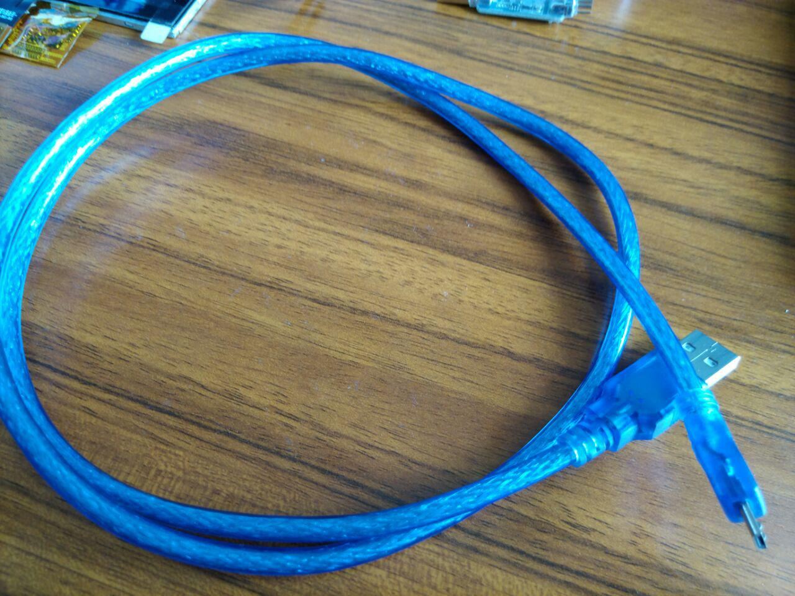
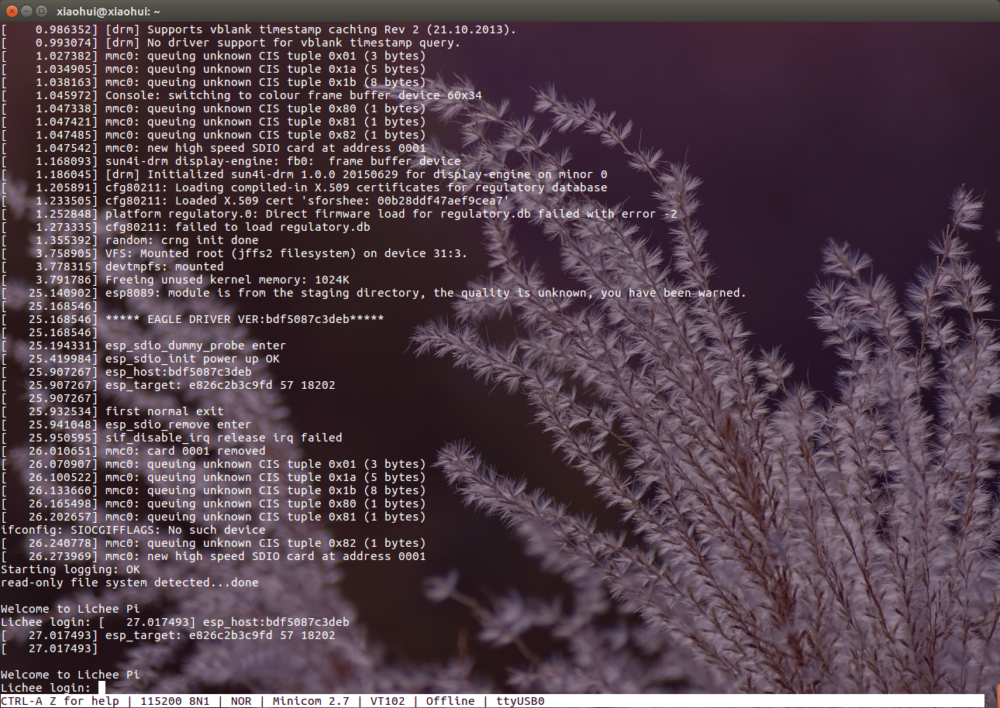

入手lichee-pi-nano
====================================

.. contents:: 本文目录

------------------------------------

1. 到荔枝淘宝购买
~~~~~~~~~~~~~~~~~~~~~~~~~~~~~~~~~~~~

  地址:https://item.taobao.com/item.htm?spm=a1z10.1-c.w137644-13936013979.39.1d3657987edY8V&id=566862065090

2. 拆箱
~~~~~~~~~~~~~~~~~~~~~~~~~~~~~~~~~~~~

- lichee-pi-nano kit套餐
.. figure:: ../_static/step_by_step/nano_kit.jpg
   :align: center
   :width: 500px
- lichee-pi-nano F(16M)
.. figure:: ../_static/step_by_step/nanoF(16).jpg
   :align: center
   :width: 500px
- lichee-pi-nano F(16M)
.. figure:: ../_static/step_by_step/nanoF(8).jpg
   :align: center
   :width: 500px
- lichee-pi-nano (9.9)
.. figure:: ../_static/step_by_step/nano(9.9).jpg
   :align: center
   :width: 500px
- LCDC(带电容触摸)
.. figure:: ../_static/step_by_step/LCDC.jpg
   :align: center
   :width: 500px
- LCD
.. figure:: ../_static/step_by_step/LCD.jpg
   :align: center
   :width: 500px

3. 准备工具
~~~~~~~~~~~~~~~~~~~~~~~~~~~~~~~~~~~~

- 准备一个usb转ttl,用于查看console打印.
.. figure:: ../_static/step_by_step/usb_to_ttl.jpg
   :align: center
   :width: 500px
- 准备一根usb线,一般mp4那种,用于下载固件到spi_flash和sdram,方便调试.

4. 焊接
~~~~~~~~~~~~~~~~~~~~~~~~~~~~~~~~~~~~

- 焊接
.. figure:: ../_static/step_by_step/seal.jpg
   :align: center
   :width: 500px

4. 测试板子是否正常
~~~~~~~~~~~~~~~~~~~~~~~~~~~~~~~~~~~~

- 使用一键镜像包构建启动固件并下载到spiflash或tf卡

  教程地址: `一键烧录镜像包 <http://nano.lichee.pro/build_sys/onekey.html>`_
  固件下载完后是使用杜邦线连接nano和电脑,
  在终端输入sudo minicom -s,配置好串口参数(115200 8N1).

- 正常运行的打印截图

   :align: center
   :width: 500px

- 正常运行的液晶显示

 .. figure:: ../_static/step_by_step/lcd_run_is_ok.jpg
 
    :align: center
    :width: 500px
