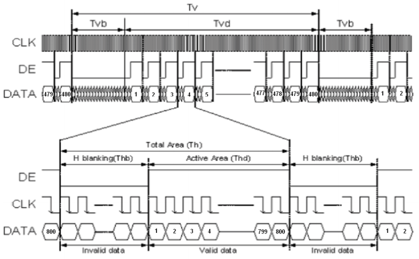

RGB LCD example

# Introduce timing first

The principle of RGB LCD display image is similar to that of VGA. It is to digitally generate the image information to be displayed inside the computer, and then convert the image information of these numbers into RGB three primary color analog signals through analog-to-digital conversion. Field sync signal.

The timing of VGA is introduced below.


The above figure is the line synchronization and field synchronization timing of VGA in data transmission.

As can be seen from the timing diagram, whether a line of data or a column of data is required, a synchronization (sync) signal is required, and the transmission of data needs to be completed between the pulses of the two synchronization signals.

The data for each line includes the back porch, active viedo, and front porch.

The valid data is the resolution we often say, and the parameters of the leading and trailing edges need to be set with reference to the specific resolution and number of frames. The relevant parameters can refer to the typical parameters, and the link is here: http://www.tinyvga.com /vga-timing

The control timing of this screen is slightly different. You can view the [Specifications] (../../assets/files/AT050TN43.pdf)

Screenshots of LCD related timing are provided below




The above picture is the parameter table in the timing, and the following picture is the timing chart.

As seen from the timing diagram, this screen can be set without the front and rear edges, and only the blanking time can be set. It can be proved by the actual program that both methods are possible.

# Verilog implementation

## 1.pll

The onboard crystal clock is 24MHz, but our screen requires a 33.3MHZ clock, so we need to use pll to generate the clock we need.

Need to use `IP Core Generate` here, located in Tools -> IP Core Generate


Double-click `PLL`, select Verilog in the pop-up window language, CLKIN is 24MHz, CLKOUT is 200MHz, CLKOUTD should select Enable, then generate clock is 33.33MHz, Tolerance selects 0.2%


## 2.osc

The system clock can be provided by an external clock or by using an OSC generated clock.

Also use `IP Core Generate`

Find `OSC` and double-click to open the settings for crossover.

As you can see on the help page, the OSC of the GW1N-1 series fpga is divided from 240MHz, so to generate a 24MHz clock, only need to divide by 10

## 3.lcd timing generation

```
localparam V_BackPorch = 16'd6; //0 or 45
localparam V_Pluse = 16'd5;
localparam HightPixel = 16'd480;
localparam V_FrontPorch= 16'd62; //45 or 0

localparam H_BackPorch = 16'd182; //NOTE: When the high pixel clock is used, increase the delay here to facilitate the K210 to join the interrupt.
localparam H_Pluse = 16'd1;
localparam WidthPixel = 16'd800;
localparam H_FrontPorch= 16'd210;

localparam PixelForHS = WidthPixel + H_BackPorch + H_FrontPorch;
localparam LineForVS = HightPixel + V_BackPorch + V_FrontPorch;
```

The first is to set the timing related parameters: leading edge, trailing edge, effective pixels

Regarding the display leading edge and trailing edge, as mentioned earlier, it can be combined into one erasing time, that is, one can be set to 0 and the other to the erasing time. Anyway, the time between the front and the back adds up to meet the time requirements in the table.

```
always @( posedge PixelClk or negedge nRST ) begin
    if( !nRST ) begin
        LineCount <= 16'b0;
        PixelCount <= 16'b0;
        end
    else if( PixelCount == PixelForHS ) begin
        PixelCount <= 16'b0;
        LineCount <= LineCount + 1'b1;
        end
    else if( LineCount == LineForVS ) begin
        LineCount <= 16'b0;
        PixelCount <= 16'b0;
        end
end

/ / Note the HSYNC and VSYNC negative polarity here
assign LCD_HSYNC = (( PixelCount >= H_Pluse)&&( PixelCount <= (PixelForHS-H_FrontPorch))) 1'b0 : 1'b1;
assign LCD_VSYNC = ((( LineCount >= V_Pluse )&&( LineCount <= (LineForVS-0) )) ) ) 1'b0 : 1'b1;
```

This code generates a sync signal. It should be noted that the sync signal of this screen is negative polarity enabled.

```
assign LCD_DE = ( ( PixelCount >= H_BackPorch )&&
                    ( PixelCount <= PixelForHS-H_FrontPorch ) &&
                    ( LineCount >= V_BackPorch ) &&
                    ( LineCount <= LineForVS-V_FrontPorch-1 )) ? 1'b1 : 1'b0;
                    //This is not minus one, it will shake
```

This code sets the LCD to enable image display. This screen needs to control one pin to be used as a display switch. The actual signal is set when the 800*480 data is valid for transmitting images.

```
assign LCD_R = (PixelCount<200)? 5'b00000 :
                    (PixelCount<240 ? 5'b00001 :
                    (PixelCount<280 ? 5'b00010 :
                    (PixelCount<320 ? 5'b00100 :
                    (PixelCount<360 ? 5'b01000 :
                    (PixelCount<400 ? 5'b10000 : 5'b00000 )))));

assign LCD_G = (PixelCount<400)? 6'b000000 :
                    (PixelCount<440 ? 6'b000001 :
                    (PixelCount<480 ? 6'b000010 :
                    (PixelCount<520 ? 6'b000100 :
                    (PixelCount<560 ? 6'b001000:
                    (PixelCount<600 ? 6'b010000:
                    (PixelCount<640 ? 6'b100000 : 6'b000000 ))))));

assign LCD_B = (PixelCount<640)? 5'b00000 :
                    (PixelCount<680 ? 5'b00001 :
                    (PixelCount<720 ? 5'b00010 :
                    (PixelCount<760 ? 5'b00100 :
                    (PixelCount<800 ? 5'b01000 :
                    (PixelCount<840 ? 5'b10000 : 5'b00000 )))));
```

This code is used to generate test data for the LCD to produce a color bar display.

```
VGAMod D1
(
    .CLK ( CLK_SYS ),
    .nRST ( nRST ),

    .PixelClk ( CLK_PIX ),
    .LCD_DE ( LCD_DEN ),
    .LCD_HSYNC ( LCD_HYNC ),
    .LCD_VSYNC ( LCD_SYNC ),

    .LCD_B ( LCD_B ),
    .LCD_G ( LCD_G ),
    .LCD_R ( LCD_R )
);
```

Finally, instantiate in TOP

The entire project can be found at [https://github.com/sipeed/Tang-Nano-examples/tree/master/example_lcd][https://github.com/sipeed/Tang-Nano-examples/tree/master/example_lcd] download
