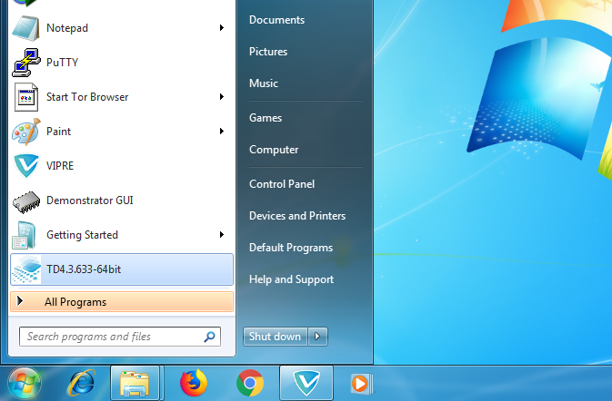
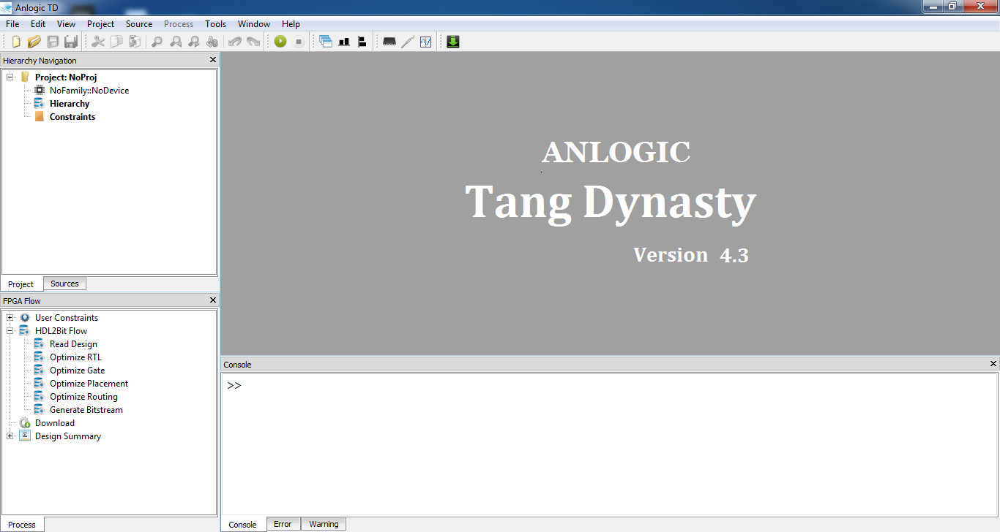

Once you have downloaded the installer, open it and you will see a welcome screen.

On this screen you can choose where you want to install TD IDE. By default it installs to C:\Anlogic\TD4.3.633\

Click next, and the installer will begin copying the files it needs to install TD IDE.

When it's finished installing you should see this following screen. Click Finish to complete the installation.

Go to start menu and click on TD icon to start the IDE.

Congratulations, you have installed the TD IDE on windows.