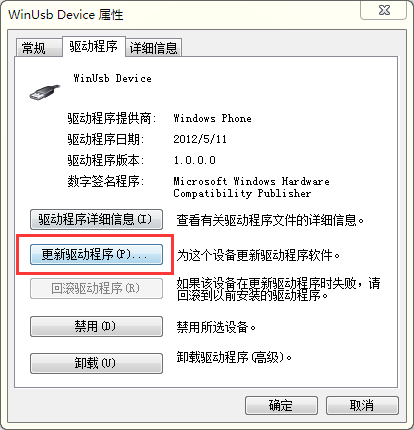
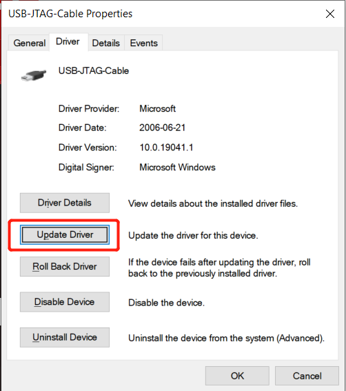
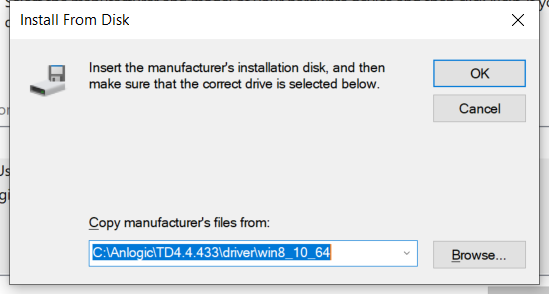

## Check for default windows driver

Insert Tang Primer into your computer and open Device Manager to see the information. It may be named `WinUsb Device` or `USB-JTAG-Cable` depending on the Windows version. Make sure USB VID:PID is `0547:1002`.

## Install drivers (Windows 7)

Double click on `WinUsb Device` to select update driver

Browse the folder and select the driver directory under the `TD installation directory`. Click OK to start the installation.

The installation is successful and can be seen in the device manager.

## Install drivers (Windows 10)

> Before installing the driver itself, make sure you [disable driver signature enforcement](https://social.technet.microsoft.com/wiki/contents/articles/51875.windows-10-how-to-install-drivers-which-are-not-digitally-signed.aspx) first, otherwise Windows 10 won't allow you to install the unsigned driver from Anlogic.

Double click on `USB-JTAG-Cable` to select update driver.

Browse the folder and select the `driver\win8_10_64` directory under the `TD installation directory`. Click OK. Then click on `Let me pick from a list of available drivers on my computer`.

Click on `Have Disk...`, then select the directory you selected in the last step, then click OK.

Now select the `Anlogic usb cable v0.1` in the driver list and click Next to start the installation.

The installation is successful and can be seen in the device manager.

## Check if device detected by Tang Dynasty IDE

Click on Download button as shown in following image.

Plugin Tang Primer into your computer and hit Refresh buttion on Download Dialog box.

Congratulations, you have setup the TD driver on Windows.
