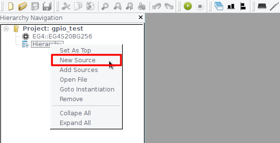
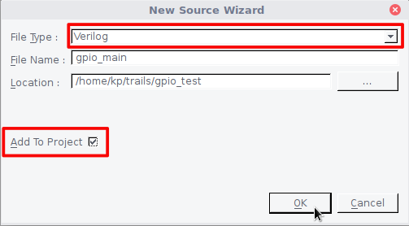
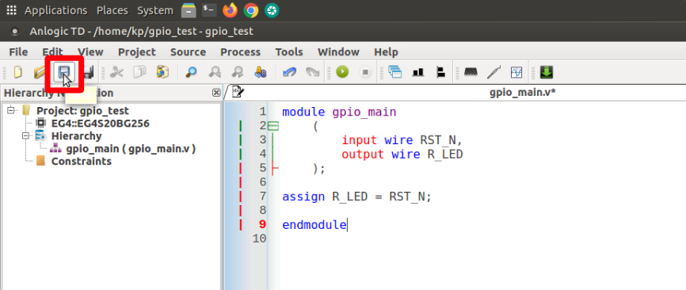
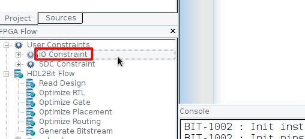
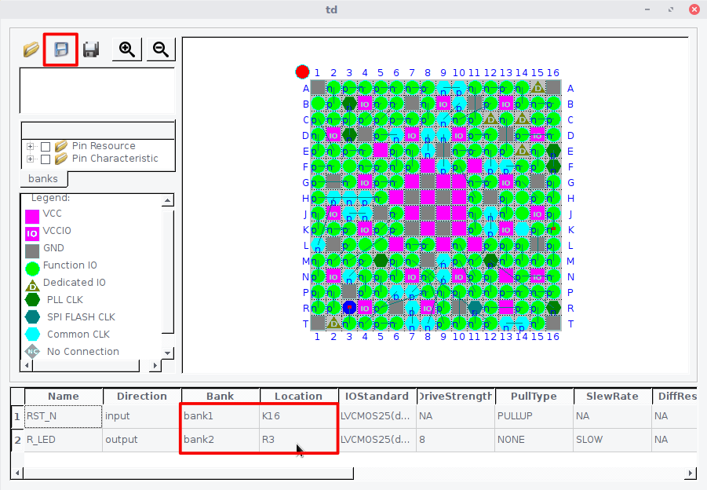
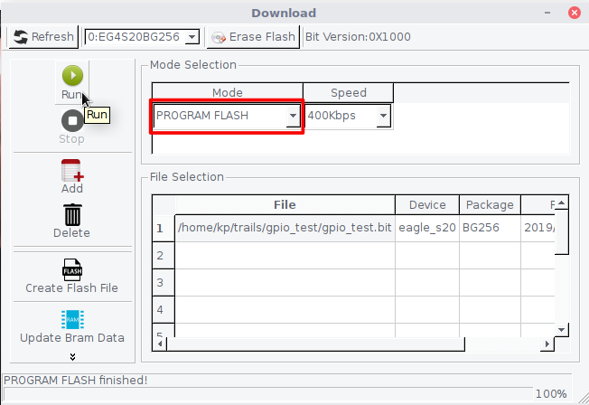

## Create a new project

In the Menubar goto **Project -> New Project** or uses the shortcut key **Ctrl+Alt+P**.

Fill in the **Project Name** and **Project Path** fields. Note that you may create a new directory (such as "gpio_test") by clicking on **Browse** and then clicking on the **Create New Folder** icon in the "choose a directory" window. It's generally recommended to keep each project in its separate directory.

Select **Device Family** and **Device Name** for Tang Primer as shown below. When done, click **OK**.


## Create a new HDL source file.

Right-click on **Hierarchy** and click on **New Source** to make a new HDL source file.



Select the HDL **File Type** and enter a source file name in the **File Name** field. Check **Add To Project** to add this file to your project. Click **OK**.



**Copy** the following code into a text editor and **Save** it, as shown in the following image.

```toml
module gpio_main
	(
		input wire RST_N,
		output wire R_LED	
	);

assign R_LED = RST_N;

endmodule
```



Now we need to assign physical Pins to our IO ports. In the **FPGA Flow** pane, if there is a "+" to the left of **User Constraints**, click on the "+" to show the **IO Constraint** and **SDC Constraint** items. Double click on **IO Constraint** to open the IO Constraint Dialog.



Select the **IO Bank** and **Pin Location** for Tang's onboard LED and Button then save it as an adc file in the project.




Click on **Run** Icon to start the compilation process.


Plugin your Tang Primer board to USB and click on **Download** icon to open Download Dialog. 


Make sure your device detected by TD IDE. Add generated bitstream file by clicking on the **Add** button. Click on the **Run** button to start the download process.


Download the Bitstream into SPI Flash to make your design run after a power reset. 


