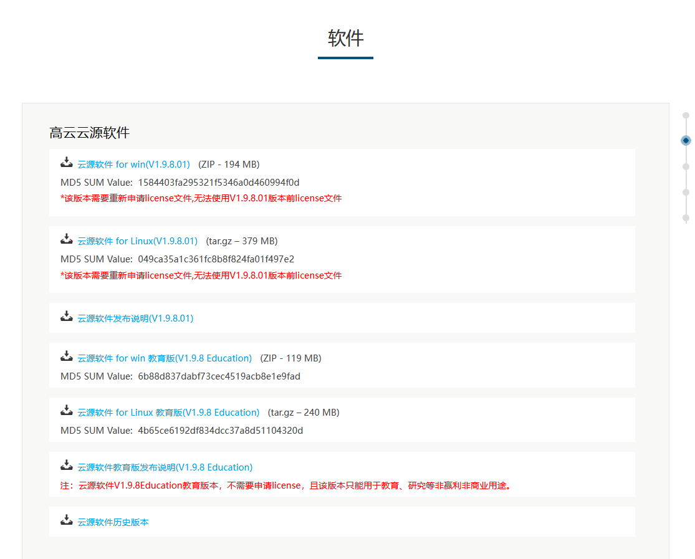
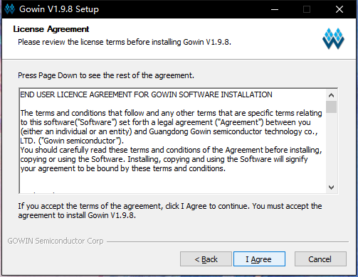
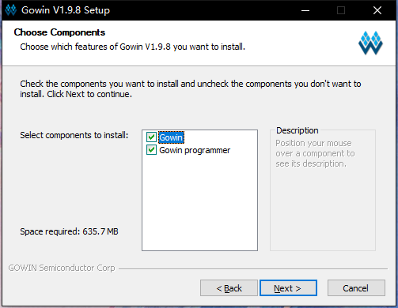
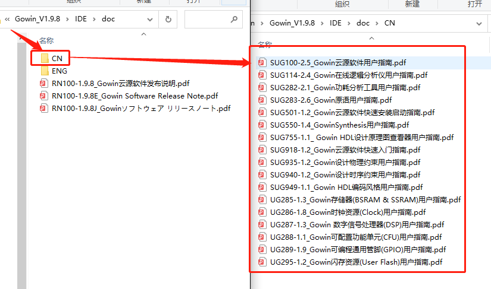

高云半导体云源软件是专门为高云半导体半导体芯片配套的集成电路设计与实现工具。覆盖了FPGA芯片全类型的设计功能，具体功能可以自行到高云半导体官网进行查阅，在此不进行赘述。附上文档链接：<http://www.gowinsemi.com.cn/down.aspx?FId=n14:14:26>

1. 用户安装请根据自己电脑系统选择 IDE；
2. 对于 Linux 系统下下载可以使用 Openfpgaloader，可以查看本页底部的 [安装openfpgaloader](#安装openfpgaloader) 来进行烧录操作。

## 安装软件

此处以安装 **Gowin_V1.9.8_win** 为例进行说明：

按照文档对IDE有了初步了解之后根据文档说明可自行进行IDE的安装。云源软件链接 http://www.gowinsemi.com.cn/faq.aspx



> 由于高云半导体的IDE在不断的更新，上图为2021年11月30号截图

进入链接后选择“云源软件历史版本”，往下拉找到历史版本中最新版本进行下载，下载到本地的文件夹是一个压缩包格式的文件，进行解压后得到安装包“Gowin_V1.9.8_win.exe”，直接双击开始进行安装：

<div>
	
	
</div>

下图的两个都需要安装上。



下图的安装路径个人按照自己需要设置
  

- 安装中...
  

- 下面这一步不要更改任何东西，按照默认的点击`Finish`就行


- 上面的`Finish`后会出现下面的内容，这是安装驱动的。


- 这里需要选择接受协议才能继续安装
  


- 前面的完成后桌面上会出现下面这种图的图标
  


这样我们就完成了软件的安装

## license 激活

对于教育版 IDE 的是不需要 license 的，因此可以跳过这步。

对于非教育版的 IDE 需要向高云半导体官方申请 **license** 。

申请链接：[http://www.gowinsemi.com.cn/faq_view.aspx](http://www.gowinsemi.com.cn/faq_view.aspx)

打开高云半导体 IDE 的时候，在弹出的 license 管理中，点击 Broswer 选择自己所获得的 license 文件


## 拓展
- IDE 的安装路径下主要有如下几个文件夹：IDE、Programmer、uninst.exe；
- **IDE** 文件夹：主要介绍次路径下的 **doc** 文件夹，用户在安装完之后可以在这个路径下进行对 IDE 的基本了解，主要包含文件如下图所示：



> “Programmer”：附带的烧录软件
> “uninst.exe”：卸载工具


## 使用方法

参考官方文档[Gowin云源软件用户指南](http://cdn.gowinsemi.com.cn/SUG100-1.8_Gowin%E4%BA%91%E6%BA%90%E8%BD%AF%E4%BB%B6%E7%94%A8%E6%88%B7%E6%8C%87%E5%8D%97.pdf)，第5章 云源软件使用

## 参考文档

+ [高云半导体软件简介和安装](http://cdn.gowinsemi.com.cn/%E9%AB%98%E4%BA%91%E8%BD%AF%E4%BB%B6%E7%AE%80%E4%BB%8B%E5%92%8C%E5%AE%89%E8%A3%85.pdf)


## Linux 烧录教程

在Ubuntu系统下我们建议使用**openFPGALoader**烧写，以下为具体步骤

### 安装openFPGALoader
参考：https://trabucayre.github.io/openFPGALoader/guide/install.html
```
# preprocess
sudo apt-get install libftdi1-2 libftdi1-dev libhidapi-hidraw0 \
  libhidapi-dev libudev-dev zlib1g-dev cmake pkg-config make g++
# compile
git clone https://github.com/trabucayre/openFPGALoader.git
cd openFPGALoader
mkdir build
cd build
cmake ../ # add -DBUILD_STATIC=ON to build a static version
          # add -DENABLE_UDEV=OFF to disable udev support and -d /dev/xxx
          # add -DENABLE_CMSISDAP=OFF to disable CMSIS DAP support
cmake --build .
# or
# make -j$(nproc)
# install
sudo make install
```

### 烧录方法
检测板卡
```
$ ./openFPGALoader --detect
Jtag frequency : requested 6.00MHz   -> real 6.00MHz  
index 0:
	idcode 0x100481b
	manufacturer Gowin
	family GW1N
	model  GW1N(R)-9C
	irlength 8
detach error -5

```
下载码流
```
$ ./openFPGALoader -b tangnano9k -f ../../nano9k_lcd/impl/pnr/Tang_nano_9K_LCD.fs
write to flash
Jtag frequency : requested 6.00MHz   -> real 6.00MHz  
Parse file Parse ../../nano9k_lcd/impl/pnr/Tang_nano_9K_LCD.fs: 
Done
DONE
Jtag frequency : requested 2.50MHz   -> real 2.00MHz  
erase SRAM Done
erase Flash Done
write Flash: [==================================================] 100.00%
Done
CRC check: Success
detach error -5

```

其中-b表示目标板型，可以使用以下取值：

|Board name|FPGA|Memory|Flash|
|--|--|--|--|
|tangnano|GW1N-1 QFN48|OK|Internal Flash|
|tangnano1k|GW1NZ-1 QFN48|OK|Internal Flash|
|tangnano4k|GW1NSR-4C QFN48|OK|Internal Flash/External Flash|
|tangnano9k|GW1NR-9C QFN88|OK|Internal Flash/External Flash|


