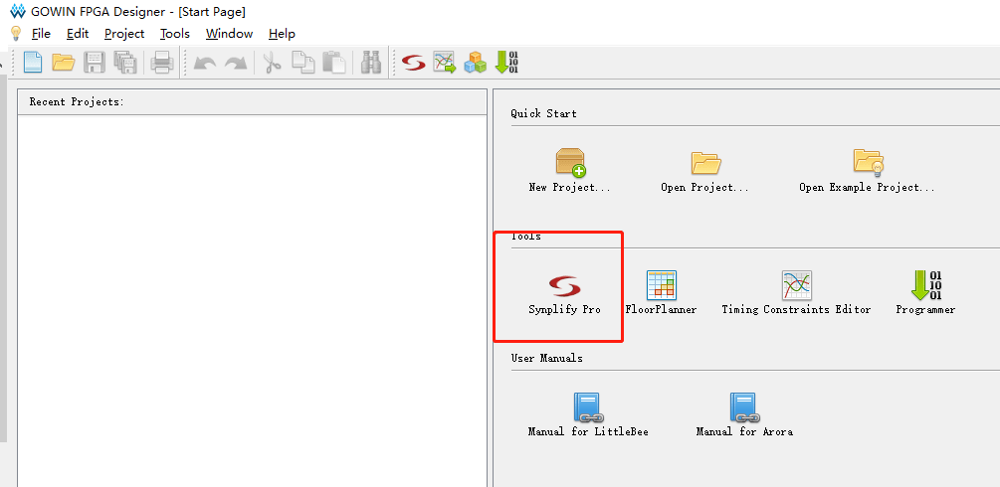

# Download

Go to the official website http://www.gowinsemi.com.cn/faq.aspx, you can see the software list below, select the version of the system suitable for the computer to download.


# Installation

**Windows** User:

Double-click the downloaded exe installation file, select the installation language, installation location, click the next step to complete the installation.

Be sure to install the driver that prompts you to install when you complete the installation.


Check the installation driver and click Finish, the driver will be installed.

**Linux** User:

TODO

# license

There are currently two ways to license.

**The first type: use the stand-alone version of the licence (need to apply for license)**

Send an application email to `Support@sipeed.com` under the heading `[Apply Tang Lic] MAC: XXXXXX`. The content template is as follows

```
Company Name:
Company Website:
Department:
Contact Person:
Contact No.:
Email:
Media Access Control Address(MAC):
Type of License: Shared Type, Local Only
Operating System: Windows, Linux
```

When you open the High Cloud IDE, in the license management that pops up, select your local license path.


Then you need to add the path of the license of synplifypro to the system variable. The following is a brief introduction to an add method. In ` `The second: use the sipeed license server networking activation`, there is a more detailed introduction.

**Windows** User press win+r on the keyboard, enter `cmd` in the pop-up window, click OK to pop up the black command line window, enter the following command, `path_to_the_file` is your `gowin_Synplifypro.lic Path of `.

```
setx LM_LICENSE_FILE path_to_the_file
```

**Second: Network activation with license server using sipeed**

This method is simple to configure, but you can't use the software without a network.

After downloading the software, the software will prompt you for a licence. Fill in the server address `45.33.107.56` in the pop-up box, IDE port: 10559.


The activation of the synopsys advanced function requires adding the environment variable `LM_LICENSE_FILE=27020@45.33.107.56` to the system.

**Windows** User presses win+r on the keyboard, enter `cmd` in the pop-up window, click OK to pop up the black command line window, enter the following command.

```
setx LM_LICENSE_FILE 27020@45.33.107.56
```

Windows can be added in addition to the command line. You can also add it by right-clicking Computer->Properties->Environment Variables and then adding it as shown below.


**Linux** users need to add in `~/.bashrc`

```
Export LM_LICENSE_FILE 27020@45.33.107.56
```

After entering the IDE, click on `Synplify Pro` in Tools.



Then the interface will pop up as shown below. At this time, you need to wait for a short time. After the license is initialized, you can use it.


# Instructions

Refer to the official documentation [Gowin Source Software User Guide] (http://cdn.gowinsemi.com.cn/SUG100-1.8_Gowin%E4%BA%91%E6%BA%90%E8%BD%AF%E4%BB%B6%E7%94%A8%E6%88%B7%E6%8C%87%E5%8D%97.pdf), Chapter 5 Cloud Source Software Usage.

# Reference document

+ [Gowin Software Introduction and Installation](http://cdn.gowinsemi.com.cn/%E9%AB%98%E4%BA%91%E8%BD%AF%E4%BB%B6%E7%AE%80%E4%BB%8B%E5%92%8C%E5%AE%89%E8%A3%85.pdf)

