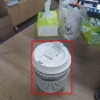

FOMO (Faster Objects, More Objects) is a lightweight target detection model proposed by Edgeimpulse engineers. Its main feature is that the model is very small and the amount of calculation is small. It is very fast and accurate.

The advantage of FOMO is fast speed, and the disadvantage is that the accuracy is not high, but in some scenarios that do not require high accuracy, FOMO is a good choice.

## Target

Input a picture, detect the position and size of the target, and recognize the category of the object, and can detect multiple objects at the same time.

## principle

Original doc: [FOMO: Object detection for constrained devices](https://docs.edgeimpulse.com/docs/edge-impulse-studio/learning-blocks/object-detection/fomo-object-detection-for-constrained-devices)

Similar to YOLO v2, the purpose is to detect objects, but the post-processing of YOLO v2 is still relatively complicated, there are a large number of bounding boxes to be processed, and it is still very difficult to run on a microcontroller without hardware acceleration.
FOMO uses a simpler idea to detect:
* Use a classic network as a feature extractor, such as MobileNet v1, and then truncate from the middle of the network to get a feature map. The size of this feature map is n x n x c, n is the width and height of the feature map, and c is the number of channels of the feature map.
The value of n here depends on where to truncate from the network. For example, our input resolution is 128 x 128, and we want an 8 x 8 feature map output, which is equivalent to reducing the image resolution by 16 times. Find this layer truncation from the network Get an 8 x 8 feature map.
* This n x n x c, c represents that there are c categories, each layer is used to find the position of a classified object, each layer has n x n pixels, and each pixel represents whether there is an object of this category at that position (Confidence )
* Traverse this n x n x c feature map, find the pixel coordinates whose confidence exceeds the set threshold, we think that there are objects in these places, and then map to the original image according to the scaling ratio, for example, when there is only one category, that is, c is 1, we need to detect One cup, the following results are obtained:

* After getting a lot of coordinate points that look valid, we think that there are objects in these places, but there are a lot of points, we can simply merge the points next to each other into a box, so that we get a big box

* Because this box may not be very accurate sometimes, the official Edgeimpulse method is to use the center point of this box, so that the probability of this point on the object is relatively high. In the implementation of MaixHub, the box is directly given for you to choose Use the box directly, or if you want to use only the center point, you can modify the code yourself.

In fact, the above processing has been encapsulated in the [code](https://github.com/sipeed/TinyMaix/tree/main/examples/maixhub_detection_fomo) library. In actual use, you only need to train the model and combine the code to run.

## Try to train a model

Create a detection training project in [MaixHub](https://maixhub.com), then collect data and label (can be marked online), create a training task, select the TinyMaix platform as the parameter, select fomo, and select the backbone network according to the actual situation. For example, the name `mobilenetv1_0.25_8` means that the `mobilenetv1` network is used, and the alpha is 0.25. The smaller the value, the smaller the network and the lower the accuracy rate. The last 8 means that the output resolution is 1 of the input resolution. /8, for example, if the input is 128x128, the output is 16x16. The larger the output resolution, the more suitable for detecting smaller objects. Choose according to your MCU performance and the size of the object to be detected.
Then just do the training. After the training is completed, the model is obtained. According to the instructions in [code](https://github.com/sipeed/TinyMaix/tree/main/examples/maixhub_detection_fomo), put the model file into the code. Then compile and run. You can test it under Linux now, and then transfer it to the single-chip microcomputer to run.
