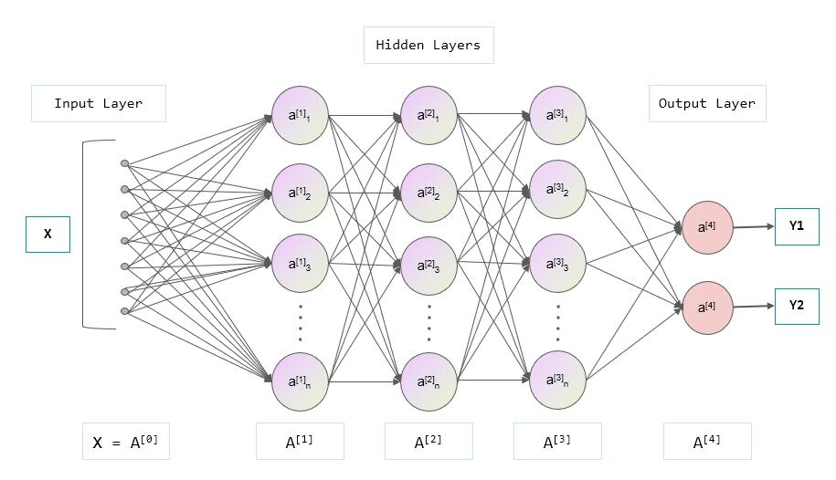

AI（Artificial Intelligence） 想必大家都听之极多了，有人觉得 AI 要毁灭人类了；有人认为 AI 只是擅长某些特殊场景不必惊慌（比如 alpha Go 打败了人类围棋大师）；但大多数人接触到的 AI 可能更愿意称之为“人工智障”，比如手机里面的助手；对于很多工程师来说， AI 可能更多的是指机器学习，比如图像识别，语音识别，自然语言处理等等。

作为一个开发者， 首先我们需要了解大家经常听到的 `AI`，`机器学习`，`神经网络`等概念以及区别：
* AI： 人工智能，是指让机器具有人类智能的能力，比如人类可以看到一张照片，然后判断出这是一只猫，这是一个人，这是一只狗等等，而机器也可以做到这一点，这就是人工智能。
* 机器学习： 一般是指让机器通过大量的数据，然后通过算法，让机器自己学习，比如通过大量的猫的图片，让机器自己学习，然后判断出一张图片是不是猫。
* 神经网络： 一般是指在机器学习中用到的一种数据结构，因为其类似人大脑的神经网络，各个数据节点互相连接互相通信和影响，故称之为神经网络。
* 模型： 指用来承载和表示机器学习过程中的相关参数的数据结构，一般可以保存为一个文件，可以将神经网络的结构和参数都存储在这个数据结构里面，方便用数学或者编程语言将其解析，比如取名叫`.model`格式的文件

所以可以理解为三者是包含关系： 神经网络 ∈ 机器学习 ∈ 人工智能， 模型文件则一般为机器学习中的产物， 另外你可能还听说过“深度神经网络”，其实也是属于神经网络，只不过是网络层数有深度不同一说。

而本文也大多阐述了如何利用各种神经网络模型和机器学习的方法来实现 AI 应用。

## 机器学习过程简介

这里首先对机器学习的过程做一个通俗的介绍，不涉及数学公式，只是简单的介绍一下机器学习的过程。

### 训练

以让机器区分猫咪和狗为例：
和教（训练）人类婴儿一样，可以把模型比作婴儿，为了让这个模型能认识猫和狗，我们需要一遍一遍地让它看各种猫猫狗狗，并让它去识别，错了我们就告诉它错了，对了我们就告诉它对了，这样一遍一遍地让它看，让它学习，最终它就能区分猫和狗了。

从这段话我们分析出训练的时候几个关键点：
* 模型： 一个工具或者黑盒，给它一个输入，它能给我们一个输出结果。
* 输入： 这里是图像，猫或者狗的图像。
* 输出： 猫或者狗
* 判断错误的方法：也就是它的输出和真实的结果是否一样，这里是靠教学者判断正误的，也就是判断错误的方法是教学者。
* 学习方法：就是当我们告诉模型输出结果是错的时候，它如何去改进。

得到这几个关键点后，就可以很好地理解这个机器学习的过程了：
* 定义模型的输入输出， 输入是图像，输出是猫或者狗。
* 为了让这个模型能够有学习的本领，也就是和人一样有足够的脑容量， 我们定义一个属于模型的“脑子”，也就是一个看起来和人脑突触结构类似的神经网络结构：

可以看到输入和中间每个节点间都有线连起来，每条线都是一个计算公式，具体是什么样的公式以及具体如何设计一个这样的结构这里先不细究，先有个概念就行。
* 然后就是判断错误和误差的方法，一般在代码中称之为损失函数，也就是模型的输出结果是否正确。
* 然后就是学习方法，比如结果不正确，如何去微调模型内部的参数，让下一次的输出结果更接近正确的结果。

### 验证

经过很多数据的反复训练后，我们发现好像基本都能识别正确了，但是我们还是担心我们用的图片种类是否不够多，这个模型是否真的能够识别所有的猫和狗或者其它猫和狗，这个时候就需要验证了，验证的方法就是把模型拿出来，给它一些新的数据，即在训练的时候从来没用到过的数据，让它去识别，看看它的识别结果是否正确，如果正确，那我们就认为这个模型泛化效果不错，可以放心的使用这个模型去识别猫猫狗狗了。

一般我们会在训练是一段时间后拿出`验证集`（也就是用来验证的数据集，对应训练的数据叫`训练集`）来测试一下模型的效果，如果效果不错就可以停止训练了，如果效果不好，则需要继续训练或者考虑是不是训练集有问题，或者模型结构、损失函数、学习方法等有问题了。

### 测试

验证效果的好坏决定了我们合适停止训练，也就是说模型效果如何和`验证集`紧密相关，相当于**验证集也变相地参与了模型的训练过程**， 所以在结束训练后，我们用一个新的数据集`测试集`来测试一下模型的效果，这个数据集是在训练和验证的时候从来没用过的，这样就可以更加客观地评估模型的效果了。

这里共提到了`训练集`，`验证集`，`测试集`，需要注意他们三个数据集的区别！前两者在训练过程参与，后者在训练过程不参与，只是用来评估模型的效果，并且三者互相不重合，防止训练过程中模型只对一小部分数据有效，到了新的场景就无法识别（也就是所谓的`过拟合`）。

### 总结

这里简单阐述了机器学习的过程的通俗解释，你也可以到 [MaixHub](https://maixhub.com) 注册登录后体验自己体验一遍在线训练过程加深理解，无需懂代码，懂得这里描述的机器学习的过程就可以了，然后再进行进一步学习。
