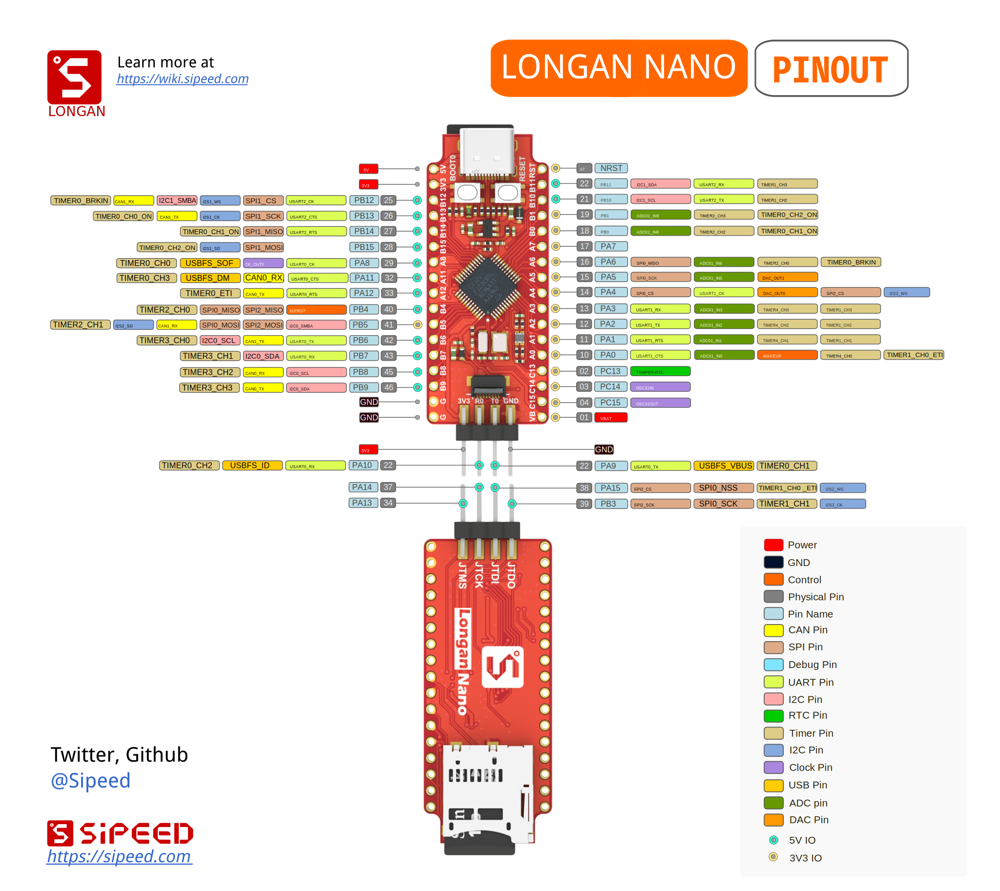

      

## 什么是 Longan

Longan Nano 是基于兆易创新(GigaDevice)最新基于 RISC-V 32 位内核的`GD32VF103CBT6` 单片机的极简开发板。方便广大学生、工程师、极客爱好者们接触最新一代的RISC-V处理器。了解其特性。

主芯片为 GD32VF103CBT6 ，基于[芯来科技](http://www.nucleisys.com/).的Bumblebee内核(指令集文档在此下载：[http://dl.sipeed.com/LONGAN/Nano/DOC/](http://dl.sipeed.com/LONGAN/Nano/DOC/).。支持 `RV32IMAC` 指令集及`ECLIC` 快速中断功能。内核功耗仅传统 `Cortex-M3` 的1/3.

芯片内置 `128KB` Flash, `32KB` SRAM，外设情况为：
* 4 x 通用16位定时器
* 2 x 基本16位定时器
* 1 x 高级16位定时器
* 看门狗定时器
* RTC
* Systick
* 3 x USART
* 2 x I2C
* 3 x SPI
* 2 x I2S
* 2 x CAN
* 1 x USBFS(OTG)
* 2 x ADC(10 channel)
* 2 x DAC

Longan Nano 开发板，双列插针版型设计，排针间距 700mil，可直插面包板；板载 8M 无源晶振，32.768KHz RTC 低速晶振，迷你 TF 卡槽，并使用最新的 Type-C USB 接口。

## 如何开发

Longan Nano 支持基于 VS CODE 的 PlatformIO IDE 环境下的开发， 支持一键工程配置、编译、下载、调试。安装使用教程见：[PIO 配置](./get_started/pio.md).

## 引脚定义

