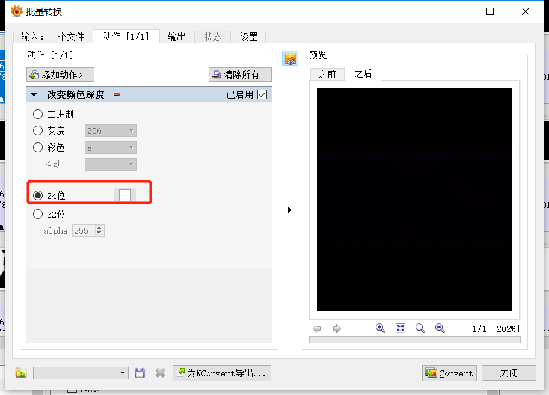

Bad Apple 演示视频
==================

本文目的是使用板载的 160*80 分辨率的 OLED 屏幕播放 bad apple 视频

## 主要工作介绍

+ 移植 OLED 屏幕的驱动
+ 移植 tf 卡驱动和 fatfs 文件系统
+ 将视频按自己需要的帧率转换为一帧帧的图片然后打包到 tf 卡
+ 在 gd32v 上读取 tf 卡中的图片并进行显示

### 屏幕驱动

使用硬件 SPI 驱动屏幕，首先需要初始化 SPI

```c
void spi_config(void)
{
    spi_parameter_struct spi_init_struct;
    /* deinitilize SPI and the parameters */
    OLED_CS_Set();
    spi_struct_para_init(&spi_init_struct);

    /* SPI0 parameter config */
    spi_init_struct.trans_mode           = SPI_TRANSMODE_FULLDUPLEX;
    spi_init_struct.device_mode          = SPI_MASTER;
    spi_init_struct.frame_size           = SPI_FRAMESIZE_8BIT;
    spi_init_struct.clock_polarity_phase = SPI_CK_PL_HIGH_PH_2EDGE;
    spi_init_struct.nss                  = SPI_NSS_SOFT;
    spi_init_struct.prescale             = SPI_PSC_8;
    spi_init_struct.endian               = SPI_ENDIAN_MSB;
    spi_init(SPI0, &spi_init_struct);

	spi_crc_polynomial_set(SPI0,7);
	spi_enable(SPI0);
}
```

初始化完成后就可以实现数据指令的发送

```c
void LCD_Writ_Bus(u8 dat)
{
	OLED_CS_Clr();

	while(RESET == spi_i2s_flag_get(SPI0, SPI_FLAG_TBE));
        spi_i2s_data_transmit(SPI0, dat);
	while(RESET == spi_i2s_flag_get(SPI0, SPI_FLAG_RBNE));
        spi_i2s_data_receive(SPI0);

	OLED_CS_Set();
}

void LCD_WR_DATA8(u8 dat)
{
	OLED_DC_Set();//写数据
	LCD_Writ_Bus(dat);
}

void LCD_WR_DATA(u16 dat)
{
	OLED_DC_Set();//写数据
	LCD_Writ_Bus(dat>>8);
	LCD_Writ_Bus(dat);
}

void LCD_WR_REG(u8 dat)
{
	OLED_DC_Clr();//写命令
	LCD_Writ_Bus(dat);
}
```

`LCD_Writ_Bus` 完成了 SPI 的收发，通过控制命令数据线，完成命令和数据的发送

OLED 屏幕在使用前还需要设置它的一些参数，比如屏幕开启、数据帧的格式等等，这些在参数在屏幕初始化的时候，通过写命令再写数据的方式写入。想修改这些参数需要依靠屏幕配套的数据手册，不过一般可以参数屏幕生产商提供的例程中的参数。

### tf 卡驱动和 fatfs 文件系统

tf 卡在 longan 上也是使用 SPI 驱动的。为了更快的访问速率，也是使用硬件 SPI 驱动。使用前也需要初始化，方式和屏幕的 SPI 初始化类似，就不再累述。

fatfs 是一个专为小型嵌入式设备设计的文件系统。fatfs 符合 ANSI C(C89)规范，并且和磁盘 I/O 层完全分离。

具体的移植也很简单，直接参照 fatfs 提供的 stm32 的工程移植进行

这里提供该工程的[下载地址](http://dl.sipeed.com/LONGAN/Nano/Firmware/badapple_demo_tools/ffsample.7z)，完整版可以去 fatfs 的[官网下载](http://elm-chan.org/fsw/ff/ffsample.zip)

主要的工作在于实现 fatfs 的几个基本函数 `disk_initialize` `disk_status` `disk_read` `disk_ioctl`

这些函数又是基于 SPI 通信的，还需要修改 SPI 接收发送的实现

```c
static
BYTE xchg_spi (
	BYTE dat	/* Data to send */
)
{
	while(RESET == spi_i2s_flag_get(SPI1, SPI_FLAG_TBE));
        spi_i2s_data_transmit(SPI1, dat);
	while(RESET == spi_i2s_flag_get(SPI1, SPI_FLAG_RBNE));
        return(spi_i2s_data_receive(SPI1));     /* Return received byte */
}

static
void rcvr_spi_multi (
	BYTE *buff,		/* Pointer to data buffer */
	UINT btr		/* Number of bytes to receive (even number) */
)
{
	do
	{
		*buff = xchg_spi(0xff);
		buff++;
	} while (btr--);

}
```

### 视频预解码

mp4 格式的视频，单片机因为没有硬件的加速，无法胜任解码播放的工作，所以只能靠手工预解码，相当于按照一定的帧率对原视频进行截图

这里需要使用到 PotPlayer XnViewMP

首先使用 PotPlayer 打开视频，快捷键 ctrl+G 打开连续截图

打开后如图


其中格式一定要 BMP，尺寸按照屏幕的尺寸设置，时间我这里设置的是 100ms 也就是 1s 十帧的样子，采集数量就自己计算一下视频总时间再乘每秒帧数，我这里就是 219s * 10 = 2190

最后得到的图片是 32位 的 BMP，转换起来不方便，就用 XnViewMP 转换为 24位 的 BMP

打开 XnViewMP ，选择要转换的图片，快捷键 ctrl+U 打开批量转换，在动作中选择 24位 进行转换，如图



然后就是将这些图片打包到 tf 卡，这里为了方便，修改了网上的一个开源项目 [bmp2hex](https://github.com/robertgallup/bmp2hex)，重新整理了一个工具，可以[点击下载](http://dl.sipeed.com/LONGAN/Nano/Firmware/badapple_demo_tools/tools_bmp2hex.zip)

使用方法很简单，把下载的这个压缩包放到之前生成的图片集中，进行解压

使用工具前需要确保所有图片的名字是 数字.bmp ，不是的话可以先运行一遍 rename.py 这个脚本，直接在命令行输入 `python rename.py` 即可

根据自己图片总数修改 genhex.py 这个脚本的第4行中的数字，比如我有 2190张 图片，这里的数字就写 2190

然后就运行这个脚本，在命令行输入 `python genhex.py`，时间可能比较久，需要耐心等待

最后运行完毕后会生成一个 bmp.bin 文件，将这个文件放入到 tf 卡中即可

### 读取图片

最后的读取图片并显示其实很简单了，主要涉及到的就是文件操作，关于 fatfs 的 API [可以点击这里阅读](http://elm-chan.org/fsw/ff/doc/open.html)

首先需要将 tf 卡挂载到文件系统，这里需要使用到 f_mount 这个函数

```c
fr = f_mount(&fs, "", 1);
```

挂载上后，就找到对应的文件然后打开，这里涉及到 f_open

```c
fr = f_open(&fil, "bmp.bin", FA_READ);
```

文件打开后，就可以读取图片信息并显示了，这里 160*80 尺寸的 16位真彩图片，一张有 25600 字节，longan 上的处理器无法直接创建一个这么大的数组，所以只能分两次进行读取，每次读取完进行一次偏移，最后通过循环读取总共的 2189 张图片，这里涉及到 f_read f_lseek

```c
for (int i=0; i<2189;i++)
{
        fr = f_read(&fil, image, sizeof(image), &br);
        LCD_ShowPicture(0,0,159,39);
        offset += 12800;
        f_lseek(&fil, offset);
        LEDB_TOG;
        fr = f_read(&fil, image, sizeof(image), &br);
        LCD_ShowPicture(0,40,159,79);
        offset += 12800;
        f_lseek(&fil, offset);
        LEDB_TOG;
}
```

最后，本工程可以到 github 下载体验，[点击进行传送](https://github.com/sipeed/Longan_GD32VF_examples)
