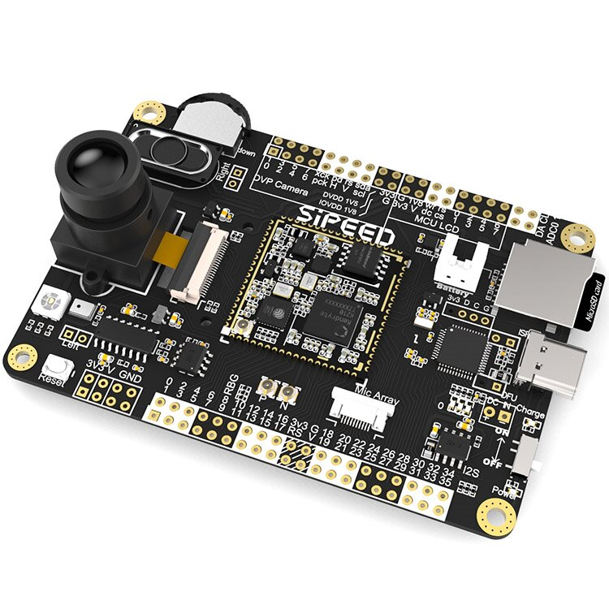
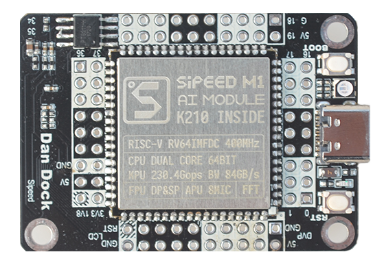
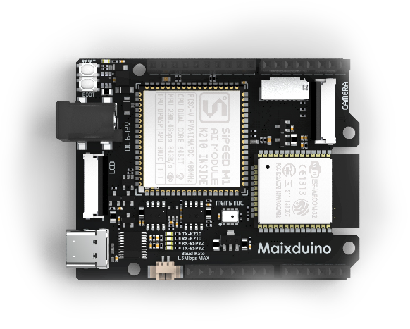
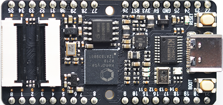

-------

## MaixPy Development Board

At present, MaixPy series development boards have the following models:

- Maix Go
- Maix Dock
- Maix Duino
- Maix Bit
- Maix Cube
- Maix Amigo

## Difference comparison

| Model | USB IC | Core Module | Remarks |---| --- |
| --- | --- | --- | --- | --- | --- | --- | --- |
| Maix Go  |Maix Go | STM32 | M1W | --- | --- |
| Maix Dock | CH340 | M1/M1W | --- | --- | --- |
| Maix Duino  | CH552 | M1 | --- | --- | --- |
| Maix Bit  | CH552/CH340 | --- | --- | --- | --- |
| Maix Cube  | GD32/CH552 | M1n | --- |- - | --- |
|Maix Amigo  | GD32 | M1n | --- | --- | --- |
