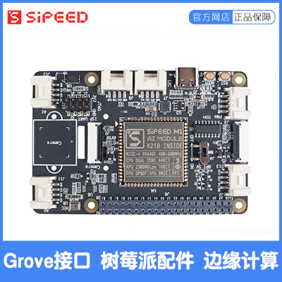

To start using MaixPy, you must need a K210 development board, you can get your favorite hardware from Sipeed's official Taobao store:
[Sipeed Official Taobao Store](https://sipeed.taobao.com/)

## Required hardware

### A development board

Since MaixPy has many early product lines, the specific development board and parameter list are as follows, users can choose the corresponding development board according to their own practical ability and needs

> The onboard ROM of MaixPy series development board is 16MB SPI FLASH, RAM: 6MB (general purpose) + 2MB (KPU dedicated)

<table border="2">
    <tr>
        <th colspan=3>MaixPy series development board</th>
    </tr>
    <tr>
        <td>Description</td>
        <td>Physical image</td>
        <td>Description</td>
    </tr>
        <td>Maix Amigo</td>
        <td>
            
            
<a href="https://sipeed.taobao.com/">Click to buy Maix Amigo</a>
        </td>
        <td>3.5-inch large screen, reserved three Grove ports, three SPMOD ports (one of which is a gamepad port)</td>
    <tr>
        <td>Maix Cube</td>
        <td>
            
            
<a href="https://sipeed.taobao.com/">Click to buy Maix Cube</a>
        </td>
        <td>Mini development board, leads to Grove/Spmod interface</td>
    </tr>
    <tr>
        <td>Maix Dock(M1W)</td>
        <td>
            
            
<a href="https://sipeed.taobao.com/">Click to buy Maix Dock(M1W)</a>
            </td>
        <td>All pins are led out, using M1W module (integrated ESP8285)</td>
    </tr>
    <tr>
        <td>Maix Dock(M1)</td>
        <td>
            
            
<a href="https://sipeed.taobao.com/">Click to buy Maix Dock(M1)</a>
        </td>
        <td>All pins lead out, using M1 module </td>
    </tr>
    <tr>
        <td>Maix Bit</td>
        <td>
            
            
<a href="https://sipeed.taobao.com/">Click to buy Maix Bit</a>
        </td>
        <td>All pins lead out, 2x20pin, the smallest system board</td>
    </tr>
    <tr>
        <td>Maix Duino</td>
        <td>
            
            
<a href="https://sipeed.taobao.com/">Click to buy Maix Duino</a>
        </td>
        <td>Compatible with Arduino, supports ESP32 WIFI, supports reading of 5 ADC channels of ESP32</td>
    </tr>
    <tr>
        <td>Grove AI HAT</td>
         <td>
              
             
<a href="https://sipeed.taobao.com/">Click to buy Grove AI HAT</a>
         </td>
         <td>Onboard accelerometer and high-precision ADC, lead to multiple Grove/Spmod interfaces, which can be used as Raspberry Pi accessories</td>
     </tr>
    <tr>
        <td>Maix GO</td>
        <td>
            
            
<a href="https://sipeed.taobao.com/">Click to buy Maix GO</a>
        </td>
        <td>Discontinued</td>
    </tr>
    <tr>
        <td>Maix Nano</td>
        <td>
             
            
            
<a href="https://sipeed.taobao.com/">Click to buy Maix Nano</a>
        </td>
        <td>Core development board</td>
    </tr>
</table>

### USB Type-C cable

Type-C was chosen because it supports positive and negative insertion, which is very friendly to development

You can ask if it is included in the official purchase from Taobao. At present, most Android phones are also using Type-C cables

> **USB data cable note: ** Due to the uneven quality of USB cables on the market, the wires used (mainly the core material) are different, and the better data cable uses tinned copper, copper wire, copper foil wire, and bare wire. Copper, etc., the line resistance is small, the voltage drop at both ends of the data line is small, and copper clad steel, copper clad iron, the line resistance is large, the voltage drop at both ends of the data line is large, causing the actual voltage and current supplied to the development board Small, make the development board in an abnormal working state; therefore, it is recommended to use a reliable data cable (generally the quality of the data cable attached to the mobile phone is relatively reliable)

### Screen

**The screen is strongly recommended to buy!**

From Taobao official purchase, you can ask whether it is included. It is recommended that users buy a board or package with LCD to facilitate the visual display of the results when running the program later.

| 板型                      | 屏幕驱动 IC | 支持分辨率 | 备注 |
| ------------------------- | ----------- | ---------- | ---- |
| Maix Cube(IPS)            | ST7789      | 240\*240   | ---  |
| Maix Amigo                | ILI9486     | 320\*480   | ---  |
| Maix Amigo(IPS version)   | ILI9486     | 320\*480   | ---  |
| Maix Nano(without screen) | ---         | ---        | ---  |
| Maix Dock                 | ST7789      | 320\*240   | ---  |
| Maix Bit                  | ST7789      | 320\*240   | ---  |
| Maix Dock                 | ST7789      | 320\*240   | ---  |
| Maix Go                   | ST7789      | 320\*240   | ---  |
| Grove AI HAT              | ST7789      | 320\*240   | ---  |
### camera

On sale are: OV2640 (conventional, M12), OV7740, GC0328;

Since the resolution supported by the K210 DVP interface is VGA (640*480 30W), you can actually use a camera with 30W pixels.

As of MaixPy firmware version: `MaixPy 0.5.0_160`, the supported camera models are as follows

| Model   | Device id | Pixel | Description                    | Remarks |
| ------- | --------- | ----- | ------------------------------ | ------- |
| OV2640  | 0x2642    | 200W  | Better support                 |         |
| OV7740  | 0x7742    | 30W   | Better support                 |         |
| OV3660  | 0x3660    | 300W  | Compatible operation           |         |
| GC0328  | 0x9d      | 30W   | Better support                 |         |
| GC2145  | 0x2145    | 200W  | Compatible operation           |         |
| MT9D111 | 0x1519    | 200W  | Can run, support is incomplete |         |
| OV5640  | 0x5640    | 500W  | Better support                 | ---     |

As of the firmware version `MicroPython v0.5.0-173`, the related camera test conditions are as follows:

| Hardware model                             | Monocular or binocular camera that passed the test |
| ------------------------------------------ | -------------------------------------------------- |
| M1/M1W Module Series (Maixduino, Dock, Go) | OV2640, GC0328, OV7740, GC2145, OV5640             |
| M1n Module Series (Nano, Cube)             | OV2640, GC0328, OV7740, GC2145, OV5640             |
| MaixBit                                    | OV2640, GC0328, OV7740, GC2145, OV5640             |
| Maix Amigo                                 | OV7740 (rear shot), GC0328 (front shot)            |

- The color mode of the current camera

| YUV422 | RGB565 & YUV422 |
| ------ | --------------- |
| OV2640 | OV5640          |
| OV7740 | GC2145          |
| GC0328 | OV5642          |

You can ask for the model from Taobao official purchase, OV7740 frame rate is relatively high; OV2640 is relatively old, and the picture quality is slightly inferior to GC0328

> Note: Many users ask which one supports the highest frame rate when they come up. In fact, the frame rate will be different in addition to the hardware, and in the program you use, the frame rate will also be different due to the different processing procedures of the program, so The specific maximum frame rate cannot be marked here (so as not to mislead users).

### Micro SD card (TF card) (optional)

Files can be manipulated without using a Micro SD card. A part of the internal Flash has been reserved as a file system, but the Flash speed is very slow!

In order to facilitate the quick operation of picture files, you can choose to buy a `Micro SD` card, 　 MaixPy 　 built-in SPI SD card protocol driver,

When buying, try to choose a new Micro SD card with fast speed protocol, such as SD 2nd generation protocol, Class10 memory card

Because the K210 does not have SDIO hardware peripherals, it uses SPI to communicate with the SD card. Of course, the quality of SD cards on the market is uneven, and the SPI mode may not be compatible. Try to buy a regular card. If you really need it, please customize it yourself. Drive~~

For example: the two cards on the left side of the picture below are not supported by MaixPy drivers, the middle and right ones are supported, but the class10 card in the middle has the fastest speed (up to 128GB tested available)
> I have also tested several SanDisk, Kingston, and Samsung cards purchased online, and found that one of the Samsung cards cannot be used

[**Sipeed official store SD card purchase link**](https://item.taobao.com/item.htm?spm=a1z10.5-c.w4002-21231188711.12.5a7f7379ZEhEdC&id=587713418483), the card’s SPI protocol only It supports the V1 version, so the reading rate is low. It is recommended to buy other SD cards that support the SPI V2 protocol. The SD card can be selected in the Taobao store development board package.

### ST-Link (used to update the firmware of STM32 on the development board Maix Go) (optional)

If you buy a `Maix Go`, a `STM32` chip is integrated on it to simulate the `USB to serial port` tool and to simulate `JTAG`, if you want to update its firmware later, it is recommended to buy a `ST-Link `Spare; if you don't need `JTAG` function, you don't need to buy it

### JTAG debugger (optional)

- **Note:**

**!!! After burning ken_gen.bin, the JTAG debugging function of K210 will be permanently disabled**

`K210` This chip supports `JTAG` debugging. If you need the debugging function, you need to use the `JTAG` debugger. Please consult and purchase at the official Taobao store of `Sipeed`.

If it is a `Maix Go` development board, you do not need to purchase a separate `JTAG` debugger. The `Maix Go` development board integrates a `STM32` chip, which can simulate `JTAG` (`STM32` uses `CMSIS-DAP` or `open-ec` firmware), `open-ec` firmware is not currently supported, and will be supported in the future, please refer to the description of the `open-ec` github project homepage
