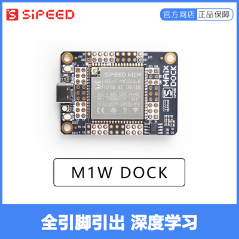
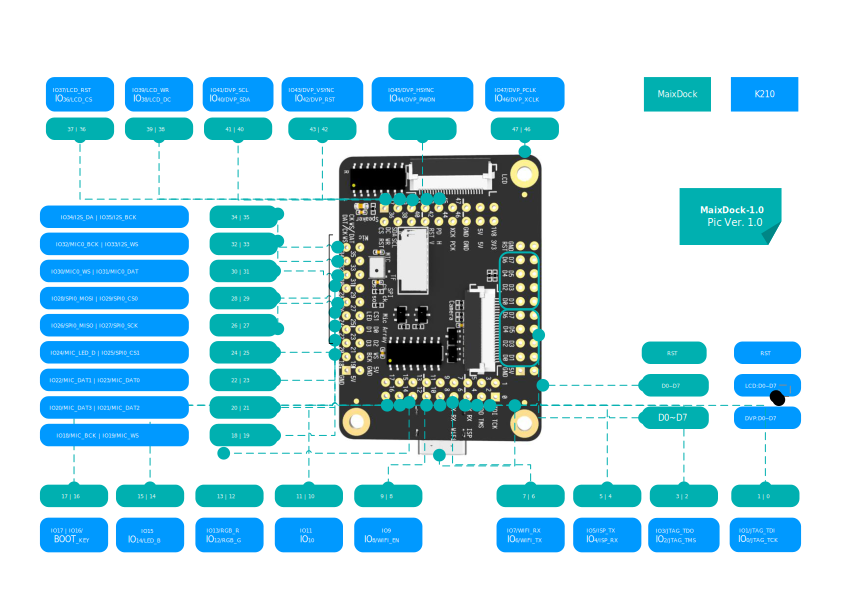

## Appearance and function introduction

### Appearance list

- MaixDock(M1W)

- MaixDock(M1)

### Onboard functions

| Project | Description |
| --- | --- |
| CPU: | Dual-core 64bit RISC-V / 400MHz* (double-precision FPU integration) |
| Memory: | 8MiB 64bit on-chip SRAM |
| Storage: | 16MiB Flash, support micro SDXC expansion storage (max 128GB) |
| Screen (package): | 2.4 inch TFT, screen resolution: 320\*240 |
| Camera (package): | 30W pixel GC0328 camera |
| WIFI: | MaixDock(M1W) uses M1W (integrated ESP8285 WIFI SOC); MaixDock(M1) has no internal WIFI function |
| TF card slot: | Multimedia resource expansion, support large-capacity storage |

### Pin Resources

## Download

Sipeed-Maix-Dock data download: [Sipeed-Maix-Dock](https://dl.sipeed.com/shareURL/MAIX/HDK/Sipeed-Maix-Dock)

Sipeed-Maix-Dock specification download: [Sipeed-Maix-Dock](https://dl.sipeed.com/shareURL/MAIX/HDK/Sipeed-Maix-Dock/Specifications)

Sipeed-Maix-Dock schematic download: [Sipeed-Maix-Dock][Sipeed-Maix-Dock]

[Sipeed-Maix-Dock]: https://dl.sipeed.com/fileList/MAIX/HDK/Sipeed-Maix-Dock/Maix-Dock_11.27/Maix-Dock_11.27(Schematic).pdf
