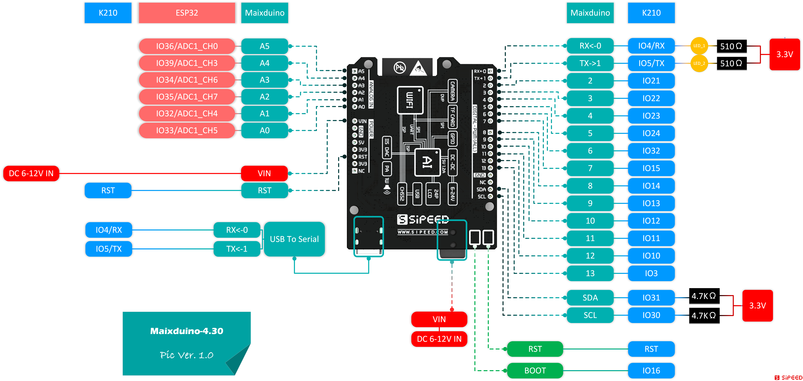

## Overview

  SIPEED MaixDuino is a development board compatible with Arduino based on our M1 module (main control: Kendryte K210)
   MaixDuino integrates camera, TF card slot, user buttons, TFT display, MaixDuino expansion interface, etc., users can use MaixDuino to easily build a face recognition access control system, and also reserve development and debugging interfaces, which can also be used As a powerful AI learning development board.

## Appearance and function introduction

### Appearance list

### Onboard functions

| Project | Description |
| --- | --- |
| CPU: | Dual-core 64bit RISC-V / 400MHz* (double-precision FPU integration) |
| Memory: | 8MiB 64bit on-chip SRAM |
| Storage: | 16MiB Flash, support micro SDXC expansion storage (max 128GB) |
| Screen (package): | 2.4 inch TFT, screen resolution: 320\*240 |
| Camera (package): | 30W pixel GC0328 camera |
| DVP: | Standard Camera DVP 24PIN interface |
| Power + USB: | USB Type-C interface |
| ESP32: | ESP32 SPI connection (ESP32 supports WIFI and Bluetooth), PAM8403A |
| DAC: | I2C DAC |
| TF card slot: | Multimedia resource expansion, support large-capacity storage |

### Pin Resources

## Download

Sipeed-Maix-Duino data download: [Sipeed-Maix-Duino](https://dl.sipeed.com/shareURL/MAIX/HDK/Sipeed-Maixduino/)

Sipeed-Maix-Duino specification download: [Sipeed-Maix-Duino](https://dl.sipeed.com/shareURL/MAIX/HDK/Sipeed-Maixduino/Specifications)

Sipeed-Maix-Duino schematic download: [Sipeed-Maix-Duino][Sipeed-Maix-Duino]

[Sipeed-Maix-Duino]: https://dl.sipeed.com/fileList/MAIX/HDK/Sipeed-Maixduino/Maixduino_2832/Maixduino_2832(Schematic).pdf
