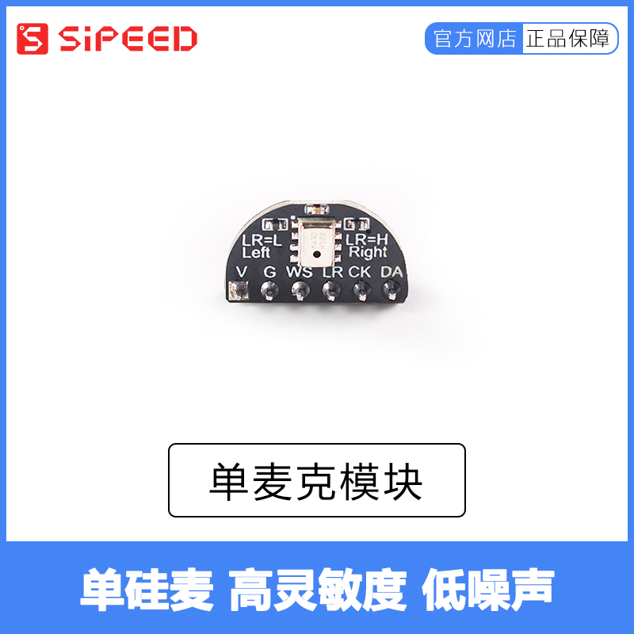

<table border="2">
    <tr>
        <th colspan=3>Sipeed microphone module</th>
    </tr>
    <tr>
        <td>Description</td>
        <td>Physical image</td>
        <td>Description</td>
    </tr>
        <td>
            Single microphone module
        </td>
        <td>
            
            </p>
            <a href="https://sipeed.taobao.com/">Click to buy microphone module</a>
        </td>
        <td>
        1. Microphone IC: MSM261S4030H0</p>
        2. Interface: 6P 2.54mm cable interface</p>
        3. Power supply voltage: 3.3V@5mA</p>
        4. Module size: 15.2mm*9.1mm</p>
        4. Working temperature: -30℃~80℃</p>
    <tr>
    <tr>
        <td>
            Single microphone module
        </td>
        <td>
            
            </p>
            <a href="https://sipeed.taobao.com/">Click to buy microphone module</a>
        </td>
        <td>
        1. Microphone IC: 6 MSM261S4030H0</p>
        2. Interface: 10Pfpc / 10 pin 2.54mm cable interface</p>
        3. Power supply voltage: 5V@mA</p>
        4. Module size: 15.2mm*9.1mm</p>
        4. Working temperature: -30℃~80℃</p>
    </tr>
</table>


## Sipeed Mic-Array

Mic-Array microphone array, as of MaixPy version `MicroPython v0.5.0-218-g8053a70`, the pin io on the microphone array hardware supports custom configuration


| No. | MaixGo (default configuration IO) | Description |
| --- | --- | --- |
| MIC_D0 | 23 | --- |
| MIC_D1 | 22 | --- |
| MIC_D2 | 21 | --- |
| MIC_D3 | 20 | --- |
| MIC_WS | 19 | --- |
| MIC_SCLK | 18 | --- |
| --- | --- | --- |
| LED_DAT | 24 | SK9822 DAT |
| LED_CLK | 25 | SK9822 CLK |

### Routine

Sound source localization

```python
from Maix import MIC_ARRAY as mic
import lcd

lcd.init()
mic.init()#Default configuration
# mic.init(i2s_d0=23, i2s_d1=22, i2s_d2=21, i2s_d3=20, i2s_ws=19, i2s_sclk=18, sk9822_dat=24, sk9822_clk=25)#Customizable configuration IO

while True:
    imga = mic.get_map() # Get sound source distribution image
    b = mic.get_dir(imga) # Calculate and get the sound source direction
    a = mic.set_led(b,(0,0,255))# Configure RGB LED color value
    imgb = imga.resize(160,160)
    imgc = imgb.to_rainbow(1) # Convert image to rainbow image
    a = lcd.display(imgc)
mic.deinit()
```

effect:

<iframe width="600" height="350" src="//player.bilibili.com/player.html?aid=37058760&cid=65120313&page=1" scrolling="no" border="0" frameborder="no" framespacing="0" allowfullscreen="true"> </iframe>
