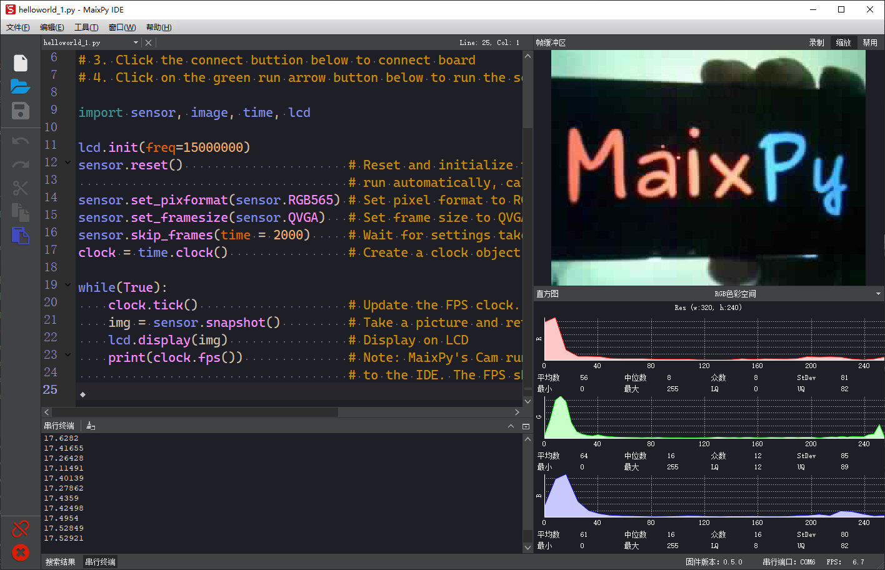

## About MaixPy IDE


First of all, you need to clarify: **MaixPy** uses `Micropython` script syntax, so it does not need to be compiled like `C` language. In fact, it can be used happily without `IDE`: Use the serial terminal tool, which has been installed before

Using `IDE` will facilitate real-time editing of scripts on the computer and upload to the development board, execute scripts directly on the development board, and view camera images on the computer in real time, save files to the development board, etc.

Of course, the use of `IDE` will consume some resources for compression and transmission, so the performance will be reduced, and if MaixPy is down, there is no serial terminal to find the problem.


## MaixPy firmware

To use `MaixPy IDE`, the firmware must be `v0.3.1` or higher, otherwise MaixPyIDE will not be connected. Try to check the firmware version and IDE version before use, and update to the latest version to ensure normal use

## Download the installation package

[dl.sipeed.com](http://dl.sipeed.com/MAIX/MaixPy/ide/)

Please refer to the `readme.txt` file in the latest version folder for the description of the file list. If the download speed is slow, please use the cdn link to download

## Installation

#### If it is an installer (**recommended**, simple and convenient)

`Windows` directly double-click the `exe` file to run the installer; `Linux` command line to run the permission and then execute

```shell
chmod +x maixpy-ide-linux-x86_64-0.2.2.run
./maixpy-ide-linux-x86_64-0.2.2.run
```

#### If it is a compressed package (`7z`)

Unzip to folder

> If the system does not support `7z`, you need to [download `7z` decompression tool](https://www.7-zip.org/), then use `7z`

You can also double-click the compressed package to decompress it under `Linux`!

If you need to use the terminal to decompress, you can refer to the following command:

```bash
sudo apt install p7zip-full
7z x maixpy-ide-linux-x86_64-0.2.2-installer-archive.7z -r -omaixpy-ide
# `-o` is directly followed by the decompressed path, without spaces.
```

* After decompression, execute
  * If it is `Windows`: directly double-click `maixpyide` to execute, you can right-click to fix it to the start page or fix it to the taskbar for later use
  * `Linux`: execute

```
chmod +x setup.sh
./setup.sh
./bin/maipyide.sh
```


## Test run

Open MaixPy IDE, select the model of the development board in the upper toolbar. **Please select Maixduino to connect to amigo and cube development board**.

`Tool-> Select Board` (Tool->Select Board)

Click `connect` to connect to `MaixPy IDE`


After the connection is successful, the link button will change from green to red.


Below the link button is the run button, which will execute the `py` file in the current editing area.




Click the run button (red) again to stop running the current code.

## upload files

You can choose to send files in the **Tool/Tools** menu


## Note

* After clicking the connection, do not use it with the terminal tool at the same time, otherwise the serial port will be occupied and cannot be opened
* If you have been unable to successfully connect successfully, check:
  * Please check whether the development board model selection is wrong;
  * Observe whether there is any change on the development board screen, if there is no response, it may be the serial port selection error;
  * Try to upgrade to the latest [master branch firmware](http://cn.dl.sipeed.com/MAIX/MaixPy/release/master), and the latest MaixPy IDE software


## Find the reason according to the error message

When the program runs incorrectly, a pop-up box will prompt an error, but the error information may not be complete, please **look for more detailed error information in the terminal output**

If necessary, please disconnect the IDE, and only use the serial terminal to run the program (maybe you need to save the program to a file first, and then run the file) to check and print to troubleshoot

If you submit a problem (bbs, group, github issue, etc.), in order to solve the problem quickly, please be sure to bring the complete information described above
