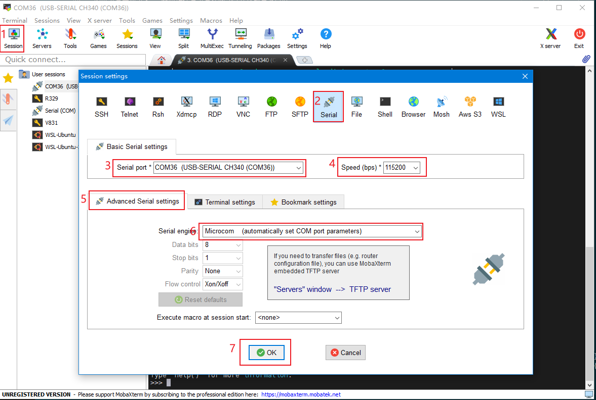
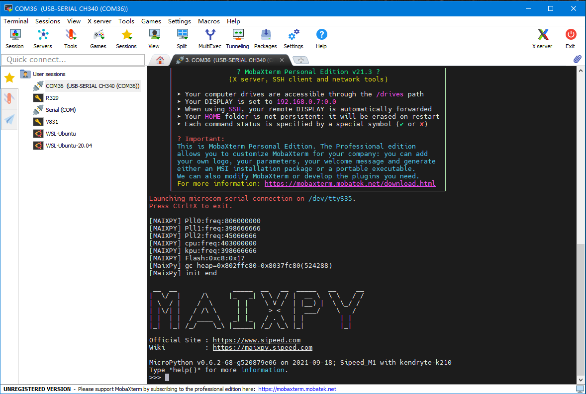
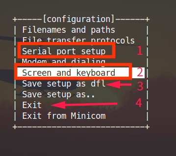
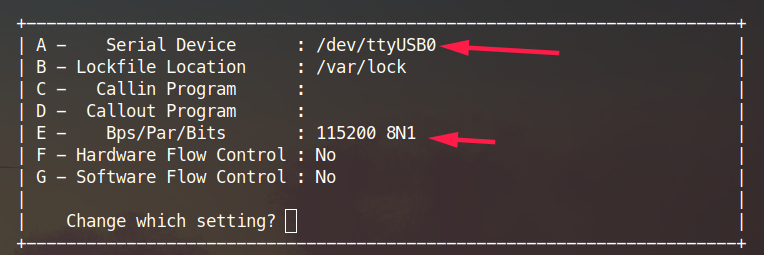
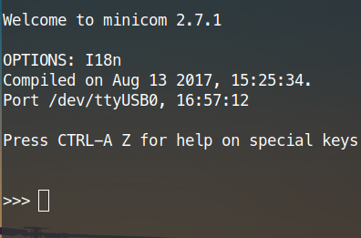

## Connect the hardware

Connect the Type C cable, one end of the computer and the other end of the development board

Check whether the device has been correctly identified:

Under Linux, you can use `ls /dev/ttyUSB*` or `ls /dev/ttyACM*` to check. If not, you can look for it with `ls /dev`. The specific device name is related to the serial port chip and driver. Use `sudo dmesg` to see if there is a device mount record

In Windows, you can open the Device Manager to view

If the device is not found, you need to confirm whether the driver is installed and the contact is good


## Use serial port tool

### Windows

Commonly used serial terminal software for Windows includes [putty](https://www.putty.org/), [mobaxterm](https://mobaxterm.mobatek.net/), [xshell](https://xshell.en .softonic.com/) and other tools

- Putty

Then select the serial port mode, then set the serial port and baud rate, and open the serial port.


Then click the Enter key, you can see the interactive interface of MaixPy

`>>>`

Type `help()` to view the help

> Source of the above picture: [laurentopia's tutorial](https://github.com/laurentopia/Learning-AI/wiki/MaixPy)

- Mobaxterm

[MobaXterm](https://mobaxterm.mobatek.net/) is a very easy-to-use multi-function terminal software under Windows (of course it also includes a serial terminal)





### Linux

Use tools such as `minicom` (recommended) or `screen`

#### minicom

```
sudo apt update
sudo apt install minicom
sudo minicom -s
# Then follow the prompt to set the serial port number and baud rate 115200, etc., if you don’t understand, you can use the search tool to search
# Set Backspace to DEL function
# Set linewrap to Yes
sudo minicom
```

Note that saving the default configuration file of minicom requires sudo permission, so use `sudo minicom -s`





Press `A` here to set up the device

Press `E` to set the baud rate, the baud rate needs to be set to `115200`


Press `A` and `R` here to switch the settings to the same as the settings in the figure. The first is to use the `pye` editor shortcut keys to not conflict with each other, and the second setting of automatic line wrapping is to display the complete output.

Save and exit after setting. You don’t need to set it again next time. Just execute `sudo minicom`. If you don’t want to use `sudo` command every time, execute `sudo usermod -a -G dialout $(whoami)` Just add yourself to the `dialout` user group, you may need to log out or restart to take effect. Note that `sudo minicom -s` still needs `sudo` if you need to modify the default configuration file

After entering `minicom`, click the enter key or the reset button of the development board, you can see the interactive interface of MaixPy



Type `help()` to view the help

To exit `minicom`, press `Ctrl+A` `X`, press `Enter` to confirm exit

> In addition, the serial port number may change during the development process. You can specify the serial port number when executing minicom, so you don't need to set it every time the serial port number changes, for example: `minicom -D /dev/ttyUSB1 -b 115200 `
