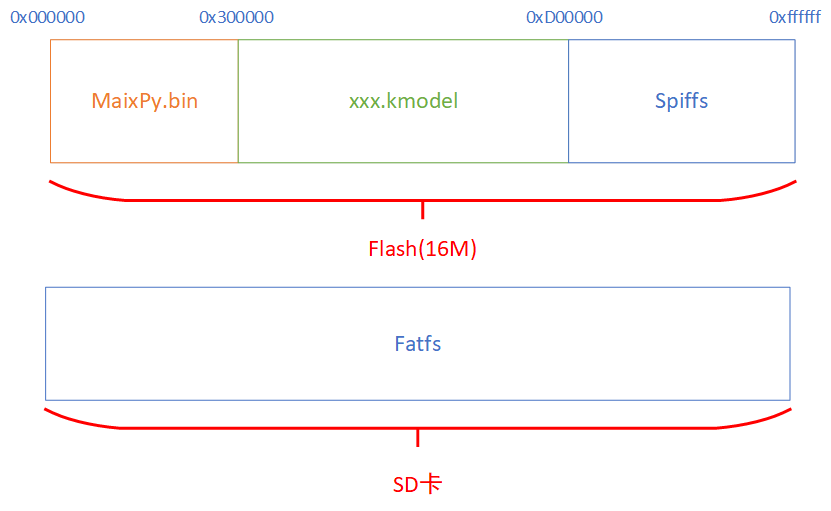

The MaixPy storage system is roughly as shown in the figure below:



As can be seen from the above figure, the storage medium in MaixPy is mainly composed of `Flash` and `SD` cards, which are divided into three areas, namely MaixPy.bin firmware area, xxx.kmodel model area, and file system area: Flash is [ `spiffs`](https://github.com/pellepl/spiffs) (SPI Flash File System), SD card is Fatfs (FAT file system).

## MaixPy.bin firmware area

It is used to store MaixPy.bin firmware, starting at 0x000000, because K210 will start to run the program from 0x000000.

## xxx.kmodel model area

It usually starts at 0x300000. The reason why the model file is not burned in the file system of `Flash` (the file system will be explained later) is due to the following reasons:

1. The memory of the file system in `Flash` is not large enough to fit in a large model, and a larger model can be placed in an SD card.
2. Reading model files directly is faster than reading through the file system.

There is no file system management in this area. You need to operate files based on the starting address during programming. For example, the reading method when the model is programmed at 0x500000:

```python
KpuTask = kpu.load(0x500000)
```

## File system area

Usually starting from 0xD00000, this area is managed by the file system. We reserve the space `3MiB` at the end of `Flash`, which will be managed by [`spiffs`](https://github.com/pellepl/spiffs), and Also supports `FAT32` (Fatfs) `SD` card. These file systems provide interfaces so that we can read and write files through **file name** instead of using **file start address** as in the model area. At the same time, it can also help us effectively manage storage media. For example, wear leveling (Flash has a wear life, please search for relevant knowledge) can give full play to the life of Flash.

### Use of MaixPy File System

Because the file systems of `Flash` and `SD` cards are different and the interfaces are inconsistent, different file systems need to call different interfaces. At this time, the virtual file system (VFS) in MaixPy is used to solve this problem, `VFS `You can mount multiple file systems of different types, and provide a unified interface for users to operate these file systems, and users can ignore the differences between different file systems when using these interfaces. These interfaces are implemented in the `os` module. Examples of usage are as follows:

```python
import uos

print("files:", uos.listdir("/flash"))

with open("/flash/test.txt", "w") as f:
    f.write("hello text")

print("files:", uos.listdir("/flash"))

with open("/flash/test.txt", "r") as f:
    content = f.read()

print("read:", content)
```

In the above example, the `spiffs` file system is automatically mounted to the `/flash` directory when booting. The user only needs to pass in the `"/flash"` directory name as a parameter when using the `os` interface to access the file system .

Interpretation:

* Import the `uos` module
* List all files in the `/flash` directory
* Write a file named `test.txt` to the `/flash` directory with the content of `hello text`,
* List all files in the `/flash` directory, you will find the existence of `test.txt`
* Read the content of the file into the `content` variable
* Print the `content` variable and output `hello text`, which is the content of the file just written
* This content is powered on after the development board is powered off, the correct content can still be read (the content will not be lost after the Flash is powered off)

Of course, SD card is also supported. If you need to use it, SD card needs to meet the following points:

* Support `SPI` mode, most genuine cards on the market support
* The partition is `MBR (msdos)`
* Format as `FAT32`
* The size tested is the largest `128GiB` available

sAfter inserting the `SD` after power off, the `SD` card will be mounted on `/sd` if it is powered on. If there are multiple partitions, the second partition name is `/sd2`

Note that `/` (root directory) cannot write data, only write data to `/flash` or `/sd`
If there is a `SD` card at boot, it will automatically switch the current directory to `/sd`, if not, it will automatically switch to `/flash`
