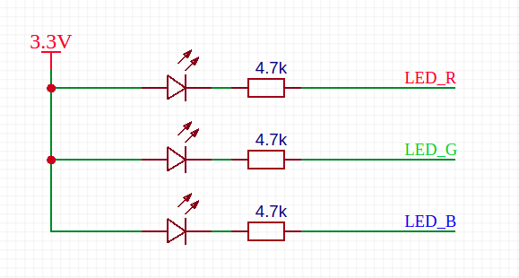

The lighting program is the first program to learn all the development boards, just like learning all programming languages, it has a sacred meaning.

## Circuit

As we all know, lighting an LED requires a power supply, a resistor, and an LED bulb,
There are three LEDs on the Maix Dock development board, the wiring is as follows:




For example, we want the red light to light up, that is, the LED connected to `LED_R`. As you can see in the picture, the anode of the LED has been connected to a 3.3V power supply, so we only need to make LED_R a low-level LED to light up.

> Note that here `LED_R` is an alias for this pin, which is actually connected to a pin of the chip, such as `Pin13` or `IO13`

## FPIOA (Field Programmable Input and Output Array)

Maybe you have used some single-chip microcomputers, and the manual stipulates the binding of pins and on-chip peripheral functions (that is, the peripherals integrated in the chip, such as `GPIO`, `I2C`, `SPI`, etc.), or re Mapping. For example, it is stipulated that `I2C` can only use `Pin9` and `Pin10`. After the remapping function is enabled, only `Pin11` and `Pin12` can be used

However, the pins (hardware pins) corresponding to the on-chip peripherals of the hardware K210 used by MaixPy can be **arbitrarily mapped**. In contrast, the K210 hardware design and software design have more freedom. For example, `I2C` can use `Pin11` and `Pin12`, and can also be changed to any other pin

> Pay attention to distinguish the difference between `GPIO` and `IO`. `IO` can also be called `Pin`, which is a hardware pin derived from the chip, and `GPIO` is a peripheral device that can control these Peripherals of `Pin/IO`

Because of this powerful mapping function, when using pins, you need to add a step of mapping:
```python
from fpioa_manager import fm # import library
fm.register(28, fm.fpioa.GPIO0)
```
Here we map pin `28` to the function of `GPIO0`. After executing this command, pins `28` and `GPIO0` are mapped (bound). If you want to unmap (unbind), then Need to call the `fm.unregister` function, see the `API` documentation for details, not introduced here

In addition, `Pin` and peripherals can only correspond **unique**, not one-to-many. It is necessary to map the same peripherals or pins repeatedly, otherwise the program may produce errors that are difficult to find (`BUG`)

## Code

We need to use GPIO to control the LED

The procedure is as follows:

```python
from fpioa_manager import fm
from Maix import GPIO

io_led_red = 13
fm.register(io_led_red, fm.fpioa.GPIO0)

led_r=GPIO(GPIO.GPIO0, GPIO.OUT)
led_r.value(0)
```

Run the code in the terminal according to the previous method of running the code, and you will find that the LED light is lit!

Next we analyze the code:

* Import the `fm` object from the `fpioa_manager` package, which is mainly used for pin and peripheral mapping
* Imported the class `GPIO` from package `Maix`, GPIO peripheral related operations
* Define a variable `io_led_red`, the value is `13`, that is, `Pin13/IO13`, which pin of the chip is connected to the specific LED pin, please see the schematic in the previous development board introduction
* Use the built-in object `fm` (abbreviation of fpioa manager) to register the correspondence between the peripherals of the chip and the pins, 　here `fm.fpioa.GPIO0` is a GPIO peripheral of K210 (`pay attention to distinguish GPIO (external Set) and the difference between pins (real hardware pins)`), so `fm.fpioa.GPIO0` is registered to pin `IO13`;

* Then define a `GPIO` object `led_r`, see the `GPIO` API documentation for specific parameters, and find it in the left sidebar.

* Use `led_r.value(1)` or `led_r.value(0)` to set the high and low levels, because the low level is set here. According to the above schematic diagram, it can be seen that the low level is on and the LED is on


Now you can light up the lights. Now you can try to use the `for` loop to achieve the `LED` flashing or running lights~ to make different transformation effects
