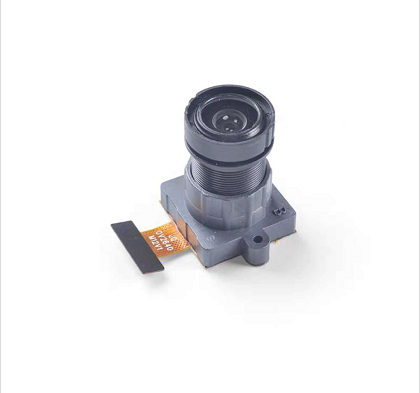
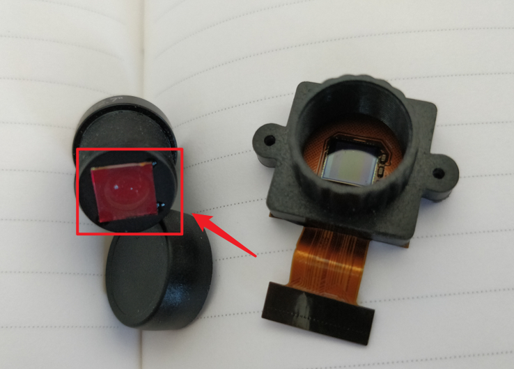

## What is a camera?

We have all seen various cameras, such as

So what is a camera, in the final analysis, is a device that converts optical signals into electrical signals. In computer vision, the simplest camera model is the `hole imaging model`:

The pinhole model is an ideal camera model and does not consider the field curvature, distortion and other issues in the actual camera. But in actual use, these problems can be solved by introducing `distortion parameters` in the calibration process, so the pinhole model is still the most widely used camera model.
SC
The image passes through the lens and shines on a photosensitive chip. The photosensitive chip can convert information such as the wavelength and intensity of the light into a digital signal that can be recognized by a computer (digital circuit). The `photosensitive element` looks like this:

(The square element in the middle is the photosensitive element)

## What are pixels and resolution?

The photosensitive element is composed of many photosensitive points. For example, there are `640` x `480` points. Each point is a pixel. Collect and organize the pixels of each point to form a picture. Then the picture is The resolution is 640x480:

## What is frame rate

The frame rate (FPS) is the number of pictures processed per second. If it exceeds 20 frames, the human eye can hardly distinguish the freeze. Of course, if used on a machine, the higher the frame rate, the better.

## What is color

Physically, colors are electromagnetic waves of different wavelengths.

However, according to the visual effect of the human eye, the color of visible light can be described through RGB, CMYK, HSB, LAB color gamut.

## RGB three primary colors

The principle of the three primary colors is not caused by physical reasons, but by human physiological reasons. There are several color-discriminating cone photoreceptor cells in the human eye, which are the most sensitive to yellow-green, green, and blue-violet (or violet) light (wavelengths are 564, 534, and 420 nanometers, respectively).

So RGB is often used on monitors to display pictures.

- LAB brightness-contrast
In the Lab color space, L brightness; the positive number of a represents red, the negative end represents green; the positive number of b represents yellow, and the negative end represents blue. Unlike the RGB color space, Lab colors are designed to approximate human vision.

Therefore, the L component can adjust the brightness pair, and modify the output color scale of the a and b components for accurate color balance.

Note: In MaixPy's algorithm for finding color patches, this LAB mode is used!

- Selection of light source

If your machine is in the industry, or a device that runs for a long time 24 hours, maintaining a stable light source is crucial, especially in the color algorithm. When the brightness changes, the value of the entire color will change greatly!

## The focal length of the lens

Because the image is optically refracted by the lens, it hits the photosensitive element. Then the lens determines the size and distance of the entire picture. One of the most important parameters is the focal length.

**Lens focal length**: refers to the distance from the principal point to the focal point behind the lens optics, which is an important performance index of the lens. The length of the lens focal length determines the size of the image taken, the angle of view, the depth of field and the perspective of the picture. When shooting the same subject at the same distance, the image formed by the long focal length of the lens is large, and the image formed by the short focal length of the lens is small. Note that the longer the focal length, the smaller the viewing angle.

Another point is the distortion of the lens. Because of the optical principle, the distance between the lens and the lens is different at different positions on the photosensitive chip. Simply put, the distance is small, so fisheye effects (barrel distortion) appear at the edges. In order to solve this problem, algorithms can be used in the code to correct the distortion. Note: image.lens_corr(1.8) is used in MaixPy to correct the 2.8mm focal length lens. You can also directly use the distortionless lens. The non-distortion lens adds an additional corrective lens part, and the price will naturally be much higher.

## Lens filter

On the lens, there is usually a filter.

What does this filter do?

We know that different colors of light have different wavelengths. In a normal environment, in addition to visible light, there are a lot of infrared light. In night vision, infrared light is used.

However, in normal color applications, infrared light is not needed, because infrared light will also cause the photosensitive element to react, making the entire screen white. So we put a filter on the lens that can only pass through the wavelength of 650nm to filter the infrared light.
