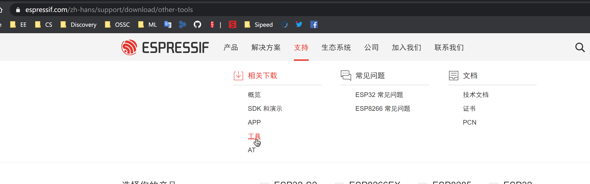

## Introduction:

In the MaixPy series of development boards, MaixDuino has an ESP32 WIFI SOC onboard. By default, we don’t need to update the onboard ESP32 module, but we find that there are bugs in the use process and fix them, we need to update the repaired firmware.

## Update ESP32 firmware steps

### Preparation

- Hardware: MaixDuino, USB Type-C data cable
- Software: ESPFLASH

- ESP32 firmware update tool: ESP32 **flash_download_tools**
  -Download link: [**flash_download_tools**](https://www.espressif.com/zh-hans/support/download/other-tools)
- ESP32 MaixDuino firmware:
  -Download link: [**flash_download_tools**](https://cn.dl.sipeed.com/MAIX/factory_firmware/)

### Update process:

1. Download **flash_download_tools**,

   
   

2. Download **MaixDuino ESP32 firmware**
   

3. Connect MaixDuino, select ESP32 serial port (usually the serial port number is relatively large)

4. Set download options:
   1. Configure the corresponding options as shown in the figure, and note that the **baud rate must be set to 115200**

   
   

5. Click **Start** to update the firmware and wait for the update to complete

6. Verify that the update is complete

   1. Using XCOM, open the ESP32 serial port, click RST to reset ESP32, the flashing is successful as shown in the figure

   
