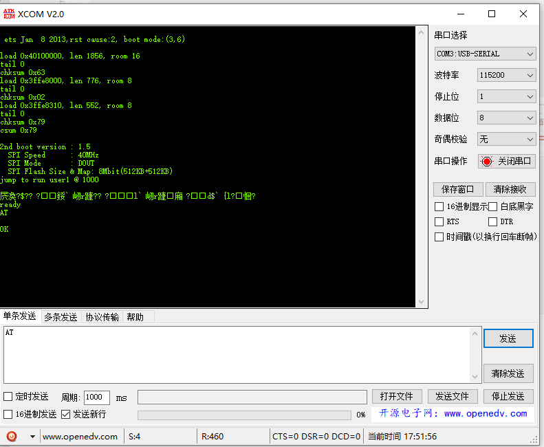
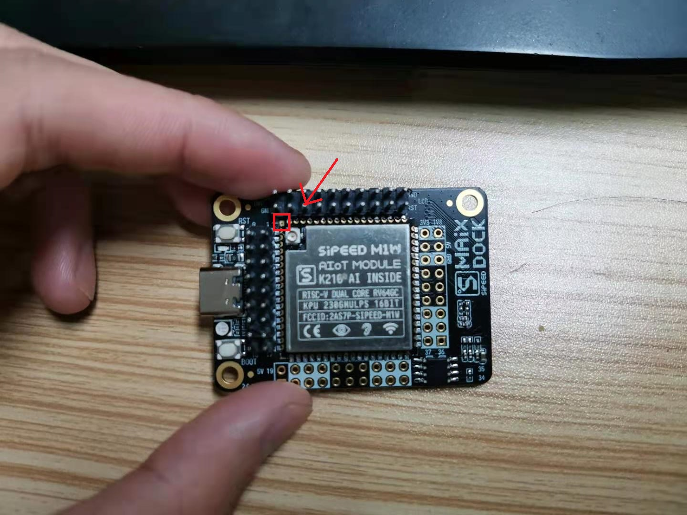
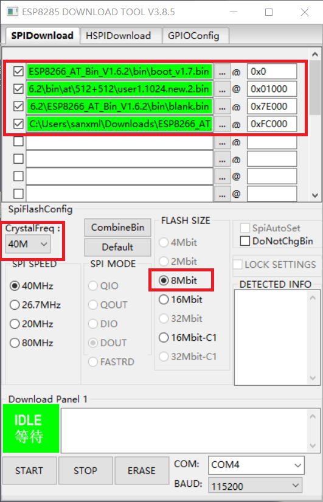
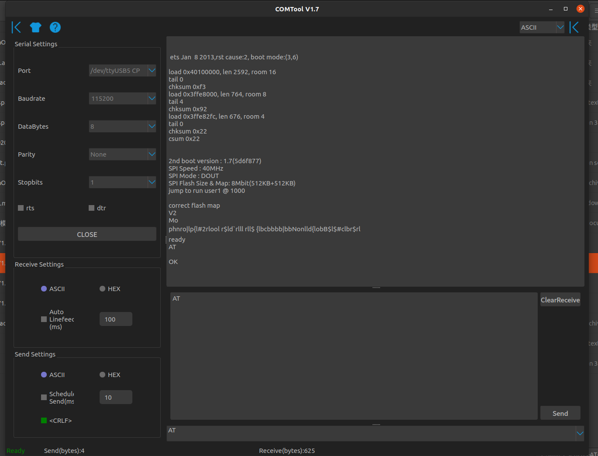

## Introduction:

At present, MaixPy series adopt M1W module as the core module development boards: MaixDock(M1W), MaixGo

Normally we don’t need to update the firmware of the WIFI SOC ESP8285 inside the module, but if there is a bug in the use process, and a new version of the firmware is released, we can update the firmware

> The ESP8285 in the M1W module used by MaixDock and MaixGo burns AT firmware by default

## Verify that ESP8285 can work normally

- MaixPy verifies whether ESP8285 is working properly

> View the end of text routine

- External USB to serial module test

   Use USB to serial port module, connect according to the following table, and then power on

| M1W | USB Module | Description |
| --- | --- | --- |
| M1W GND | GND | Common ground |
| K210 (IO6)/ESP8285 TX | RX |-|
| K210 (IO7)/ESP8285 RX | TX |-|
| k210 RST (ground before power on, pull down RST during the whole process) | GND |

   After power-on, the board will output serial port (here XCOM, baud rate 115200) to verify whether ESP8285 starts normally
   


## AT command set

ESP8285 and ESP8266 are the same series of products, using the same set of AT commands
ESP8285/ESP8266/ESP32 latest AT command set https://github.com/espressif/esp-at/blob/v2.0.0.0_esp8266/docs/ESP_AT_Commands_Set.md


## Update ESP8285 firmware steps

Before burning ESP8285 firmware, first understand the ESP8285 burning principle:

### ESP8285 firmware burning principle

When ESP8285 is powered on, it will determine the state of the boot stapping pin and determine the boot mode, such as:

> ets Jan 8 2013,rst cause:1, boot mode:(3,2)

The first digit (3) of the printed boot mode represents the current boot mode.
Boot mode is determined by the 3-bit value of strapping pin [GPIO15, GPIO0, GPIO2]. As shown in the following table
Show:

| 3-bit value of strapping pin/[GPIO15, GPIO0, GPIO2] | Boot mode |
| --- | --- |
| 7 / [1, 1, 1] | SDIO HighSpeed ​​V2 IO |
| 6 / [1, 1, 0] | SDIO LowSpeed ​​V1 IO |
| 5 / [1, 0, 1] | SDIO HighSpeed ​​V1 IO |
| 4 / [1, 0, 0] | SDIO LowSpeed ​​V2 IO |
| 3 / [0, 1, 1] | Flash Boot |
| 2 / [0, 1, 0] | Jump Boot |
| 1 / [0, 0, 1] | UART Boot |
| 0 / [0, 0, 0] | Remapping |


Please see the following table for the IO level of ESP8285 entering different modes:

| Mode | CH_PD(EN) | RST | GPIO15 | GPIO0 | GPIO2 | TXD0 |
| :------------- | :-------- | :--- | :----- | :---- | :---- | ---- |
| UART download mode | High | High | Low | Low | High | High |
| Flash operating mode | High | High | Low | High | High | High |
| Chip Test Mode |-|-|-|-|-| Low |

That is, ESP8285 enters UART download mode, the first bit of the startup information mode should be mode:(1, X), as follows:

> ets Jan 8 2013,rst cause:1, boot mode:(1,1)


Taking MaixDock as an example, you can see the schematic diagram of MaixDock as follows:


### Preparation

> Here is MaixDock(M1W), Windows 10 system as an example

- Hardware: MaixDock, USB Type-C data cable
- Software:

- ESP firmware update tool: ESP8285 **flash_download_tools**
  - Espressif's official website download link: [**flash_download_tools**](https://www.espressif.com/zh-hans/support/download/other-tools)

- ESP8285 AT firmware:
  - Download link: [**ESP8266 AT bin**](https://cn.dl.sipeed.com/MAIX/factory_firmware/)
 - Espressif's official download link: [espressif_esp8266-at](https://www.espressif.com/zh-hans/support/download/at?keys=&field_type_tid%5B%5D=14)

   


### Windows uses flash_download_tools to update ES8285 (here, MaixDock is taken as an example):

1. Follow the configuration below to connect to MaixDock,

    Connect the USB to serial port module and ESP8285, the connection method has been introduced above
    Before power-on, GPIO0 needs to be pulled down, that is, the contact in the upper left corner next to the antenna is grounded to enter the UART download mode.




1. Open **flash_download_tools**

2. Download **MaixDock ESP8285 firmware**

    

3. Select ESP8285 serial port (usually the serial port number is relatively large)

4. Set download options:

    Configure the corresponding options as shown in the figure, note that the baud rate must be set to 115200**

    

5. Click **Start** to update the firmware and wait for the update to complete

6. Verify that the update is complete

   - Use the XCOM baud rate of 115200, open the ESP8285 serial port, and output `AT\r\n`, as shown in the figure, it prompts `OK` to flash in successfully
    

### LINUX uses esp_tool to update ES8285 (here, MaixDock is taken as an example):


1. Follow the configuration below to connect to MaixDock,

    

2. Install esptool

    ```shell
    pip3 install esptool
    ```

3. Download **MaixDock ESP8285 firmware**

    ```shell
    ls /dev/ttyUSB* # View USB serial port
    esptool --port /dev/ttyUSB0 write_flash 0x0 ESP8285-AT-V1.7.4_8Mbit_40Mhz.bin # Burn the firmware
    ```

4. Verify that the update is complete

    Use XCOM baud rate 115200, open ESP8285 serial port, output `AT\r\n`, as shown in the figure, prompt `OK`, then flashing is successful
    


### MaixPy routine test:


```python
import network, time
from machine import UART
from Maix import GPIO
from fpioa_manager import fm

# En SEP8285 rst
#fm.register(8, fm.fpioa.GPIOHS0, force=True)
#wifi_en=GPIO(GPIO.GPIOHS0, GPIO.OUT)
#wifi_en.value(1)
# En SEP8285 rst
fm.register(0, fm.fpioa.GPIOHS0, force=True)
wifi_io15=GPIO(GPIO.GPIOHS0, GPIO.OUT)
wifi_io15.value(0)

fm.register(8, fm.fpioa.GPIOHS1, force=True)
wifi_en=GPIO(GPIO.GPIOHS1, GPIO.OUT)
wifi_en.value(1)
# for new MaixGO board, if not, remove it
#fm.register(0, fm.fpioa.GPIOHS1, force=True)
#wifi_io15_en=GPIO(GPIO.GPIOHS1, GPIO.OUT)
#wifi_io15_en.value(0)

fm.register(6, fm.fpioa.UART2_RX, force=True)
fm.register(7, fm.fpioa.UART2_TX, force=True)

uart = UART(UART.UART2,115200,timeout=1000, read_buf_len=4096)

def wifi_enable(en):
    global wifi_en
    wifi_en.value(en)

def wifi_deal_ap_info(info):
    res = []
    for ap_str in info:
        ap_str = ap_str.split(",")
        info_one = []
        for node in ap_str:
            if node.startswith('"'):
                info_one.append(node[1:-1])
            else:
                info_one.append(int(node))
        res.append(info_one)
    return res


#wifi_enable(0)
time.sleep(2)
nic = network.ESP8285(uart)

ap_info = nic.scan()
ap_info = wifi_deal_ap_info(ap_info)

ap_info.sort(key=lambda x:x[2], reverse=True) # sort by rssi
for ap in ap_info:
    print("SSID:{:^20}, RSSI:{:>5}, MAC:{:^20}".format(ap[1], ap[2], ap[3]))


```
