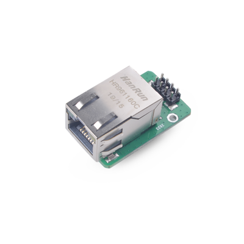

This module uses W5500 as the main control chip, which is an embedded Ethernet controller that integrates a full hardware TCP/IP protocol stack.

## Parameters

* Working voltage: 2.6V~3.6V
* Working current: <132mA
* Sleep current: <15mA
* Communication interface: SPI
* Operating temperature range: -40℃ ~ 85℃

For detailed module information, please refer to [Ethernet Specification](http://api.dl.sipeed.com/shareURL/MAIX/HDK/sp_mod/sp_ethernet)

## Instructions

1. Preparation: The development board with the latest firmware, sp_ethernet module, and network cable.
2. Run: Connect the module, modify the configuration surrounded by config in [Sample Code](https://github.com/sipeed/MaixPy_scripts/tree/master/modules/spmod/sp_ethernet), the module will print the communication data after running.

The procedure is as follows:

```python
spi1 = SPI(4, mode=SPI.MODE_MASTER, baudrate=600 * 1000,
            polarity=0, phase=0, bits=8, firstbit=SPI.MSB, sck=WIZNET5K_SPI_SCK, mosi=WIZNET5K_SPI_MOSI, miso = WIZNET5K_SPI_MISO)

# create wiznet5k nic
nic = network.WIZNET5K(spi = spi1, cs = WIZNET5K_SPI_CS)
print("Static IP: ", nic.ifconfig())
```

* Create SPI and use SPI to create WIZNET5K wired network card
* Print current IP information

Related API reference: [wiznet5k API](../../api_reference/machine/network.md#WIZNET5K_Module)
