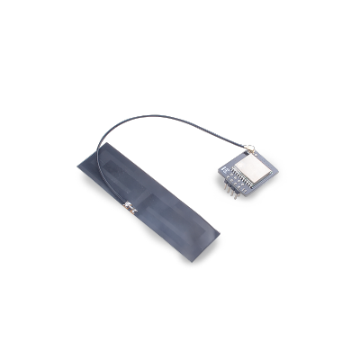

SP_LoRa module uses M-XL8 module, which has built-in LoRaTM modem and adjustable power amplifier LoRa module, which has high performance and high reliability.

## Parameters

* Working frequency: 370MHz~1200Mhz
* Transmitting power: 20dBm (maximum)
* Communication interface: SPI
* Antenna: External antenna, IPEX or welding
* Receiving sensitivity: -148dbm
* RSSI dynamic range: 127dB
* Working voltage: 1.8V~6.3V
* Working temperature: -40°C~80°C

For detailed module information, please refer to [LoRa Specification and Data Manual](http://api.dl.sipeed.com/shareURL/MAIX/HDK/sp_mod/sp_lora)

## Instructions

1. Preparation: Two development boards with the latest firmware burned, two sp_lora modules.

2. Run: Connect the module, modify the configuration surrounded by config in [sample code](https://github.com/sipeed/MaixPy_scripts/tree/master/modules/spmod/sp_lora), and run the two development boards to send and receive separately Function, you can view the received and sent information on the terminal.

The procedure is as follows:

```python
# init
lora = SX127x(spi=spi1, pin_ss=cs)

# lora reset
rst.value(0)
time.sleep_ms(10)
rst.value(1)
time.sleep_ms(100)
lora.init()

####### receiver ##########
receive(lora)

######## sender ###########
# send(lora)

'''output
mpfs [/flash]> runfile lora_send.py
    transfer 6400 of 14576
    transfer 12800 of 14576
    transfer 14576 of 14576
[Warning] function is used by fm.fpioa.GPIOHS7(pin:23)
LoRa Sender
Sending packet:
Hello(0)

mpfs [/sd]> runfile lora_recv.py
    transfer 6400 of 14576
    transfer 12800 of 14576
    transfer 14576 of 14576
[Warning] function us used by fm.fpioa.GPIOHS7(pin:23)
LoRa Receiver
[Memory-free: 470080 allocated: 48064]
*** Received message ***
Hello(0)
with RSSI: <bound_method 800d19e0 <SX127x object at 800f5700>.<function packetRssi at 0x800d3180>>
'''
```

The debugging and running tool used here is mpfshell, which is convenient to open two terminals to run scripts at the same time.

The main steps are:

* Create LoRa object (parameters: SPI object, chip selection pin)

* Reset (pull the reset pin low or high), initialization.
  
* Start sending or receiving.
