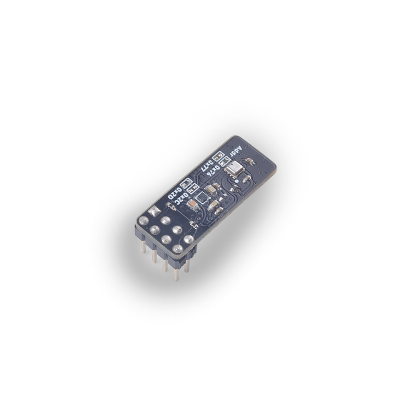

The SP_Weather weather module has two sensors, the magnetic sensor QMC7983, which is a three-axis magnetic sensor with built-in sensitivity compensation and NTC. It has excellent dynamic range and accuracy and ultra-low power consumption. The temperature, humidity and air pressure sensor BME280 can simultaneously measure temperature Humidity and atmospheric pressure.

## Parameters

### Magnetic sensor QMC7983

* Magnetic induction range: ±30 Gauss
* Accuracy: 1mG per LSB
* RMS noise: 2mG
* External interface: I2C, default address 0x2C, can be adjusted by selecting resistance
* Working voltage: 2.6V~3.6V
* Working temperature: -30°C ~ 85°C

### Temperature, Humidity and Pressure Sensor BME280

* The key parameters of the temperature sensor
  * Measuring range: -40°C~85
  * Accuracy:
  
|range(°C)|accuracy(°C)|
|----|----|
|25|±0.5|
|0~65|±1.0|
|-20~0|±1.25|
|-40~-20|±1.5|

* Key parameters of humidity sensor
  * Response time (τ63%): 1 s
  * Accuracy tolerance: ±3% relative humidity
  * Hysteresis: ±1% relative humidity
* Key parameters of air pressure sensor
  * RMS noise: 0.2Pa (equivalent to 1.7cm)
  * Offset temperature coefficient: ±1.5 Pa/K (equivalent to ±12.6cm when the temperature changes at 1℃)
* External interface: I2C, default address 0x76, can be adjusted by selecting resistance
* Working voltage: 1.71V~3.6V
* Working temperature: -30°C ~ 85°C

For detailed module information, please refer to [Meteorological Module Specification and Data Manual](http://api.dl.sipeed.com/shareURL/MAIX/HDK/sp_mod/sp_weather)

## Instructions

1. Preparation: The development board with the latest firmware, sp_weather module.

2. Run: Connect the module, modify the configuration surrounded by config in [Sample Code](https://github.com/sipeed/MaixPy_scripts/tree/master/modules/spmod/sp_weather), you can see the magnetism printed on the terminal after running Sensor and air pressure temperature and humidity sensor data

The procedure is as follows:

```python
weather=SPWEATHER(i2c=i2c_bus) # create sp_weather
while 1:
    time.sleep_ms(500)
    print(weather.qmc_read_xyz) # QMC7983 read data
    print(weather.bme_values) # BME280 read data

'''output
>>> I2C devices:[44, 118]
0x32
6
(228, 123, 156)
('31.0C', '1017.75hPa', '34.32%')
(235, 130, 185)
('30.75C', '1017.74hPa', '34.31%')
(235, 130, 161)
('30.7C', '1017.82hPa', '34.32%')
'''
```

The main steps are:

* Create SPWEATHE (parameter: I2C object).

* Read magnetic sensor data and temperature and humidity data. (The data read are all tuples)
