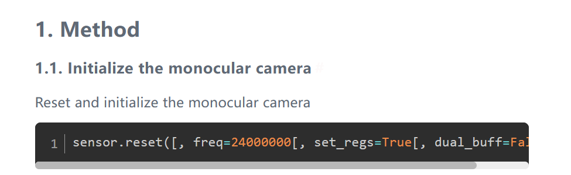

## What are the similarities and differences between MaixPy and C development, and how should I choose

MaixPy is a scripting language based on Micropython. It does not need to be compiled and parsed at runtime. It is simpler and more convenient to write, but it is not as real as C language at runtime.
So if you are a quick verification, novice, only python, less hair, etc., you can use MaixPy; those who are pursuing extreme performance efficiency or are familiar with C, and those who are not confident about the long-term stability of MaixPy can use C language development

## MaixPy IDE cannot successfully connect to the development board

**phenomenon:**

​ After getting the development board, I have been unable to connect to MaixPy IDE

* Check whether the firmware supports IDE, early firmware and firmware with `minimum` in the name are not supported
* Check whether the serial port is occupied (other software also opened the serial port)
* After clicking the connection, do not use it with the terminal tool at the same time, otherwise the serial port will be occupied and cannot be opened
* If you have been unable to successfully connect successfully, check:
  * Please check whether the development board model selection is wrong;

  * Observe whether there is any change on the development board screen, if there is no response, it may be the serial port selection error;

  * Try to upgrade to the latest [master branch firmware](http://cn.dl.sipeed.com/MAIX/MaixPy/release/master), and the latest MaixPy IDE software

> MaixPy version number is lower than 0.5.0_v0 does not support connection to MaixPy IDE


## The document webpage cannot be opened and the speed is slow

If you encounter some pages that cannot be accessed, please check whether the URL (path) is correct, and you can return to the home page (`maixpy.sipeed.com`) and re-enter.

For example, this URL is caused by clicking too quickly:

```shell
http://localhost:4000/zh/zh/get_started/how_to_read.html
```

The correct URL should be:

```shell
http://localhost:4000/zh/get_started/how_to_read.html
```

In addition, you can try another network line, such as connecting to a proxy, or changing mobile phone data. You can also use `cn.maixpy.sipeed.com` in China.

## The download speed of the download station is slow, and the file cannot be downloaded

If you encounter slow download speed at the dl.sipeed.com download station, you can use the domestic synchronization server cn.dl.sipeed.com to download, the path is the same, and it is synchronized once a day;
Some files provide CDN download links, which will be faster, for example, IDE has instructions in readme.txt

## Micro SD card cannot be read

Micro SD cannot be read phenomenon and solutions:

* Confirm whether the SD can be used normally on the computer, if not, the SD is damaged,

* The computer can be used normally, read SD, but MaixPy development board cannot be used:

  SD card is not formatted as MBR partition FAT32 format

* The computer can use the SD card normally. It is also confirmed that the disk format of the SD card is FAT32, but the MaixPy development board still cannot be used:

  Possible reasons: When some SDs leave the factory, there is no disk partition table in the sd, or the disk partition table type is not MBR

  Solution: Use a third-party disk management software to convert the sd partition table type to MBR, and format the sd format to FAT32

> Here **Diskgenius** is used to convert the disk partition table format


* SD card does not support SPI protocol

At present, the hardware can only support SPI protocol reading, try to buy a regular card

For example: the two cards on the left side of the picture below are not supported by MaixPy drivers, the middle and right ones are supported, but the class 10 card in the middle has the fastest speed (up to 128GB tested and available)
> I have also tested several SanDisk, Kingston, and Samsung cards purchased online, and found that one of the Samsung cards cannot be used


## How much capacity does the SD card support?

We have tested that **`1TB`** storage capacity SD card is OK  

## Use SD to load file, model is unsuccessful

Phenomenon: We may encounter errors when loading the model during use.

Possible cause of the problem: sd is not compatible and the mount is unsuccessful

Verify whether the SD card is mounted:

```python
import os
print(os.listdir("/"))
>>['flash'] # SD card is not mounted

>>['flash','sd'] # Successfully mount the SD card
```

## Why is the frame rate reduced a lot when the IDE is connected

K210 has no USB peripherals, so it can only use the serial port to communicate with the IDE. The speed is not as fast as the USB device, so it will affect the frame rate. You can turn off the IDE camera preview


## Why the camera image previewed on the IDE is blurry

K210 has no USB peripherals, so it can only use the serial port to communicate with the IDE. The speed is not as fast as the USB device. Therefore, the picture is compressed. If you need to see a clear picture, please watch it on the screen of the development board, or save it as a picture and upload it to the computer View

Therefore, the image preview function of the IDE is mainly for teaching and demonstration. It is usually recommended to use the screen.
You can use the following code to set the preview quality
```python
sensor.set_jb_quality(95)
```
This sets the quality of the preview image to 95%, but the frame rate will be significantly reduced


## How to increase the camera frame rate

* Change to a better camera. For example, the frame rate of `ov7740` will be higher than that of `ov2640`. But the premise is that the camera circuit must be compatible with the circuit of the development board
* Increase the camera clock frequency (`sensor.reset(freq=)`), but be careful not to be too high, too high will make the picture worse
* You can compile the source code yourself, turn on the camera double buffering option (by default), and `sensor.reset(dual_buff=True)`, the frame rate will increase, but the memory consumption will increase accordingly (approximately 384KiB)


## IDE frame buffer imaging direction is incorrect, LCD display direction is incorrect

Since MaixPy supports many hardware models, the display direction will be incorrect when using MaixPy IDE or LCD display, then we need to rotate the image at this time;
Before correcting the display direction, we need to confirm whether the sensor direction is rotated (the image in the upper right corner of MaixPy IDE is the image directly output by the Sensor) or the LCD direction is rotated
Correction method:

- Sensor direction correction:

```python
# Set camera horizontal mirroring
# `enable`: 1 means to turn on horizontal mirroring 0 means to turn off horizontal mirroring
sensor.set_hmirror(enable)

# Set the camera to mirror vertically
# `enable`: 1 means turn on vertical mirroring 0 means turn off vertical mirroring
sensor.set_vflip(enable)
```

- lcd direction correction:

```python
# Set `LCD` screen orientation
# Parameters: `dir`: value range [0,3], rotate clockwise from `0` to `3`
# Return value: current direction, value [0,3]
lcd.rotation(dir)

# Set whether `LCD` is mirrored
# Parameters: `invert`: Whether to display in a mirror, `True` or `False`
# Return value: The current setting, whether it is mirrored or not, returns `True` or `False`
lcd.mirror(invert)
```

## After burning MaixPy, MaixPy fails to start

Phenomenon: We may encounter MaixPy cannot be started after burning MaixPy (it appears that the screen cannot be turned on, the screen shows white, etc.).

The cause of the problem: A large part of this phenomenon is that the configuration file in the internal file system is read incorrectly, or the system configuration value we set (such as the gc heap value is too large) is incorrect and the system cannot be started.

Solution: Erase the file system (erase all flash)

Use kflash_gui to select the `erase` function in the upper right corner, then load the `MaixPy file system` template, the address becomes `0xD00000`, and the length becomes `3MiB`

Or reburn the erase firmware: Click to download [K210-chip_erase.kfpkg](https://dl.sipeed.com/fileList/MAIX/MaixPy/release/Erase_all/K210-chip_erase.kfpkg)

After erasing device do remember to reburn your target firmware


## Using JTAG debugger has been unable to connect to K210

Phenomenon: Using bare metal to develop K210, JTAG debugger has been unable to connect to K210

possible reason:
  1. There is a problem with the OpenOCD debugging environment (the details are not explained here)
  2. After burning key_gen.bin, the JTAG debugging function of K210 will be permanently disabled

## After downloading and saving the script to MaixPy internal flash, the board cannot update the firmware and cannot start the script

-Possible phenomenon: After downloading and saving the script to MaixPy internal flash, the board cannot update the firmware, and the board cannot start


> The problem can be located from the hardware and software:

Possible hardware reasons:

​ TODO: To be updated

Possible software reasons:

  1. GPIO16 is pulled up in the program, which causes the automatic download point circuit to fail to pull down GPIO16, making K210 enter ISP mode

## kflash cannot burn/update MaixPy firmware

kflash_gui configuration options

- Development board model
  - The wrong development board model is selected
- Burning space (SRAM/Flash)
  - Wrong selection of burning space
- Baud rate & download speed mode
  - Download baudrate is too high

## An error: type object 'board_info' has no attribute 'XX' 
Visit [Board_config](./../get_started/board_info.md) to reconfig your board.

## TF card format is right, but can't read tf card anf failed mount

Use following to remount:
```python
from machine import SDCard
SDCard.remount()
```

Using following code to check whether succeed mounting tf card:
```python
def sd_check():
    import os
    try:
        os.listdir("/sd/.")
    except Exception as e:
        return False
    return True
print(sd_check())
```

## ValueError:[MAIXPY]kpu: load error:2002, ERR_KMODEL_VERSION: onlysupport kmodel V3/V4 now

1. Update firmware, using the latest MaixPy firmware with v3/v4 supported. The update way has been tole before.
2. Check the location you store the model whether matches your read location. For example, if you store the model on sd card, but you read your flash address 0x300000, this error will occour.
3. If you use module named with .smodel, you should redownload it with your own machine-key from maixhub.

## No any response when run boot.py in MaixPy IDE

If you burn your model on flash, you should run boot.py in serial terminal. If is told `Out of memory`, you should store your model on sd card, then run your code (Make sure your sd card can well be mounted).

## ValueError: [MAIXPY]kpu: load error:2006, ERR. NO_ MEM: memory not enough

This error means out of memory, use smaller size firmware to comsume less ram. There will be about 1M memory left because standard firmware consumes 2MB bytes, if you choose firmware which consumes 600kB you will have 3MB bytes memory left. Visit this demo [demo_view_mem.py](https://github.com/sipeed/MaixPy_scripts/blob/master/basic/demo_view_mem.py) to see how to know the rest memory.

1. Using mini firmware instead of which you used now, or you need to reduce your dataset used during training
2. Visit [memory manegment](./../course/others/mem.md) to manage your memory amd adjust it by garbage collector.

## OSEerror: [Errno 2] ENOENT

This error means the file your code read is not at the correct path. If the file is on sd card, check whether sd card is well mounted.

Using following codes to check whether sd card is mounted, it will return false if failling mounting. This maybe because your sdcard is not compatible with this board, or the file system format on sdcard is incorrect(It should be FAT32). It's suggested to use our official sdcard and if it can't work do contact with us we will response you soon.
```python
def sd_check():
    import os
    try:
        os.listdir("/sd/.")
    except Exception as e:
        return False
    return True
print(sd_check())
```
Using following codes to remount
```python
from machine import SDCard
SDCard.remount()
```

## Failed to open serial terminal, but it run in IDE

1. Check if the serial port is occupied, because only one application can use a serial port at a time
2. Using serial terminal contained in IDE

## ValueError: [MAIXPY]kpu: load error:2005,ERR_READ_FILE: read filefailed

1. Check if the name of model on sdcard matches it in the code, and its path whether matches.
2. Check whether your model downloaded address matches the load address in your code.

## Operations after burning key_gen.bin

After burning key_gen.bin, use serial terminal connects with your board, and press reset key which is on your board. Then you will see a machine code prints out on your serial terminal. Or you can use the [serial terminal](/soft/maixpy/en/get_started/env_serial_tools.html#Use-serial-port-tool) contained in MaixPy IDE connects with your board to see your machine code.

After you get your machine code, you need to reburn your corresopnding firmware to reuse your board.

## Camera is not clear

If you are using OV5642 while it doesn't shows very clear, you can adjust its focal length by rotating the lens. If the other camera is not very clear, you can do the same operation to adjust its focal too. But there is a limit to the camera display effect, so maybe sometiomes we can juse use other camera to get better image.

## Display incorrect, like blurred screen, incorrect color or single color

Using kflash flashs your board with [K210-chip_erase.kfpkg](https://dl.sipeed.com/fileList/MAIX/MaixPy/release/Erase_all/K210-chip_erase.kfpkg), this will clear all data in your flash. And reburn your firmware to restart your board.

When you reburn your model, make sure your model address matches it in your code.

- White blurred screen means wronf firmware, reburn correct firmware after erasing your your board to solve this
- Screen blurred screen may mean your camera is broken
- Red screen is the righe color, but there is no user's code running on it.

## TypeError: Can't convert to type when using IDE

This error means the memory on board is not enough while contacts with IDE.

Use the termial located on the top menu bar or allocate memory wisely to solve this.

## kpu:check img format err!

Pay attention to your terminal !!!

The content of gray font: kpu img w=320, h=240 but model w=224, h=224

means the requirement for this model is 224 224, but the input is 320 240

so we should resize all pictures into 224 224, and for 128 128 we need resize resolution of picture too.

Use `sensor.set_windowing` to resize camera input or use `img.resize` to resize picture resolution

## ValueError input not support

Check the Python code error line and check ValueError error. This normally happens when the type of input-format mismatches the type target functions need, or because of lack of memory the object is to be None or that the class type was recycled.

## OSError reset failed

This error means that the board failed to initialize the camera. from `sensor.reset()` we see that this function initializing the camera.



1. Camera connection wrong, so the board can not initialize the camera.
2. Camera is damaged, board can not initialize the camera.

It's suggested to use camera provided by Sipeed, this can reduce many troubles like the different line sequence of camera to the board or the lack of your camrea driver on this board.

## What's the difference between kmodel and smodel?

kmodel is a kind of model explaining the structure and parameters of this model.

smodel requires Machine-code; Machine-code is a kind of encrypted way to encrypt the model. The development board can't use the smodel encrypted and generanted by other Machine-code.

## How to run multiple models in the same time

Try to run it in time-sharing instead of in the same time

If the RAM is big enough to load target models, then load them all and run rhem in time-sharing.

If the RAM is not big enough to load multiple models, try to load one model, and deinit it after finishing running it (use `kpu.deinit`), the load another model or rest models(if the RAM is big enough). Use `load_flash` mode to load model, read content from flash.

## How to load big model

Beacuse the limit of RAM in K210, if need load big model, try to load it from flash and run it.

The detailed usage can be found in github: [Click me](https://github.com/sipeed/MaixPy_scripts/tree/master/machine_vision/load_big_model)

## could not open port 'COMxx':Permission denied

This happens when the serial port is occupied. Try to close application which is using this serial port, or try to reboot computer to close all applications to avoid serial port occupied.

## Maix Dock serial port connect failed

Maix Dock cannot use MobaXterm or other software which does not support manual serial port flow control for serial communication.

To avoid wasting time, it is recommended to use MaixPy IDE for communication.

You can open terminal in MaixPy IDE top menu bar tools->open terminals->new terminal->Connect to serial ports ->select the correct serial port->baudrate 115200, to create a new terminal.

