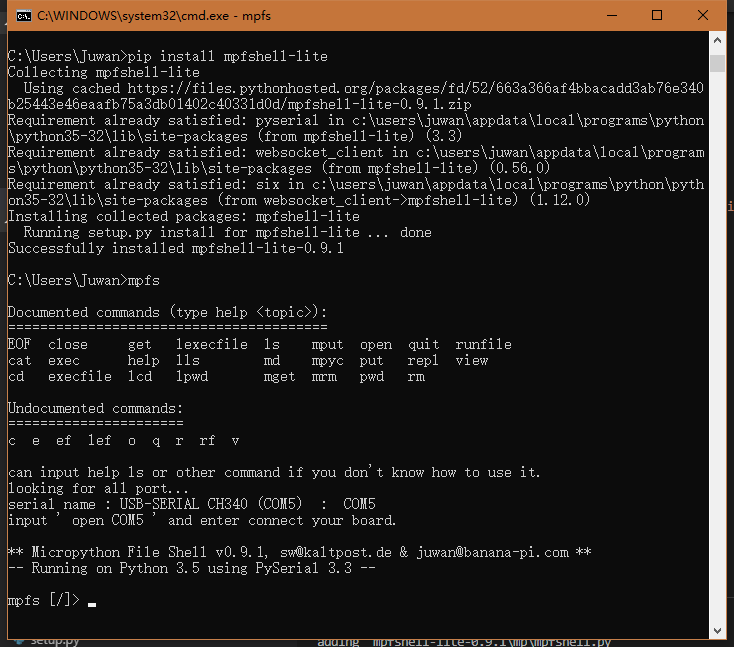
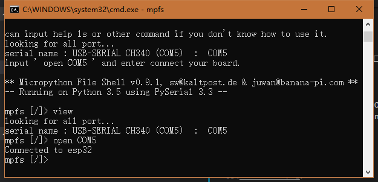
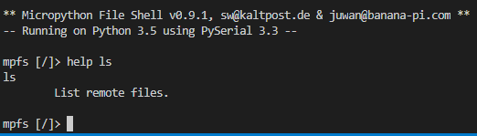

# &emsp;&emsp;&emsp;&emsp;A Shell Type Micropython File Explorer⛺

[中文文档](README.md)

[](./LICENSE)
[](https://badge.fury.io/py/mpfshell-lite)

The lite version of this mpfshell is an aggressive development version. The stable version is available at [mpfshell](https://github.com/wendlers/mpfshell).

## Features:

1. Compact, full-featured MicroPython management tools, such as: put\get\cat\rm\execfile and so on.

2. Fixed the problem of massive use of Windows, such as path, garbled code, etc., but some problems are still being solved in succession.

3. Green single file under Windows, out of the box, or using Python for cross-platform operation.

## System requirements

- Python 3.5.4 +
- requirements.txt

## Uasge

### 1. into [releases](https://github.com/junhuanchen/mpfshell-lite/releases) download mpfs.exe.

Find the version of the system you are using and download it.


### 2. Install using PIP

Using the Python PIP tool to download and install, in the console input ` pip insrall mpfshell-lite`, then enter `mpfs` can run.

```shell
pip install mpfshell-lite

mpfs
```



## Connect your hardware

Connect to your hardware and the port number of the current hardware will appear.

```
looking for all port...
serial name : USB-SERIAL CH340 (COM5)  :  COM5
input ' open COM5 ' and enter connect your board.
```

Enter 'open COM5' as shown in the figure to connect.



You can see ` Connected to esp32 ` already Connected.

## Run micropython code.

### 1.Run the code directly

```
mpfs [/]> view
looking for all port...
serial name : USB-SERIAL CH340 (COM5)  :  COM5
current open_args ser:COM5
mpfs [/]> open COM5
Connected to esp32
mpfs [/]> exec print('hello world!')
hello world!
mpfs [/]>
```


### 2.Run the code file

Prepare a Python code file (.py) on your desktop

```python
print('hello world!')
```


- use the exe version


Put exe with .py and follow these commands.

```
looking for all port...
serial name : USB-SERIAL CH340 (COM5)  :  COM5
input ' open COM5 ' and enter connect your board.

** Micropython File Shell v0.9.1, sw@kaltpost.de & juwan@banana-pi.com **
-- Running on Python 3.5 using PySerial 3.3 --

mpfs [/]> open com5
Connected to esp32
mpfs [/]> runfile ts.py
hello world!
Connected to esp32
mpfs [/]>
```


- use the PIP version

In CMD console mode, you need to use the following command to locate the folder path (LCD) and then run the file (runfile).


You can use the LCD location to run a file path, such as `lcd C:/Users/Juwan/Desktop` (note that is `/` is not `\`, this let a person tired)

```
mpfs [/]> open com5
Connected to esp32
mpfs [/]> lcd Desktop
mpfs [/]> lls

Local files:

 <dir> blog
       desktop.ini
       editor.exe
       mpfs-0.9.1.exe
       ts.py

mpfs [/]> runfile ts.py
hello world!
Connected to esp32
mpfs [/]>
```


## Use help

In the program, you can also get the details of the corresponding command description or parameters by using the help + command.



For example: `help cd`， returns the `cd <TARGET DIR>
​        Change current remote directory to given target.`。

You can see that it is used to change the current file directory starting point in the target board, equivalent to setting the default path of the folder in the board.

## Common mistakes

If there is a dead loop without any delay in the connection process, it will affect the success of the software connection board, especially the dead loop of main.py without delay, which will lead to the failure to connect to the hardware after power on. You can reset the connection rm main.py, which needs to be noted.

## Dissection tool

### 0. Supported version of the system

| system type | system version | running condition | notes |
| -------- | ---------------- | -------- | ------------------- |
| Windows | win7-win10 | normal | native CMD does not support TAB |
| Linux | luubuntu | normal | native Shell supports TAB |
| Mac | Darwin | normal | is consistent with Unix |

### 1. Important functional operations

| operation method | different system tools support | run effect | notes                                               |
| ----------------------------- | --------------------------------- | ------------------------------------------------------------ | ------------------------------------------------------------ |
| Enter something and complete it with the TAB key | Only the shell, repl, powershell support. | If you want to type "import", you only need to input "i" and then press the TAB key to complete it automatically. For example, in Linux, you can input "ttyUSB0" and only need "i + TAB". | It can only input completion history. |
| Left copy selection, right paste selection    | Windows only system support.           | Open the CMD console program attributes in the quick edit function, can let the program supports the mouse to click suspended after some drag copying the text content. | Are generally choose a line. |
| Up, down, left and right buttons and backspace            | all supports.                            | You can modify what you've typed. | Fixes were made for Windows                                   |

### 2. All of the use of the command

Command the braces for short, easy to use.

| command type | USES method | to run the result | note |
| ------------ | ------------------------------------------------------------ | ---------------------------------------------------- | ------------------------------------------------------------ |
| open (o) | opens the current device. Format: a serial port cable ` open com3 `, wireless ` ws: 192.168.10.114, 1234 ` | connection after a successful return to ` Connected to esp32 ` | control board before, need to open the connection first. The parentheses are shorthand.             |
| close        | closes the current device.                                               |                                                      |                                                              |
| quit (q)         | enters                                                              | exit the program                                                   |                                                              |
| EOF          | enters                                                         |  exit the program                                                    |                                                            |
| cat (c)          | Enter the file name, such as `cat boot.py`                              | Prints out the contents of the specified file on the board for quick viewing.                   |                                                            |
| put          | Push files from the current directory to the board, for example `put boot.py`              |                                                    | Failure returns an error message                                           |
| get          | Gets the files in the current directory of the board, for example `get boot.py`                  | Boot.py is added to the directory where the program is running (lpwd)              |                                                              |
| mput         | Opposite to put                 |                                                      |                                                              |
| mget         | Opposite to put                |                                                      |                                                              |
| repl (e)      | Enter python's repl control interface                                 | You can execute python code directly.                             |                                                              |
| exec (e)     | input Python Code, for example `exec print('hello')`                  | Returns the run result of print('hello')                   | Only one line of python code can be executed.                        |
| execfile (ef) | Python files that exist in the execution board, for example `execfile main.py`           | Execute the effect of main.py                                  |                                               |
| lexecfile (lef) | A python file that exists under the execution program, for example `lexecfile main.py`           | Execute the effect of main.py                                  | Unlike runfile will enter repl mode, so support input() operations.                                              |
| runfile (rf)  | It combines the put and execfile commands                                  |                                                      |                                                  |
| cd           | input Specify the directory in the board, for example `cd /` 或  `cd D:/Users`                           | Modify the program to access the board of the directory                           | To ` / ` separate Linux path. |
| md           | input Directory name                                                | Create a new directory on the board                                 |                                                            |
| lcd          | input Specifies the current directory in the program, for example `cd /`                       | Modify the directory in which the program accesses the board                           | To ` / ` separate Linux path. |
| pwd          | input`pwd`                                                    | Returns the directory on the current board                               |                                                            |
| lpwd         | input `lpwd`                                                  | Returns the directory in which the current program resides                               |                                                            |
| mpyc         | input Python files in the current directory, for example `mpyc main.py`           | Pyc python code static compilation code processing, generate main.pyc | need to have mpy-cross command in the system                                                            |
| mrm          | Enter the specified directory or file name `rm Directory or file name`                                     | Removes the directory or file name from the system                                           |                                                              |
| rm           | Enter the specified directory or file name `rm Directory or file name`                                     | Removes the directory or file name from the board                                           |                                                              |
| ls           | input` ls /`                                                  | View all files in the board's current directory                       |                                                              |
| lls          | input `lls /`                                                 | View all files in the program's current directory                       |                                                              |
| view          | input `view`                                                 | View the possible serial ports on the machine, and the current open configuration                     |                                                              |
| help         | View the help command, for example : `help lls`                             |                                                      |

# pyinstaller

1. create mpfs.exe

pyinstaller -F mpfs -i logo.ico

# uplaod pypi

```shell
python setup.py sdist build
```

```shell
# pip install twine
twine upload dist/* --verbose
```

