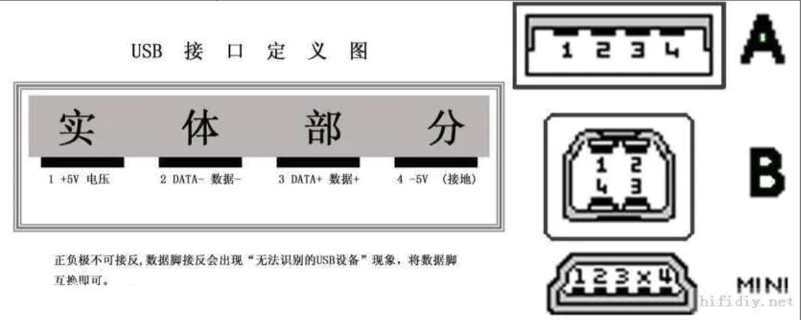

# 什么是串口

## 串口

COM口( cluster communication port )即串行通讯端口，简称串口。微机上的串口通常是9针，也有25针的接口，最大速率115200bps。

1. 通常用于连接鼠标（串口）及通讯设备（如连接外置式调制解调器进行数据通讯或一些工厂的数控机接口）等。

1. 一般主板外部只有一个串口，机箱后面和并口一起的那个九孔输出端（梯形），就是COM1口，COM2口一般要从主板上插针引出。并口是最长的那个梯形口；

1. 目前主流的主板一般都只带1个串口，甚至不带，慢慢会被USB 取代。

## USB 串口
USB，是英文Universal Serial Bus（通用串行总线）的缩写，是一个外部总线标准，用于规范电脑与外部设备的连接和通讯。是应用在PC领域的接口技术。

- USB 串口的特点

    1. 可以热插拔。就是用户在使用外接设备时，不需要关机再开机等动作，而是在电脑工作时，直接将 USB 插上使用。

    1. 携带方便。USB 设备大多以“小、轻、薄”见长，对用户来说，随身携带大量数据时，很方便。当然USB硬盘是首要之选了。

    1. 标准统一。大家常见的是 IDE 接口的硬盘，串口的鼠标键盘，并口的打印机扫描仪，可是有了USB之后，这些应用外设统统可以用同样的标准与个人电脑连接，这时就有了 USB 硬盘、USB 鼠标、USB 打印机等等。

    1. 可以连接多个设备。USB 在个人电脑上往往具有多个接口，可以同时连接几个设备，如果接上一个有四个端口的USB HUB时，就可以再连上；四个USB设备，以此类推，尽可以连下去，将你家的设备都同时连在一台个人电脑上而不会有任何问题(注：最高可连接至127个设备)。

- 传送速度

    1. USB 1.0是在1996年出现的，速度只有1.5Mb/s(位每秒)； 1998年升级为USB 1.1，速度也大大提升到12Mb/s ；

    1. USB2.0规范是由USB1.1规范演变而来的。它的传输速率达到了480Mbps，折算为MB为60MB/s，足以满足大多数外设的速率要求。

    1. USB 3.0的理论速度为5.0Gb/s，其实只能达到理论值的5成，那也是接近于USB 2.0的10倍了。

    1. USB 3.1，传输速度为10Gbit/s，三段式电压5V/12V/20V，最大供电100W ，新型Type C插型不再分正反。

## 串口和 USB 串口的区别

