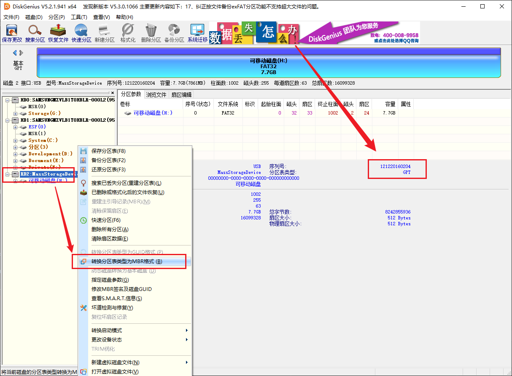

> 编辑于 2022.07.19

## MaixPy 与 C 开发有什么异同，我该怎么选择

MaixPy 是基于 Micropython 的脚本语言， 不需要编译，在运行时解析，编写起来更简单方便，只是运行时时实性不如 C 语言。
所以如果是快速验证、新手、只会 python、头发少等都可以用 MaixPy; 追求极限性能效率或者熟悉 C ，以及对 MaixPy 的长期运行的稳定性不太有信心的都可以使用 C 语言开发

## MaixPy IDE 无法成功连接开发板

**现象:**

​	开发板到手之后，一直无法连接 MaixPy IDE

* 检查固件是否支持 IDE， 早期的固件以及名字带`minimum`的固件都不支持
* 检查串口是否被占用（其它软件也打开了串口）
* 点击连接后，不用和终端工具同时使用，否则会出现串口占用无法打开
* 如果一直无法成功连接成功， 检查：
  * 请检查是否开发板型号选择错误；

  * 观察开发板屏幕是否有变化，如果没有反应可能是串口选择错误；

  * 尝试升级到最新的 [master 分支固件](http://cn.dl.sipeed.com/MAIX/MaixPy/release/master)， 以及最新的 MaixPy IDE 软件

    > MaixPy 版本号低于 0.5.0_v0 不支持连接 MaixPy IDE

## Micro SD 卡读取不到


Micro SD 读取不到现象及解决方法:

1. 确认 SD 能否在电脑上正常使用，如果不能即 SD 已损坏，

2. 电脑能够正常使用，读取 SD，但 MaixPy 开发板无法使用：

  SD 卡未格式化为 MBR 分区 FAT32 格式

3. 电脑能够正常使用 SD 卡，也确认 SD 卡的磁盘格式为 FAT32，但 MaixPy 开发板依旧无法使用：

  可能存在的原因：部分 SD 出厂时，sd 中没有磁盘分区表，或者磁盘分区表类型不是 MBR

  解决的方法：使用第三方磁盘管理软件，将 sd 分区表类型转换为 MBR, 并且将 sd 格式格式化为 FAT32

> 这里使用 **Diskgenius** 来转换磁盘分区表格式





3. SD 卡不支持 SPI 协议

目前硬件只能支持 SPI 协议读取， 尽量购买正规的卡

比如：下图左边两张卡 MaixPy 的驱动不支持， 中间和右边的都支持， 但是中间的 class10 卡速度最快（最高测过 128GB可用）
> 另外测试过网上购买的几张闪迪、金士顿、三星的卡，其中发现有一张三星的卡无法使用


## SD 卡支持多大容量

最大测试过 **1TB** 可以使用

## 使用 SD 加载文件、模型不成功

现象：我们在使用过程中可能遇到加载模型提示错误，

可能存在的问题原因: sd 不兼容，挂载不成功

验证 sd 卡是否挂载方法:

```python
import os
print(os.listdir("/"))
>>['flash'] # 没有挂载 SD 卡

>>['flash', 'sd'] # 挂载 SD 卡成功
```

## 为什么连接了 IDE 帧率降低了很多

K210 没有 USB 外设， 因此只能使用串口与 IDE 通信， 速度不如 USB 设备快，因此会影响帧率， 可以关闭 IDE 的摄像头预览


## 为什么 IDE 上预览的摄像头图像很模糊

K210 没有 USB 外设， 因此只能使用串口与 IDE 通信， 速度不如 USB 设备快， 因此对图片进行了压缩，如果需要看清晰的图像请在开发板的屏幕上看，或者保存成图片传到电脑查看

所以 IDE 的图像预览功能主要是给教学和演示使用， 平时建议使用屏幕，
可以使用以下代码来设置预览图质量
```python
sensor.set_jb_quality(95)
```
这样就将预览图的质量设置为了 `95%`， 但是帧率会有明显降低


## 怎么提高摄像头帧率

* 换更好的摄像头，比如 `ov7740` 帧率会比 `ov2640` 高一点。 但前提是摄像头电路必须与开发板的电路兼容
* 增加摄像头时钟频率(`sensor.reset(freq=)`)，但是注意不要太高，太高会让画面变差
* 可以自己编译源码，打开摄像头双缓冲选项（默认打开），并且 `sensor.reset(dual_buff=True)`，帧率会有所增加，但是相应地，耗费的内存也会增加（大约为 384KiB ）


## IDE 帧缓冲区成像方向不正确，LCD 显示方向不正确

由于 MaixPy 支持的硬件型号较多，在使用 MaixPy IDE 或者 LCD 显示的时候会出现显示的方向不正确,那么这时候我们就需要对图像进行旋转了;
在修正显示方向之前,我们需要确认是 Sensor 方向旋转(MaixPy IDE 右上角的图像即为 Sensor 直接输出的图像)了，还是 LCD 方向旋转了
修正方法:

- sensor 方向修正：

```python
# 设置摄像头水平镜像
# `enable`: 1 表示开启水平镜像 0 表示关闭水平镜像
sensor.set_hmirror(enable)

# 设置摄像头垂直镜像
# `enable`: 1 表示开启垂直镜像 0 表示关闭垂直镜像
sensor.set_vflip(enable)
```

- lcd 方向修正：

```python
# 设置 `LCD` 屏幕方向
# 参数: `dir`: 取值范围 [0,3]， 从`0`到`3`依次顺时针旋转
# 返回值: 当前方向，取值[0,3]
lcd.rotation(dir)

# 设置 `LCD` 是否镜面显示
# 参数: `invert`： 是否镜面显示， `True` 或者 `False`
# 返回值: 当前设置，是否镜面显示，返回`True`或者`False`
lcd.mirror(invert)
```

## 烧录 MaixPy 之后，MaixPy 出现无法启动

现象：我们在使用过程中可能遇到烧录 MaixPy 之后，MaixPy 出现无法启动(表象为 无法点亮屏幕，白屏 等)，

问题原因: 出现这种现象很大一部分是内部文件系统中的配置文件读取出错，或者我们设置的系统配置值(如 gc heap 值过大)出错导致系统无法启动。

解决方法：擦除文件系统(擦除全部 flash)

使用 kflash_gui 右上角选择`擦除`功能，然后加载`MaixPy 文件系统`模板，地址变成`0xD00000`, 长度变为`3MiB`

或者直接烧录擦除固件: 点击下载 [K210-chip_erase.kfpkg](https://dl.sipeed.com/fileList/MAIX/MaixPy/release/Erase_all/K210-chip_erase.kfpkg)

擦除后再重新烧录一次目标固件即可


## 使用 JTAG 调试器一直无法接连 K210

现象：使用裸机开发 K210, JTAG 调试器一直无法接连 K210

可能的原因：
  1. OpenOCD 调试环境搭建有问题（细节这里不说明）
  2. 烧录过 key_gen.bin 之后，将永久禁用 K210 的 JTAG 调试功能

## 下载，保存脚本到 MaixPy 内部flash 之后，板子无法更新固件，无法启动运行脚本

- 可能现象：下载，保存脚本到 MaixPy 内部flash 之后，板子无法更新固件，板子无法启动

  1. 程序中拉高了 GPIO16, 造成了自动下载点电路无法拉低 GPIO16,使 K210 进入 ISP 模式，手动拉低 16 号管脚即可

## kflash 无法烧录/更新 MaixPy 固件

kflash_gui 配置选项

- 开发板型号
  - 开发板型号选错
- 烧录空间(SRAM/Flash)
  - 烧录空间选错
- 波特率&下载速度模式
  - 下载波特率过高

## 出现 type object 'board_info' has no attribute 'XX'
请看[开发板配置文件](./../get_started/board_info.md),对开发板进行重新配置

## TF卡格式没有问题，但是无法读取TF卡，挂载失败
请使用
```python
from machine import SDCard
SDCard.remount()
```
进行重新挂载
使用
```python
def sd_check():
    import os
    try:
        os.listdir("/sd/.")
    except Exception as e:
        return False
    return True
print(sd_check())
```
进行检测是否挂载成功

## ValueError:[MAIXPY]kpu: load error:2002, ERR_KMODEL_VERSION: onlysupport kmodel V3/V4 now

1、更新固件，更新固件，更新到最新版本支持v3/v4的MaixPy固件，具体更新方法看前面的文档
2、检查存放模型的位置是否与读取的位置是否一致，如果将模型放到sd上，然后读取的位置为flash的0x300000时就会出现这样的错误
3、如果是使用以 smodel 为后缀模型，必需使用自己开发板上的机器码来获取模型。

## 在 MaixPyIDE 上运行 boot.py 文件时，卡死，没有显示，没有报错

如果你的模型是烧录到flash上，你需要在串口终端上运行boot.py里面的代码，输出一段红色的报错信息为`Out of memory`，这时你需要将模型放到sd上，然后再进行读取（一定要可以挂载的sd卡，否则都是白干）

## 运行模型的时候报 ValueError: [MAIXPY]kpu: load error:2006, ERR. NO_ MEM: memory not enough

同上 Out of memory ，请使用更小的固件获得更多的运行内存，标准固件大于 2m 剩余 1m 多，同理选用 600kb 可以获得 3m 多的运行内存，查看剩余运行内存看 [demo_view_mem.py](https://github.com/sipeed/MaixPy_scripts/blob/master/basic/demo_view_mem.py)。
这是内存不足了，不是 flash 或者是 sd 内存不够，是运行内存不够了。解决办法：

1. 这时需要跟换 mini 固件得以解决，如果还是不行，那就要减少训练的时候使用的数据集
2. 或者通过查看【[内存管理](./../course/others/mem.md)】这篇教程进行对内存和 GC 进行调整

## OSEerror: [Errno 2] ENOENT

所需要读取的文件不存在对应的路径上，如果这个文件是在sd卡上的话，建议查看sd卡是否挂载了

使用一下代码判断内存是否挂载上，如果挂载不上会放回False，可能是卡不兼容，或者是卡没有格式化好，如果不是在官方店买的卡，不能保证能用(`官方卡出现不能使用的及时与客服反馈`)
```python
def sd_check():
    import os
    try:
        os.listdir("/sd/.")
    except Exception as e:
        return False
    return True
print(sd_check())
```
可以使用下面代码进行重新挂载
```python
from machine import SDCard
SDCard.remount()
```

## 串口终端打不开板子，但是ide可以运行

1、检查串口是不是被ide占用了，因为串口只能用一个软件进行打开。
2、使用 ide 中软件菜单的串口终端打开

## ValueError: [MAIXPY]kpu: load error:2005,ERR_READ_FILE: read filefailed

检查sd卡上的模型模型和代码中的名字，路径是不是一样的。
检查模型下载地址是不是和程序一样

## 烧录了 key_gen.bin 之后的操作

烧录 key_gen.bin 之后，通过串口软件来连接开发板，然后按下 reset 按键，重启开发板，可以看到机器码打印到串口的接收区中。也可以通过 MaixPy IDE 中的 [串口终端](/soft/maixpy/zh/get_started/env_serial_tools.html#MaixPy-IDE终端工具)来连接开发板查看机器码。

获取到机器码之后，需要重新烧录需要使用的固件才能运行对应的代码。否则是连 IDE 都无法连接的

## 摄像头拍摄的模糊

使用 OV5642 摄像头拍摄出来的画面模糊，可以通过扭动摄像头来进行调整焦距。如果使用其他的摄像头拍摄的模糊也是同理，但有些摄像头特性就是如此，只能通过更改摄像头来进行修改

## 烧录模型或者固件，出现花屏、屏幕颜色不对、屏幕颜色单一

这时需要使用，使用 kflash 来对 flash 整片擦除，然后再重新进行对应的 固件 和 模型烧录。烧录模型到 flsah 的时候一定要注意烧录的位置，是否正确（数清楚对应 0 的个数）。

比如常见的白色花屏就是固件烧错，需要擦除重烧标准固件就正常了，主要因为屏幕配置不同导致的。

比如绿屏可能是摄像头损坏了输出了绿色图像。

比如红屏是正常的，但需要用户下载程序。

## TypeError: Can't convert to type 错误

Maixpy ide 挂着运行时内存不足，就会出现的常见错误，解决方法，换成菜单的打开终端运行，或让内存有一定预留就不会出现了。

## kpu:check img format err!

注意看终端输出提示，特别强调！！！

灰色字体的错误 kpu img w=320, h=240 but model w=224, h=224 

意思是说，这个模型的要求是 224 224 ，但输入的是 320 240 。

所以要改图片为 224 224 输入，如果是 128 128 同理修改图片尺寸！！！！！

要么使用 sensor.set_windowing 改变摄像头输入大小，要么对 图像 img.resize 改变图像大小。

## ValueError input not support

检查一下 Python 代码出错行，排查 ValueError 错误，一般发生在输入的类型不与目标函数所需的类型一致导致的错误，可能是内存不足导致对象为 None 也可能是类被回收了。

## OSError reset failed

这种情况可能是**摄像头接错、接反或被烧坏了**。可以先检查摄像头是否正确且正常被连接，确定没相关出现人为错误后只能确认是摄像头坏了。

建议使用 Sipeed 所提供的摄像头，用户自行配备的可能因为线序不符或者摄像头驱动不支持等原因而不能用。