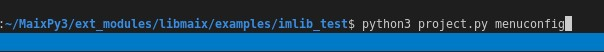
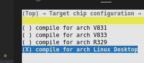
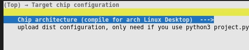
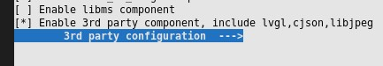

# MaixPy3 视觉模块开发

> 进度直播通过查看共享文档获得：<https://www.kdocs.cn/l/cfdsBPVRhXxo>

## 项目简介：

由于 MaixPy3 的环境传统视觉功能薄弱，所有需要结合 openmv 文档实现视觉模块的基础 API 功能以及应用，相关功能也会体现在产品介绍当中，其中一些相关模块可能配合应用需要完成，应用示例文档参考如下：https://book.openmv.cc/image/

- Feature-Detection 特征检测
- Image-Filters 图像滤波
- Color-Tracking 颜色追踪
- Codes-Tracking 标记追踪

依赖如下仓库，可在 X86 ubuntu20 本机仿真。
- [github.com/sipeed/maixpy3](https://github.com/sipeed/maixpy3)
- [github.com/sipeed/libmaix](https://github.com/sipeed/libmaix)

## 实现目标：（请查看底部最新进度）
能够满足如下应用：获取图像统计信息 / 寻找色块 / AprilTag标记跟踪 / 模板匹配 / 多模板匹配 / 特征点检测 / 测距 / 扫码识别 / 颜色形状同时识别 / 颜色模板匹配同时识别 / 高级特征


上图来自 maixpy3 文档 https://wiki.sipeed.com/soft/maixpy3/zh/usage/vision/maixpy3-example.html
## 代码原型：
MaixPy3 image 模块环境（用户直接调用的 API 层接口）
https://github.com/sipeed/MaixPy3/blob/develop/ext_modules/_maix_image/include/maix_image.h#L67
Libmaix imlib 模块环境（Openmv 底层核心算法）
https://github.com/sipeed/libmaix/blob/develop/examples/imlib_test/main/src/main.c#L190
## 开发指导：
- 在 maixpy3 的 develop 里准备好了所有需要的环境
- 接口采用 image.xxx 通过参数选择所用的函数。
- 每个模块都要包装到可用的示例代码程度，先设计示例代码再封装功能函数，最后才去实现。
- 在 ubuntu20 上测试过后再到实机中开发，可以节约大量生命。
本模块邀请开源社区的同学一起开发，参与到开发或测试的同学可以直接领取 V831 和 R329 硬件，参与度（提交）足够的情况下是可以不用归还的，所以要来就进群吧！预计开发周期为一、二个月，我会在本周确认参与的开发人员，请自带 ubuntu20 实机测试环境喔，摄像头和屏幕缺一不可，参与者在外部参与人员中登记。


## 官方负责人员：
- 陈俊欢 (大佬鼠)
- 万启超

## 外部参与人员：
- 戚晨夕
- 王晓
- 刘子健
- Steven 
- 刘闫兴
- Alex 
- 曾广仕
- 叶炯凯
- 针针扎
- 斌
- 张罗东 
- 爱笑的莫妮卡
- 奈奎斯特不稳定
- 黄涛
- 东东
- 吴冰晶
- 李伟

## 分工情况：
主要划分为 开发 和 测试 两块
测试 主要负责内容为准备测试案例、测试效果、文档接口说明，整理好需要开发做的功能和流程，协助开发实现。
开发 主要负责具体代码的编写和实现，从 C / C++ 到 Python 平台的适配，根据文档完成接口的输入输出，配合测试文档完成功能。
请在微信群中备注自己的名称，然后想做的部分登记在这里，最后再进行分工，工作内容主要分开发和测试，无论是开发还是测试都需要在本机准备好环境，先在 ubuntu20 完成功能测试后再上到实机测试，可以提高效率，节约生命。
- 陈俊欢 开发
- 万启超 开发
- Steven 开发
- Alex     测试
- 张罗东  测试
- 爱笑的莫妮卡     测试
- 叶炯凯 测试
    - 图像拼接、融合：画中画、多张局部图像合成一张全局图像、
    - 物体检测：帧差分法(检测有无物体运动，实现简单快速)，光流检测(进一步获取物体运动轨迹）
    - 分割： 漫水填充(魔术棒、需要找到一个种子点）
    - 滤波：（时域、快）高斯、均值、中值、双边、NLM、导向滤波 (频域、慢）同态、带阻/带通滤波、小波
    - 增强：gamma、自适应直方图均衡、自适应对比度、白平衡相关（灰度世界···）
- 针针扎     测试
- 斌 测试
- 刘子健（兔子） 测试
- 奈奎斯特不稳定 测试
    - 透视矫正：将原本的透视图转换为俯视图或者任意一个平面（可以准确得获得图像信息）
    - 距离测试：获取与指定物体的距离
    - 标记跟踪定位：包括测距，定位物体与镜头的相对位置，在以定位物体为原点的坐标系中获取摄像头的位置，或者以摄像头为中心原点获取定位物的坐标（以俯视图为平面的二维坐标或者直接在三维上返回六个自由度）
    - 快速线性回归：对连续的曲线进行分析，得出曲线的运动趋势。
- 曾广仕 开发
- 黄涛 测试
- 东东 开发
- pepsi 测试
- 王晓 开发
- 胡宗向 测试
- 刘闫兴 开发
- 芃芃爹  测试
- 吴冰晶 测试
- taorye 开发
- 李伟 测试
- SimonLiu 测试

## 问与答

Q：如何参与？
A：进群加入我们的讨论吧！

Q：如何提交？
A：直接在 MaixPy3 和 Libmaix 的仓库上提交或 PR 就行，最终也是看提交的。

Q：如何开发？选择了 测试就不可以开发了吗？
A：测试是起点，代表内测用户的体验，然后开发是基于测试的内容进行的，这代表测试和开发都可以一起做，互不冲突，只是侧重点不同。
e
Q：开发需要做什么？测试需要做什么？
A：开发的需要了解底层实现和代码在哪，能够跑代码修代码测代码改代码。测试需要了解用户是如何使用的，能够说明这个功能是怎么设计怎么使用的，需要什么接口，使用流程是怎样的？文档说明提供出来。开发需要实现对应功能的移植优化，做好鲁棒性，做好接口的统一封装，让使用者不需要了解内部数据流转的细节，调用相应接口就可以完成输出需要的数据

Q：报错 InportError: No module named pybind11 ？
A：安装 sudo apt install python3-pybind11 或 pip3 intall pybind11 

## 项目进度：

## 第一次会议 2022-03-29 （~~准备中~~，计划 9 点左右）
### 会议主题：

主要目的是分析现有应用所需要的模块，确保分工方式和合并方式，依赖模块为 特征检测 图像滤波 颜色追踪 标记追踪。

目前为大佬鼠想象的，可能不准确，需要结合文档示例代码来分析所需接口，还有待探讨。

> 底层实现肯定都是存在的，但不代表完美可用，所以才需要封装。

假设两个人一组，分测试和开发，测试先确定文档和示例代码效果，开发先分析要做的模块都有哪些，最后我们统一汇总各个讯息。

确定接口内容我们再开始，由我@Juwan 负责统筹确保项目运作。

### 功能表（如果发现有更多有意义有需要的功能可以分析后继续添加）
- 获取指定区域图像统计信息 https://book.openmv.cc/image/statistics.html
    - 颜色空间处理，如 LAB RGB HSV
    - 平均数、中位数、众数、标准差，最大最小值
- （过时）特征检测模块（准备用自学习检测取代）
    - 模板匹配、多模板匹配、特征点检测 https://book.openmv.cc/image/keypoints.html
- 颜色追踪模块
    - 颜色、线条、形状同时识别 https://book.openmv.cc/image/blob_circle.html
- 标记追踪模块
    - 条形码、二维码扫码与定位 https://book.openmv.cc/image/code.html
    - AprilTag标记跟踪 测距 https://book.openmv.cc/image/ranging.html
- 图像滤波模块 https://book.openmv.cc/example/04-Image-Filters/adaptive-histogram-equalization.html
    - 各种图像滤波、边缘滤波、腐蚀膨胀
    - 锐化、取反、二值化、直方图均衡、旋转校正
- （过时）高级特征 HAAR HOG LBP （方法）
    - 人脸、眼球、梯度方向和强度的统
    
### 准备工作、如何协作、如何提交？

环境、代码、功能、接口

首先在开始硬件开发之前，我们需要准备好 ubuntu20 系统，要确保能够访问摄像头方便测试。
- [github.com/sipeed/maixpy3](https://github.com/sipeed/maixpy3)
- [github.com/sipeed/libmaix](https://github.com/sipeed/libmaix)

请准备上述两个模块，测试和开发的同学都需要，请通过 git clone 获取上述仓库。
拉取子模块 'git submodule update --init --recursive' 

### 这里有自动化编译的命令给你们参考如何编译a。
#### 准备工作需要做什么？

MaixPy3 文档 https://github.com/sipeed/MaixPy3/blob/develop/docs/develop.md
MaixPy3 编译流程 https://github.com/sipeed/MaixPy3/blob/release/.github/workflows/maixpy3_build.yml#L19-L34
libmaix 文档 https://github.com/sipeed/libmaix/blob/develop/README_ZH.md
libmaix 编译流程 https://github.com/sipeed/libmaix/blob/develop/.github/workflows/test_build.yml#L26-L36

### MaixPy3 编译安装的结果（不要在 jupyter notebook 里写死循环！）
了解本文 https://wiki.sipeed.com/soft/maixpy3/zh/install/install.html 完成 maixpy3 的安装与测试。

测试人员需要会写 markdown 并能够安装 MaixPy3 并运行测试，会用 jupyter 记录运行结果，能够一步步测试给出反馈和结果，如下图。

### libmaix 编译安装的结果

开发人员需要能够编译 libmaix 和 MaixPy3 的运行、调试、打包，学会编译运行最基础的 camera 项目即可，知道如何使用 libmaix 的项目就行，测试人员不需要了解 libmaix 的编译与测试。
```shell
cd ~/MaixPy3/ext_modules/libmaix/examples/imlib_test
python3 project.py --toolchain /usr/bin --toolchain-prefix x86_64-linux-gnu- config
python3 project.py menuconfig
```



确认启用了模块。


编译 python3 project.py build 出来

然后直接 ./dist/start_app.sh 就行，我的示例代码演示了 find_line & rotation_corr 。

这表示你具备了本机的开发环境，最起码的开发和调试环境，它会调用默认的 /dev/video0 设备显示并使用，如上图所示。
#### 提交内容都有什么？如何提交你的成果？
验收方式怎么做？测试怎么设计？用户怎么使用？
最终测试人员要提供的内容有一份 jupyter notebook 文档（含测试用例、示例代码，测试报告说明），最终会以作者署名的方式提交到 wiki.sipeed.com 文档中，请参考我们其他文档是怎么写的 。
最终开发人员要提供属于自己的提交和署名，如何 PR 提交等如何使用开发、测试、发布分支，包含独立的测试代码和自己的开发工程，从 imlib_test 拷贝出来即可。
会议纪要：
- 需要确认人员和准备工作（已经标黄，其他同学没有参加会议对请确认准备工作对内容后，自行标黄表示已得知，之后我会在这些同学里进行了解和分配）
- 需要确认项目内容与全员同步（请看功能表，请继续补充，直到我们所有人准备好的时候，进行第一次合作开发，提前准备好的同学直接和我说就行）
- 需要确认各自的定位和分工（开发和测试对内容应该都清楚了，准备好各自对要点就行，我们挨个挨个对，先收集所有必备对功能点）
- 需要确认项目的提交与合并方式（使用 github 进行切到开发 develop 分支提交代码完成功能后最后统一 pr 进入 future 分支，最终合并回 release 分支完成最终的提交和代码审计）

## 第二次会议 2022-04-02 （准备中，计划 9 点左右）

在准备阶段，确保开发准备好开发环境（可电脑运行），测试准备好测试环境（可导出文档），最后准备完毕后继续。 

可以在节假日的时候进行人员的确认和分工，以及参与人员的统计，确定本次开发的功能列表以及进度表，预计完成时间，由我牵头开发的同学一起完成，如果出现人员特殊意外均由官方人员兜底，不会影响整体进度，如果其他同学因为事情搁置则提前移交任务出来给其他人继续完成，比如@Juwan 可以保证所有功能没有人处理的时候亲自处理。

在下一次会议来之前，需要统计好需要增加的功能，进而准备 API 设计和测试文档，测试即文档，可见下文。

### MaixPy3 image 现有功能表
```shell
>>> t = camera.capture()
>>> t.
t.c_img_private(          t.draw_string(            t.new(
t.clear(                  t.find_ball_color(        t.open(
t.convert(                t.find_blob_lab(          t.resize(
t.copy(                   t.find_blobs(             t.rotate(
t.crop(                   t.find_circles_blob(      t.save(
t.custom_find_ball_blob(  t.find_line(              t.set_pixel(
t.delete(                 t.get_blob_color(         t.show(
t.draw_circle(            t.get_blob_lab(           t.size
t.draw_ellipse(           t.get_pixel(              t.tobytes(
t.draw_image(             t.height                  t.width
t.draw_line(              t.load(                   
t.draw_rectangle(         t.mode                    
>>> 
```
image 模块：
- 属性查询 API ：width 、height 、mode、size
- 文件读写 API ：new 、load、open 、 save、delete
- 图像处理 API ：tobytes、copy、crop、get_pixel、set_pixel、draw_xxxx、get_blob_color、rotate、clear、convert、show
- 视觉算法 API ：find_xxxx、

预期增强的功能表（源自于第一次会议的草稿，可随时添加更多功能，取决于有没有必要）
- 获取指定区域图像统计信息 https://book.openmv.cc/image/statistics.html
    - 颜色空间处理，如 LAB RGB HSV
    - 平均数、中位数、众数、标准差，最大值、最小值
- 颜色追踪模块
    - 颜色、线条、线段、方块、形状同时识别 https://book.openmv.cc/image/blob_circle.html
    - find_rects
    - find_lines
    - find_circles
    - find_line_segments
- 标记追踪模块
    - 条形码、二维码扫码与定位 https://book.openmv.cc/image/code.html
    - AprilTag标记跟踪 测距 https://book.openmv.cc/image/ranging.html
    - find_barcodes
    - find_datamatrices
    - find_apriltags_3d_pose 3D定位
    - find_apriltags AprilTag识别
- 图像滤波模块 https://book.openmv.cc/example/04-Image-Filters/adaptive-histogram-equalization.html
    - 各种图像滤波、边缘滤波、腐蚀膨胀
    - 锐化、取反、二值化、直方图均衡、旋转校正
    
### 沟通记录
- @Juwan 封装接口的开发样例 https://github.com/sipeed/MaixPy3/commit/3ac83ef6a479ceafce288d0b2a2378a92f15a286 建议每次都重新编译安装 python3 setup.py clean --all build && python3 install . 确保代码有更新，最终效果如下：
- 分别测试了一下沿 X 轴 和 Z 轴旋转了一下。


```python
from maix import image
t = image.Image().new((240, 240), color=(255, 0, 0))
print(t)

t.draw_string(120, 20, "hello")
t.draw_circle(120, 120, 60, color=(0, 250, 0), thickness = -1)

t.imlib_rotation_corr(0.3)

from maix import display
display.show(t)

import time
time.sleep(2)
```

- 测试文档示范可以从 wiki 里的这些 jupyter note 文档可以参考 API 设计和具体的测试。
https://github.com/sipeed/sipeed_wiki/tree/main/docs/soft/maixpy3/zh/usage/vision
- 举例来说是这样的
https://github.com/sipeed/sipeed_wiki/blob/main/docs/soft/maixpy3/zh/usage/vision/maixpy3-example.ipynb
- 对应的效果在这里
https://wiki.sipeed.com/soft/maixpy3/zh/usage/vision/maixpy3-example.html

会议纪要：
暂无

