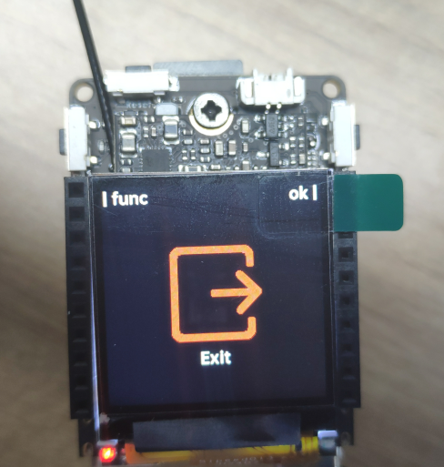

> 设置一个板块来让大家知道最近增加了哪些内容

## MaixPy3 更新日志

---

### V0.5.1 

Release 页面： https://github.com/sipeed/MaixPy3/releases/tag/MaixPy-0.5.1

#### V831

- 分离出名称带 maixhub 和 maixpy3 的镜像；前者内置了开机应用，后者无开机应用。

- image 模块修复了 find_blobs 的 lab 阈值不准确的问题。

- image 添加了 image.cv_orb() 的 orb 特征提取 和 find_template ncc 模板匹配函数，效率基本满足 10 ~ 15 fps。

#### R329

- 无新更新内容

---

### V0.5.0 

Release 页面： https://github.com/sipeed/MaixPy3/releases/tag/MaixPy-0.5.0

#### V831

- 内置 maixhub 应用，可以直接在线训练并且直接部署。在线训练网址：maix.sipeed.com
- 启动顺序为先执行 /root/app/main.py 然后是 /root/main.py。不需要 maixhub 一键部署后可以直接 `rm -rf /root/app`

相关问题：

- 使用时候被提醒 `Camera is busy` 时记得手动退出一下开机应用

#### R329

- 无新更新内容

---

## MaixPy3 开发进度跟踪

- 点击相关项目名称可以跳转到对应的展示页面

| 项目                                         | 进度       |
| -------------------------------------------- | ---------- |
| [自学习检测](./self_yolo.md)                 | 待公开     |
| [Maixsmart 串口框架](./maixcam.md)           | 待公开     |
| [中文语音识别模型](./maix_speech.md)         | 待公开     |
| [MaixSense YOLO 训练方法](./r329_yolo.md)    | 待公开     |
| [MaixSense 人脸识别](./face_reco.md)         | 待公开     |
| [MFCC关键词检测](./maixpy3_mfcc.md)          | 已归档 |
| [MaixII-Dock 摄像头 ISP 调试](./v83x_isp.md) | 已公开     |
| [AprilTag 标签定位](./apriltag.md)           | 已公开     |
| [传统视觉算法](./opmv_cv.md)                 | 已公开     |

通常步骤说明如下：（点不开可能是没有写说明，但有在做。）

1. 在计划 （收到社区反馈）
2. 开发中 （在做了在做了） 或 待移植 （需要复制粘贴修代码）
3. 待测试 （在测了在测了）
4. 待整理 （在写了在写了）
5. 待公开 （此时已经完成了基本功能原型、性能与效果测试、相关应用与开发文档，但没有公开）
6. 待合并 （该功能已经公开，但未能合并到 MaixPy3 项目，通常是某些硬件专属功能、工具）
7. 已公开 （该功能已经完成基础功能并公开）

当完成上述步骤后，就表示该功能已进到 maixpy3 项目中。