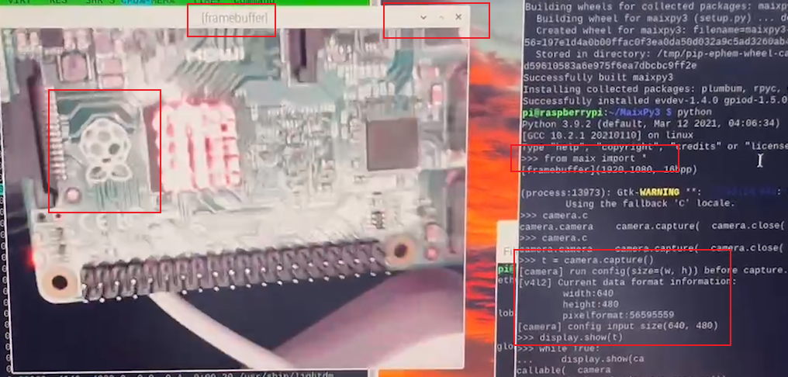
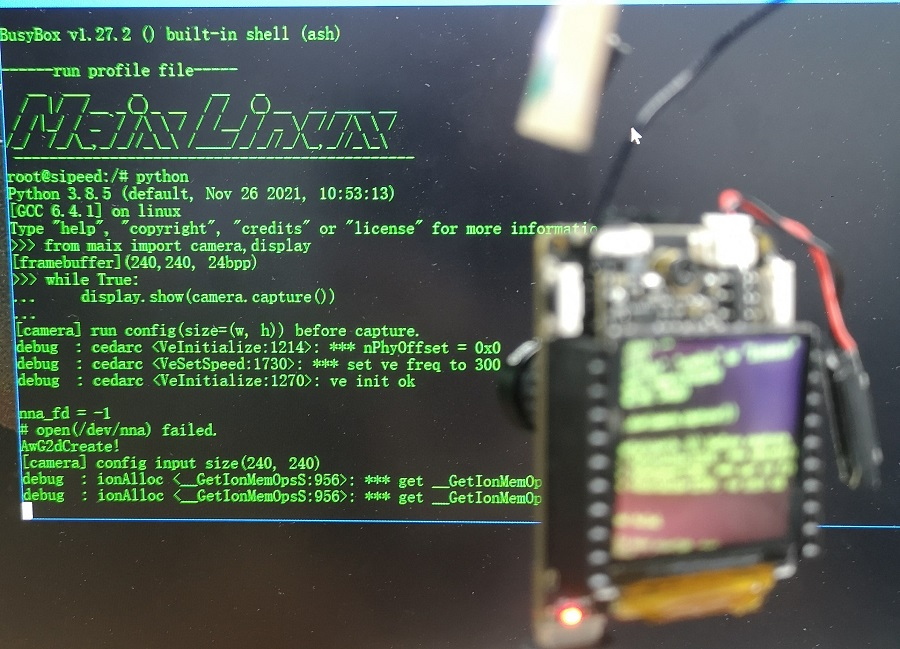
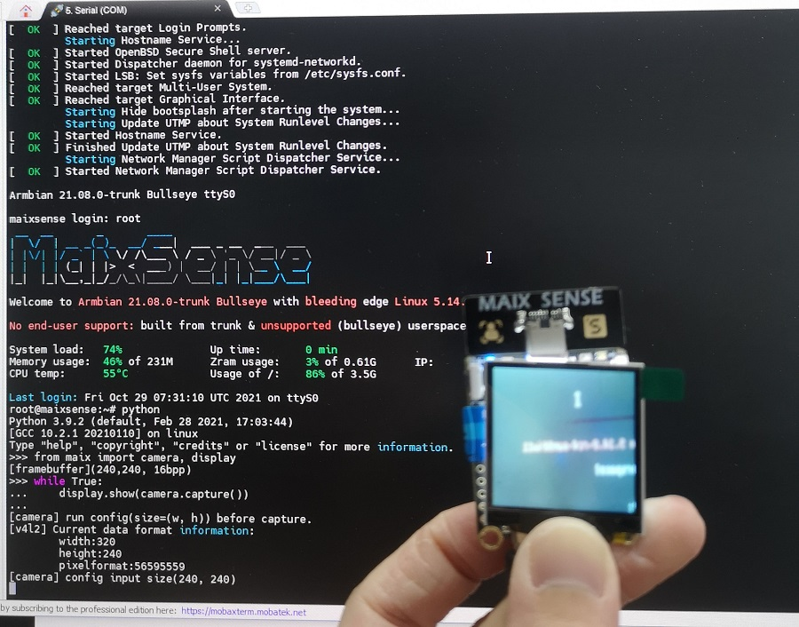

## 目前 MaixPy3 适配的平台

目前 MaixPy3 用于 Linux 平台，为用户提供了板子的 Python 编程基础模块、如摄像头、屏幕、I2C等传感器外设的用法、以及后续需要的图像处理、传统算法、AI 算法模块等相关功能模块，未来会陆续适配其他低端嵌入式芯片平台。

- [Linux Desktop](https://github.com/sipeed/MaixPy3)

- [MaixII-Dock](/hardware/zh/maixII/M2/resources.html)

- [MaixSense](/hardware/zh/maixII/M2A/maixsense.html)

## 使用 pip3 安装并更新 MaixPy3

```python
pip3 install maixpy3 --upgrade
```

## Linux Desktop 安装 MaixPy3

在终端执行下面命令来安装 MaixPy3

```bash
sudo apt update && sudo apt install libjpeg-dev gcc libopencv-dev -qq -y && wget http://mirrors.kernel.org/ubuntu/pool/main/libf/libffi/libffi6_3.2.1-8_amd64.deb && sudo apt install ./libffi6_3.2.1-8_amd64.deb -qq -y

pip3 install maixpy3

```

在设备上输入下面命令来测试拍照

```python
from maix import camera, display
display.show(camera.capture().draw_string(0, 0, "hello world!"))
```

下面为实拍图。


通常来说，像树莓派 2B 这类拥有桌面环境的 linux 设备也是可以通过 pip 进行安装 Linux Desktop 分支的，使用效果一样。



## MaixII-Dock 安装与更新 MaixPy3

- 可以通过烧录内置最新版本 MaixPy3 的系统镜像
- [手动更新](/soft/maixpy3/zh/tools/0.MaixII-Dock.html#如何更新-MaixPy3-包) MaixPy3 软件包。



## MaixSense 安装 MaixPy3

MaixSense 需要是烧录官方提供最新内置 MaixPy3 的 Armbian 镜像。

```shell
root@maixsense:~# pip3 install maixpy3

Requirement already satisfied: maixpy3 in /usr/local/lib/python3.9/dist-packages (0.3.4)
Requirement already satisfied: Pillow in /usr/lib/python3/dist-packages (from maixpy3) (8.1.2)
Requirement already satisfied: zbarlight in /usr/local/lib/python3.9/dist-packages (from maixpy3) (3.0)
Requirement already satisfied: evdev in /usr/local/lib/python3.9/dist-packages (from maixpy3) (1.4.0)
Requirement already satisfied: spidev in /usr/local/lib/python3.9/dist-packages (from maixpy3) (3.5)
Requirement already satisfied: pyserial in /usr/local/lib/python3.9/dist-packages (from maixpy3) (3.5)
Requirement already satisfied: rpyc in /usr/local/lib/python3.9/dist-packages (from maixpy3) (5.0.1)
Requirement already satisfied: gpiod in /usr/local/lib/python3.9/dist-packages (from maixpy3) (1.5.0)
Requirement already satisfied: plumbum in /usr/local/lib/python3.9/dist-packages (from rpyc->maixpy3) (1.7.0)

root@maixsense:~# python #运行python
Python 3.9.2 (default, Feb 28 2021, 17:03:44)
[GCC 10.2.1 20210110] on linux
Type "help", "copyright", "credits" or "license" for more information.
>>> from maix import camera,display
>>> while True:
···    display.show(camera.capture())
```

输出以上信息则是代表安装好了，以下为实拍图。

