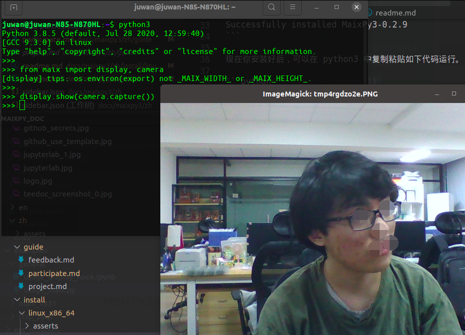

## 可适配平台

目前 MaixPy3 所能兼容的平台有 [MaixII-Dock](/hardware/zh/maixII/M2/introduce.html)、[MaixSense](/hardware/zh/maixII/M2A/R329.html)、Linux，后续会推出更加多可适配的平台


### MaixII-Dock 上安装 MaixPy3

在 MaixII-Dock 的最新[镜像](https://dl.sipeed.com/shareURL/MaixII/MaixII-Dock/SDK/release)中是会在第一次开机时自动进行安装，如果在安装过程中途断电，安装会自动取消，而且 Maixpy3 的安装包也会被删除，这时则需要进行手动安装 Maixpy3 包，或者重新[安装镜像](/hardware/zh/maixII/M2/flash.html)

手动安装需要在连接网络之后，通过 `pip install maixpy3` 进行安装，或者通过 `pip install -U Maixpy3` 进行更新

```shell
root@sipeed:/# pip install maixpy3
pip install maixpy3
Requirement already satisfied: maixpy3 in /usr/lib/python3.8/site-packages (0.3.2)
Requirement already satisfied: evdev in /usr/lib/python3.8/site-packages (from maixpy3) (1.4.0)
Requirement already satisfied: pyserial in /usr/lib/python3.8/site-packages (from maixpy3) (3.4)
Requirement already satisfied: Pillow in /usr/lib/python3.8/site-packages (from maixpy3) (7.2.0)
Requirement already satisfied: spidev in /usr/lib/python3.8/site-packages (from maixpy3) (3.5)
Requirement already satisfied: zbarlight in /usr/lib/python3.8/site-packages (from maixpy3) (3.0)
Requirement already satisfied: rpyc in /usr/lib/python3.8/site-packages (from maixpy3) (5.0.1)
Requirement already satisfied: gpiod in /usr/lib/python3.8/site-packages (from maixpy3) (1.4.0)
Requirement already satisfied: plumbum in /usr/lib/python3.8/site-packages (from rpyc->maixpy3) (1.6.9)
root@sipeed:/# python
Python 3.8.5 (default, Sep 17 2021, 03:45:02)
[GCC 6.4.1] on linux
Type "help", "copyright", "credits" or "license" for more information.
>>> import maix
>>> 
```

输出以上信息则是代表安装好了

### MaixSense 安装 MaixPy3

MaixSense 在最新的镜像中已经内置了 MaixPy3，但是随着 MaixPy3 的更新会导致镜像中的 MaixPy3 不是最新的版本，则需要进行手动更新

```shell
root@maixsense:~# pip install maixpy3
Requirement already satisfied: maixpy3 in /usr/local/lib/python3.9/dist-packages (0.3.4)
Requirement already satisfied: Pillow in /usr/lib/python3/dist-packages (from maixpy3) (8.1.2)
Requirement already satisfied: zbarlight in /usr/local/lib/python3.9/dist-packages (from maixpy3) (3.0)
Requirement already satisfied: evdev in /usr/local/lib/python3.9/dist-packages (from maixpy3) (1.4.0)
Requirement already satisfied: spidev in /usr/local/lib/python3.9/dist-packages (from maixpy3) (3.5)
Requirement already satisfied: pyserial in /usr/local/lib/python3.9/dist-packages (from maixpy3) (3.5)
Requirement already satisfied: rpyc in /usr/local/lib/python3.9/dist-packages (from maixpy3) (5.0.1)
Requirement already satisfied: gpiod in /usr/local/lib/python3.9/dist-packages (from maixpy3) (1.5.0)
Requirement already satisfied: plumbum in /usr/local/lib/python3.9/dist-packages (from rpyc->maixpy3) (1.7.0)
root@maixsense:~# python
Python 3.9.2 (default, Feb 28 2021, 17:03:44)
[GCC 10.2.1 20210110] on linux
Type "help", "copyright", "credits" or "license" for more information.
>>> import maix
>>>


```

> 如果不是使用最新的系统镜像是无法进行 MaixPy3 的安装的


### Linux 上安装MaixPy3

> 2021年02月21日 在 ubuntu20 与 manjaro20 上测试通过。

通过 `pip3 install maixpy3` 安装。

```bash
juwan@juwan-N85-N870HL:~/Desktop/v831_toolchain_linux_x86/MaixPy3$ pip3 install .Looking in indexes: https://pypi.tuna.tsinghua.edu.cn/simple
Processing /home/juwan/Desktop/v831_toolchain_linux_x86/MaixPy3
Requirement already satisfied: Pillow in /usr/lib/python3/dist-packages (from MaixPy3==0.2.9) (7.0.0)
Requirement already satisfied: evdev in /home/juwan/.local/lib/python3.8/site-packages (from MaixPy3==0.2.9) (1.4.0)
Requirement already satisfied: gpiod in /home/juwan/.local/lib/python3.8/site-packages (from MaixPy3==0.2.9) (1.4.0)
Requirement already satisfied: numpy in /home/juwan/.local/lib/python3.8/site-packages (from MaixPy3==0.2.9) (1.19.4)
Requirement already satisfied: opencv-python in /home/juwan/.local/lib/python3.8/site-packages (from MaixPy3==0.2.9) (4.5.1.48)
Requirement already satisfied: pyserial in /usr/local/lib/python3.8/dist-packages (from MaixPy3==0.2.9) (3.4)
Requirement already satisfied: rpyc in /home/juwan/.local/lib/python3.8/site-packages (from MaixPy3==0.2.9) (5.0.1)
Requirement already satisfied: spidev in /home/juwan/.local/lib/python3.8/site-packages (from MaixPy3==0.2.9) (3.5)
Requirement already satisfied: plumbum in /home/juwan/.local/lib/python3.8/site-packages (from rpyc->MaixPy3==0.2.9) (1.6.9)
Building wheels for collected packages: MaixPy3
  Building wheel for MaixPy3 (setup.py) ... done
  Created wheel for MaixPy3: filename=MaixPy3-0.2.9-cp38-cp38-linux_x86_64.whl size=115611 sha256=54f70f181ccc629f1eaf470bf30eccd20389c6333814d7145e16a31db7f6cdcd
  Stored in directory: /tmp/pip-ephem-wheel-cache-9bf1q3wt/wheels/53/7d/47/6cd374fab930089f96a0a3185f5677e52a9b71dbbee769935d
Successfully built MaixPy3
Installing collected packages: MaixPy3
  Attempting uninstall: MaixPy3
    Found existing installation: MaixPy3 0.2.8
    Uninstalling MaixPy3-0.2.8:
      Successfully uninstalled MaixPy3-0.2.8
Successfully installed MaixPy3-0.2.9
```

现在你安装好后，可以在 python3 中复制粘贴如下代码运行。

```python
from maix import display, camera
display.show(camera.capture())
```

现在你可以看到系统唤起了图像浏览器显示的摄像头捕获的图像。



> 它借助了 opencv-python 和 PIL 的接口功能实现的。


## jupyter 安装

jupyter 是一个可以进行可视化运行代码的平台，可以将代码和运行之后得到的结果保留下来，非常适合新手学习使用，而且还支持 markdown 语法编写文本

想在 linux 单片机平台上使用 jupyter 进行编程，需要对平台和电脑进行环境的配置使用

### 电脑端安装

电脑端需要安装好 python 环境才能进行下面的步骤，如果没有安装 python 请自行通过右上角搜索自行查找，或者自行百度查找 python 安装教程

需要在电脑端上安装 jupyter 和 RPyC 内核

    pip install jupyter  rpyc_ikernel

如果安装下载比较慢的时候可以通过添加中科大源来进行加速

    pip install -i https://mirrors.ustc.edu.cn/pypi/ jupyter  rpyc_ikernel

出现以下提示，则说明安装结束
```bash
Installing collected packages: rpyc-ikernel, jupyter
Successfully installed jupyter-1.0.0 rpyc-ikernel-0.3.5
```

运行 `python -m rpyc_ikernel.install` 进行rpyc 测试，输出以下信息则说明了安装成功了

```bash
Installing IPython kernel spec of RPyc
C:\Users\STR\AppData\Local\Programs\Python\Python38\lib\site-packages\rpyc_ikernel\install.py:30: DeprecationWarning: replace is ignored. Installing a kernelspec always replaces an existing installation
  k.install_kernel_spec(td, 'RPyc', user=user,
...into C:\Users\STR\AppData\Roaming\jupyter\kernels\rpyc
```

### 平台安装教程

Linux 开发板平台通过安装 MaixPy3 的时候会自动安装 RPyc ,但是可能需要进行手动的更新

pip install -U RPyc 进行更新即可

### Jupyter 启动！

安装好 Jupyter 后就可以开始使用了，由于 jupyter 是没有快捷方式启动的，需要在系统的命令行中启动

通过键盘上的 win + R，打开`运行`,输出 cmd 进入命令行中，输入 jupyter-notebook ，就可自动运行并在默认的浏览器中打开 jupyter
> 建议使用谷歌浏览器打开，或者 win10 系统自带的 Edge 中打开
>
> 打开 jupyter 之后命令行窗口不要关闭


```bash
[I 13:46:55.487 NotebookApp] Serving notebooks from local directory: D:\jupyter
[I 13:46:55.487 NotebookApp] Jupyter Notebook 6.4.4 is running at:
[I 13:46:55.488 NotebookApp] http://localhost:8888/?token=2d5ef1957ac331137cc92561ebbc14b8f4700e5a76b89d63
[I 13:46:55.488 NotebookApp]  or http://127.0.0.1:8888/?token=2d5ef1957ac331137cc92561ebbc14b8f4700e5a76b89d63
[I 13:46:55.488 NotebookApp] Use Control-C to stop this server and shut down all kernels (twice to skip confirmation).
[C 13:46:55.539 NotebookApp]

    To access the notebook, open this file in a browser:
        file:///C:/Users/STR/AppData/Roaming/jupyter/runtime/nbserver-4216-open.html
    Or copy and paste one of these URLs:
        http://localhost:8888/?token=2d5ef1957ac331137cc92561ebbc14b8f4700e5a76b89d63
     or http://127.0.0.1:8888/?token=2d5ef1957ac331137cc92561ebbc14b8f4700e5a76b89d63
c:\users\str\appdata\local\programs\python\python38\lib\json\encoder.py:257: UserWarning: date_default is deprecated since jupyter_client 7.0.0. Use jupyter_client.jsonutil.json_default.
  return _iterencode(o, 0)

```


点击右边的 new 可以看到两个内核选项，一个是 python3， 一个是 rpyc-python，说明环境安装成功，选择 rpyc-python 进新建一个 jupyter 文件，然后输入并运行，可以得到平台信息，即可开始运行使用 Maixpy3 进行调试开发了

```python
$connect("192.168.0.42")
import platform
print(platform.uname())
```
```shell
[ rpyc-kernel ]( running at Thu Oct 28 16:46:43 2021 )
uname_result(system='Linux', node='sipeed', release='4.9.118', version='#2369 PREEMPT Tue Oct 26 08:46:44 UTC 2021', machine='armv7l', processor='')
```


> 想要了解更多关于 jupyter 的可以看附录中的《[如何使用 jupyter]()》
