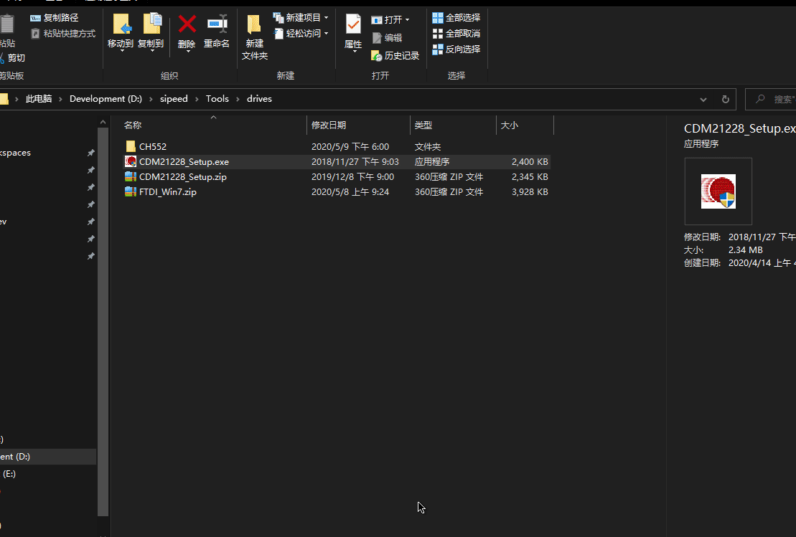
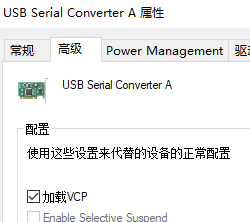

> 请将 USB 口插入到 USB UART 口从而获得串口。

## Linux & macOS

Linux & macOS 系统自带驱动不需要安装，使用 `ls /dev/ttyUSB*` 即可看到设备号。

```bash
juwan@juwan-N85-N870HL:~$ ls /dev/ttyUSB*
/dev/ttyUSB0  /dev/ttyUSB1
juwan@juwan-N85-N870HL:~$ 
```

## Windows

> 不想手动安装就去下载安装[驱动精灵](http://www.drivergenius.com/)自动完成串口驱动安装。

开发板使用 `GD32` 模拟 `FT2232`，`Windows` 用户需要安装 `FT2232` 的串口驱动。

- USB 串口驱动: **FT2232** ->[[下载链接点这里](https://dl.sipeed.com/MAIX/tools/ftdi_vcp_driver)](https://dl.sipeed.com/MAIX/tools/ftdi_vcp_driver)

在拿到开发板并连接到电脑的时候, 可以打开设备管理器查看串口驱动是否已经安装,打开设备管理器的方法有:
- 此电脑(右键) -> 属性 -> 设备管理器
- 开始菜单(右键) -> 设备管理器
- 控制面板 -> (搜索)设备管理器


### 当我们的系统是 Windows 10 系统,系统则会帮我们自动安装驱动，而如果是旧版 Win7，win8 系统，我们就需要自己手动安装 USB 驱动:


### 打开上一节的的链接下载驱动


### 点击安装



### 安装完成之后,可以在设备管理器看到已经识别到两个串口设备了(其中只有一个串口可用)


## **注意！如果只看到一个串口**


在设备管理器中对该 USB 设备勾选 VCP 选项。



## 关于 USB 串口的疑难杂症排查

如果安装驱动后仍然没有看到串口，请按如下顺序排查硬件问题。

- 插入电脑，是否存在叮咚一声，如插入 U 盘时USB 驱动加载的声音，没有表示硬件上的串口芯片出问题了。
- 更换线材重试，更换电脑 USB 口重试，仍然加载不出来，更换电脑确认。

如果没有办法烧录固件，请按如下顺序排查硬件问题。

- 使用串口工具设置 115200 波特率连接串口查看硬件当中是否有返回数据，按复位键（RST）接收到芯片的数据，不管是什么数据都表示串口芯片工作正常，如果没有数据则表示硬件异常。
- 如果到这里了，还是不能解决问题，则硬件确实存在缺陷，可能是芯片程序上出了问题。
