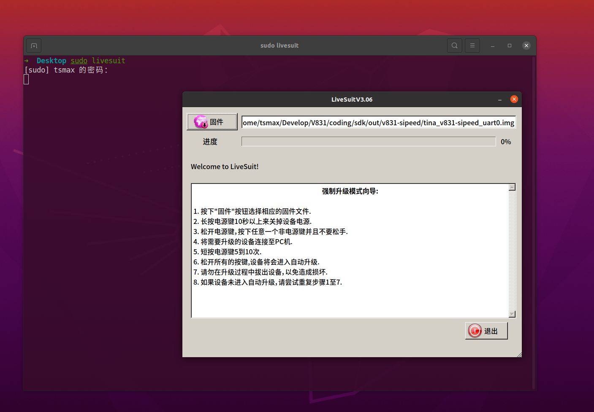
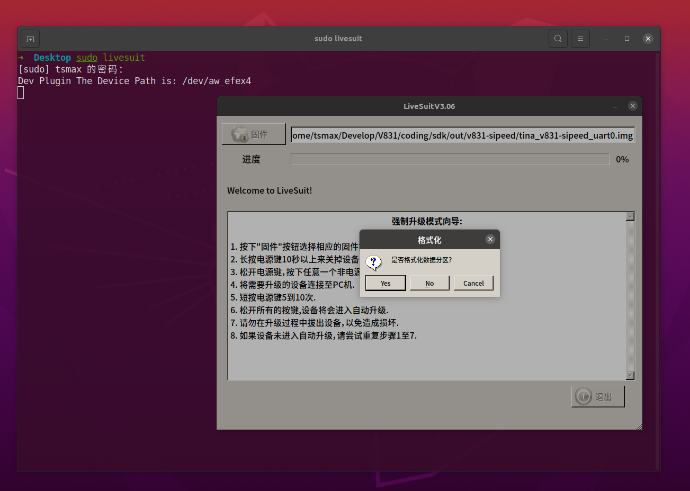

> ！！！一定要严格按照步骤操作！！！请使用大于 1G 的 TF/SD 卡进行烧录，开源版本要求使用 TF/SD 卡来启动系统。

V831 为全志的 SOC， 所以 Windwos 使用 **PhoenixSuit**, Linux 上使用 **Livesuit** 烧录镜像文件。

- 从下载站获取最新的 V831 系统镜像 [SDK_MaixII/release](http://dl.sipeed.com/shareURL/MAIX/SDK_MaixII/release) ，找不到就搜索 V831 获取最新的镜像。

- 解压 V831 镜像压缩包，得到一个 xxxx.img 文件。

- 从网上获取 PhoenixSuit(Windows) 烧录工具。
  - [baidu-PhoenixSuit](https://www.baidu.com/s?wd=PhoenixSuit)
  - [bing-PhoenixSuit](https://www.bing.com/search?q=PhoenixSuit&FORM=BESBTB&mkt=zh-CN) 
  - [github-PhoenixSuit](https://github.com/colorfulshark/PhoenixSuit)
  - [lo4d-PhoenixSuit](https://phoenixsuit.en.lo4d.com/windows)

## Windows 上使用 PhoenixSuit 烧录

解压 PhoenixSuit(Windows) 工具压缩包，不插入 SD 卡，将 V831 USB OTG 接口连接到 PC， 打开设备管理器， 安装驱动文件


打开烧录软件,  并浏览打开镜像文件


重新插拔板子（上电不插入 SD 卡），软件提示是否要清空烧录，提示是否需要升级，点击 `YES` 


插入 sd 卡，提示是否强制格式化，再次点击 `YES`开始烧录（大约 40S）


可能需要等待几秒才会更新状态，然后等待提示“固件升级成功”，即可断开 USB ，至此固件烧录完毕


## Linux(Ubuntu) 使用 Livesuit 烧录

> [https://linux-sunxi.org/LiveSuit](https://linux-sunxi.org/LiveSuit)

> [ubuntu 安装 LiveSuit 刷机工具](https://www.codenong.com/cs105573875/)

> [https://github.com/QinYUN575/allwinner-livesuit.git](https://github.com/QinYUN575/allwinner-livesuit.git)

### 安装烧录工具 Livesuit 

> **每次更新系统 linux kernel 之后需要重新按照软件**

1. 安装依赖 dkms

```shell
sudo apt install dkms
```

1. 安装 libpng1.2（一定要使用这个版本）

```shell
wget http://archive.ubuntu.com/ubuntu/pool/main/libp/libpng/libpng_1.2.54.orig.tar.xz
tar xvf  libpng_1.2.54.orig.tar.xz
```

```shell
cd libpng-1.2.54
./autogen.sh
./configure
make -j8
sudo make install
```

更新链接库:

```shell
sudo ldconfig
```

1. 安装 **livesuit**

```shell
git clone --recursive https://github.com/QinYUN575/allwinner-livesuit.git
cd allwinner-livesuit
chmod +x livesuit_installer.run
sudo ./livesuit_installer.run
```


### 使用 Livesuit 烧录

`sudo livesuit` 打开烧录工具，并点击“固件”选择镜像文件



不插入 SD 卡，将 V831 USB OTG 接口连接到 PC, 提示是否格式化分区，这时候插入 SD 卡，之后点击 `YES`



等待烧录完成，提示“固件升级成功”，即可断开 USB ，至此固件烧录完毕


## 常见问题：

系统烧录步骤严格按照文档要求，先打开软件，拔 SD 卡后插入电脑，等待提示确认后再插入 SD 卡自动完成安装。

《[error while loading shared libraries: libpng12.so.0](https://askubuntu.com/questions/895897/error-while-loading-shared-libraries-libpng12-so-0)》
