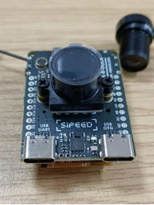

## 准备以下东西：

## 撕开3个贴片螺母的隔热胶

无图

## 安装天线

## 安装模块

## 贴上灰色导热胶在主芯片

## 接上屏幕，并压下到灰色导热胶上，请注意屏幕排线

## 插上摄像头板，请**注意方向**

## 用棉签清洁传感器表面，然后放上座子，上两颗M2x7黑色平头螺丝

## 装上镜头，旋转5圈左右

## 在镜头座与板子之间用黑色胶绕一圈固定，镜头向上，放置12小时后才能发货

