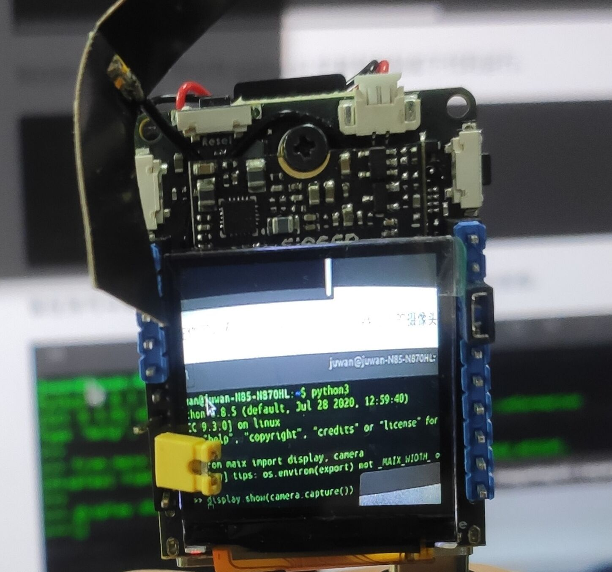

## 认识 openwrt 系统

> 全志 V831 使用 Tina Linux 系统，移植自 openwrt 。

OpenWrt 可以被描述为一个嵌入式的 Linux 发行版，可见 [官方网址](https://openwrt.org) & [官方开源仓库](https://github.com/openwrt/openwrt)。

OpenWRT 是一个高度模块化、高度自动化的嵌入式 Linux 系统，拥有强大的网络组件和扩展性，常常被用于工控设备、电话、小型机器人、智能家居、路由器以及 VOIP 设备中。 同时，它还提供了 100 多个已编译好的软件，而且数量还在不断增加，而 OpenWrt SDK 更简化了开发软件的工序。

### opkg 包管理器

Opkg 是一个轻量快速的套件管理系统，目前已成为 Opensource 界嵌入式系统标准。常用于 路由、 交换机等 嵌入式设备中，用来管理软件包的安装升级与下载。

```bash
root@sipeed:/# opkg list
MaixPy3 - 0.2.5-1
alsa-lib - 1.1.4.1-1
busybox - 1.27.2-3
busybox-init-base-files - 167-1612350358
ca-certificates - 20160104
curl - 7.54.1-1
dropbear - 2015.71-2
e2fsprogs - 1.42.12-1
eyesee-mpp-external - 1.0-1
eyesee-mpp-middleware - 1.0-1
eyesee-mpp-system - 1.0-1
......
```

#### 常用命令

- opkg update 更新可以获取的软件包列表
- opkg upgrade 对已经安装的软件包升级
- opkg list 获取软件列表
- opkg install 安装指定的软件包
- opkg remove 卸载已经安装的指定的软件包

### pip 包管理器

[pip](https://pypi.org/project/pip/) 是 Python 包管理工具，该工具提供了对 Python 包的查找、下载、安装、卸载的功能。

> 以下讯息由[YanxingLiu](https://github.com/YanxingLiu)提供与测试。

#### pip换源

在安装系统后可以更换镜像源，加速 pip 安装。

#### 临时使用

```
pip install -i https://pypi.tuna.tsinghua.edu.cn/simple some-package
```

some-package 请自行更换成你想要安装的包

#### 设为默认

升级 pip 到最新的版本 (>=10.0.0) 后进行配置：

```
pip install -i https://pypi.tuna.tsinghua.edu.cn/simple pip -U
```

设置清华镜像源为默认：

```
pip config set global.index-url https://pypi.tuna.tsinghua.edu.cn/simple
```

### 常用 Linux 命令

- ls 查看目录下文件
- cd pwd mv cp rm 一套文件管理命令
- vi 编辑文件内容
- top 查看系统内存
- df 查看磁盘信息
- time 查看时间
- ifconfig 查看网络信息
- free 查看剩余内存
- ps 查看运行的进程
- kill killall 杀死指定进程
- chmod 给某个文件权限
- passwd 设置用户的密码
- more cat 查看文件内容
- ping 检测某网址是否连通
- wget 下载某链接文件
- grep 搜索文件内容
- ln 建立文件链接

## 测试屏幕方法

> 请测试前观察系统上电后屏幕是否会闪烁一次，这表示屏幕已经通电、驱动起来，并对其复位（RST）后产生的。

在 Linux Shell 运行 `cat /dev/urandom > /dev/fb0` 就会输入随机数据到 fb0 产生雪花屏了，这表示屏幕显示是正常的。

<center></center>

> 帧缓冲（framebuffer）是 Linux 为显示设备提供的一个接口，把显存抽象后的一种设备，他允许上层应用程序在图形模式下直接对显示缓冲区进行 读写操作。framebuffer 是 LCD 对应的一种 HAL（硬件抽象层），提供抽象的，统一的接口操作，用户不必关心硬件层是怎么实施的。这些都是由 Framebuffer 设备驱动来完成的。帧缓冲设备对应的设备文件为 /dev/fb*，如果系统有多个显示卡，Linux下还可支持多个帧缓冲设备，最多可达 32 个，分别为 /dev/fb0 到 /dev/fb31，而 /dev/fb 则为当前缺省的帧缓冲设备，通常指向 /dev/fb0，在嵌入式系统中支持一个显示设备就够了。帧缓冲设备为标准字 符设备，主设备号为 29 ，次设备号则从 0 到 31 。分别对应 /dev/fb0-/dev/fb31 。

## 运行 Python3 解释器

在 Linux 上使用 Python 编程只需要在 shell 命令行交互的接口输入 python3 即可启动，可直接复制代码粘贴后按回车键运行。

```python
import platform
print(platform.uname())
```

2021年02月23日 实际操作结果：

```bash
   __  ___     _        __   _               
  /  |/  /__ _(_)_ __  / /  (_)__  __ ____ __
 / /|_/ / _ `/ /\ \ / / /__/ / _ \/ // /\ \ /
/_/  /_/\_,_/_//_\_\ /____/_/_//_/\_,_//_\_\ 
 ----------------------------------------------
Linux sipeed 4.9.118 #77 PREEMPT Wed Feb 3 11:06:36 UTC 2021 armv7l GNU/Linux
Please press Enter, then input maixpy3_config.py complete your configuration.

root@sipeed:/# python3
Python 3.8.5 (default, Jan 17 2021, 06:07:56) 
[GCC 6.4.1] on linux
Type "help", "copyright", "credits" or "license" for more information.
>>> import platform
>>> print(platform.uname())
uname_result(system='Linux', node='sipeed', release='4.9.118', version='#77 PREEMPT Wed Feb 3 11:06:36 UTC 2021', machine='armv7l', processor='')
>>> 
```

## 测试拍照功能

```python
from maix import display, camera
display.show(camera.capture())
```

<center></center>

> 如果发现屏幕没有亮起显示摄像头内容，确保系统是最新的，排查硬件接线与通电方面的问题，通常产品出厂前都会做外设硬件测试的。

## **使用 Jupyter 开发**

> 注意！！！！ MaixPy M2dock 不支持在本机安装 Jupyter ！！！

请看左侧目录的【常用的开发工具】>>>【Jupyter】 学习安装和使用。

在配置系统后会开机启动远程调用服务（RPyC），你可以在 `ps` 命令中得知是否开启了 rpyc 远程调用服务，如：`python3 -c from maix import rpycs; rpycs.start()` 命令。

## 相关参考资料

> 有些不属于 MaixPy3 的文档资料，但它对于你使用和理解 Linux 系统操作会有帮助。

- [MaixII M2dock I2C 调试](./v831_i2c.md)
- [MaixII M2dock GPIO 调试](./v831_pin.md)
- [MaixII M2dock WIFI 调试](./v831_wifi.md)
- [MaixII M2dock pwm 调试](https://www.cnblogs.com/juwan/p/14343977.html)
- [MaixII M2dock spi 调试](https://www.cnblogs.com/juwan/p/14341406.html)
- [MaixII M2dock update_dtb 工具（更新设备树）](https://www.cnblogs.com/juwan/p/14345372.html)

## 想知道更多？请往左侧目录的【一些使用案例】上前进吧！
