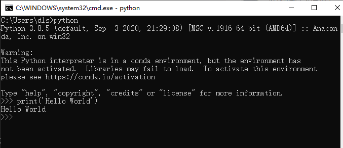

> 本文是给有一点 Python 基础但还想进一步深入的同学，有经验的开发者建议跳过。

## 前言

上文讲述了如何认识开源项目和一些编程方法的介绍，这节主要来说说 Python 代码怎么写的一些演化过程和可以如何写的参考，在现在的 Sipeed 开源社区/社群里，有太多的新手不知道如何写好 Python 代码，尤其是嵌入式中的 Python 代码也是有不少的技巧和观念需要注意的，至少让这篇文章从循环开始说起。

> 可以把本文当作一篇经验之谈，主要是探讨代码稳定性与性能，以及一些计算机知识的拓展。

## 学会循环执行代码

当写下第一行代码的时候，在电脑上的 Python 解释器运行效果是这样的。

```python
print('Hello World')
```



而嵌入式设备上的 python 是通过串口（serial）传出来。


当写完了第一行 `Hello World` 的 `print` 函数，总不能一直复制、粘贴代码吧。

```python

print('Hello World')
print('Hello World')
print('Hello World')
print('Hello World')
print('Hello World')

```

也不是只运行验证功能就好了吧，所以加上了循环（`while`）执行代码。

```python

while True:
    print('Hello World')

```

如果想要稳定一些，最好还要为它加入异常机制，保证它不会因为 Python 代码的运行出错而停下来。

```python

while True:
    try:
        print('Hello World')
    except Exception as e:
        pass

```

## 循环代码中为什么需要异常机制

是不是以为 print 这样的代码就不会出错？其实不然，其实程序越接近底层硬件越容易出错。

从功能上说上文两者之间并没有什么区别，都是输出，但你会发现串口输出可能会出现下面几类情况。

- 串口芯片损坏或线路断路、串口到芯片的通路损坏导致的串口没有数据输出。
- 串口线路数据不稳定、串口协议（波特率、停止位）等配置错误导致的数据乱码。

这就意味着你会遇到很多来自硬件上的问题，所以要注意到这些意外。

那在软件代码上会发生什么有关于硬件上的意外呢？

通常有无响应、无应答、未连接等不成功的错误，它们是来自 IO 的错误。

- 当网络连接失败后需要超时重连，传输数据通道闲置时需要定时检查心跳数据包。
- 当配置文件写入后通常会读出来确认真的写入了，也是为了防止出错，可能是存储介质出错，也可能是逻辑出错。
- 当用户向输入框填了错误数据，不用写怎么判断和处理，不合法的数据抛出异常就行。

因为这些现象太多不确定的可能性，才会需要对代码进行异常捕获机制，来决定是否放过这次意外，可能会在下一次的循环就恢复了，这样就能够基本保证了 Python 代码循环的稳定性了。

## 来自外部/硬件上异常机制

这样就足够了吗？

事实上有些错误不源于 Python 代码，可能来自于底层 C 代码，或其他程序，上文说的异常机制只能捕获 Python 异常，不能捕获来自其他语言的异常。

所以实际情况比想象的要更严峻一些，当你无法解决不稳定的系统带来其他异常的时候，通常在服务器程序上设计会在外部附加一个守护程序（如调试程序）来定时检查自己的程序，例如可以检查下面的一些情况。

- 检查当前的系统是否能联网
- 检查数据库的通路是否正常
- 检查指定的程序是否在运行

总得来说，你要为你的程序做一个监控程序，可以是守护程序，也可以是看门狗。

> 具体怎么实现，可以了解一些守护进程的实现。

## 看门狗（watchdog）是什么？

如上述的守护程序是靠一个软件去监控另一个软件的状态，而看门狗的工作行为描述如下：

假设有一条需要定时吃饭（更新）的狗、如果不定时喂它（feed）就会饿着肚子叫。那么问题来了，什么时候狗会叫呢？因为人（芯片）死了，没人喂它了。（这也许是一个冷笑话）

看门狗是要求芯片程序负责定时喂狗，如果没有喂狗就狗就饿死了，作为报复狗会把芯片重启。让它可以继续喂狗。

任何硬件产品都有可能出现意外和错误，看门狗相当于芯片上的最后一层保障机制，通常它可能会发生在函数栈的指针参数执行出错，导致后续的喂狗操作再也执行不到了，具体怎么实现，可以查阅不同芯片提供的程序接口或寄存器。

## 优化！优化！！优化！！！

当你的程序已经跑起来以后，你会发现程序并没有达到令人满意的效果，在性能、内存上都没有经过任何考虑，只是实现了最起码的功能而已，那么完成了功能以后，可以如何继续呢？

当然，在优化程序之前得先建立计算代码执行时间的观念，建立起最简单的性能指标，如在代码加上时间计算。

```python
def func():
    i = 20**20000

import time
last = time.time()
func()
tmp = time.time() - last
print(tmp)
```

在 CPU I5-7300HQ 的计算机上见到每一次的循环的时间间隔约为 0.000997781753540039 不足 1ms 即可完成。

```bash
PS C:\Users\dls\Documents\GitHub\MaixPy3> & C:/Users/dls/anaconda3/python.exe c:/Users/dls/Documents/GitHub/MaixPy3/test.py
0.000997781753540039
```

注意不要写到 `print(time.time() - last)` ，因为重定向后的 print 是相当耗时的，尤其是当内容输出到串口终端或网页前端的时候，如下使用 M2dock 设备来演示一下串口输出。

> 重定向指改变内容要输出的地方

```bash
root@sipeed:/# python3
Python 3.8.5 (default, Jan 17 2021, 06:07:56)
[GCC 6.4.1] on linux
Type "help", "copyright", "credits" or "license" for more information.
>>> def func():
...     i = 20**20000
...
>>> import time
>>> last = time.time()
>>> func()
>>> tmp = time.time() - last
>>> print(tmp)
0.09001994132995605
>>>
>>>
>>> def func():
...     i = 20**20000
...
>>> import time
>>> last = time.time()
>>> func()
>>> print(time.time() - last)
1.480057954788208
>>>
```

可以看到相差可能有 1 秒，而事实上只需要 90ms 就可以完成 func 函数的运算，这就产生了误差导致不准确，若是使用 jupyter 输出就会看到 0.026456356048583984 需要 26ms 可以较为准确的推算出它的真实运算结果。


为什么会造成这种差异的原因是因为串口依次输入命令输出结果需要时间，所以依次输入语句执行自然会存在误差，而 jupyter 是通过网络 socket 连接传输显示到屏幕上，所以耗时误差只会发生在运算重定向输出结果的时候，最终结果会较为贴近真实运算结果，通过保存下述代码文件来运行即可得知真实情况下约为 26 ~ 28ms 完成。

```bash
root@sipeed:/# cat test.py
def func():
    i = 20**20000

import time
last = time.time()
func()
tmp = time.time() - last
print(tmp)

root@sipeed:/# python test.py
0.028677940368652344
root@sipeed:/#
```

所以从现在建立起最基础的计算耗时，并且认知到在计算机的世界里，毫秒其实已经很慢了，然后可以类比一种感受，人眼感到流畅的画面至少是 24 fps ，而平时的视频在 15 fps 的流动是不会让你感受到卡顿的，如果低于这个阈值，则会出现卡顿造成心理上的不愉快，这个 15 fps 意味着每秒 15 张存在变化的画面，如果用程序来类比就是 1000 ms / 15 = 66 ms ，也就是每个流程操作最好是在 66ms 内完成，这样用户才不会觉得卡顿，同理，当 1000ms / 24 = 41ms 就可以确保用户体验这个软件的时候会觉得流畅。

有了基本的性能指标，就有了优化的对比参考，如果是一些测试框架会帮助你自动完成每个函数的耗时统计，但在没有现成框架工具的时候就要稍微辛苦一下自己了。

### 讲一些经典案例

在日常中存在最多操作就是循环和判断，显然好的优化就是减少不必要的指令操作，可以通过改变代码的执行结构来进行优化，下面就来具体分析吧。

如某个向网络上发送数据的操作，最初可能会按人类直觉写出以下的代码，这是一种不用思考也可以很容易写出来的同步阻塞式的结构，每一条语句都是满足了某些条件再继续执行。

```python

def xxxx_func():
    import random
    return random.randint(0, 1)

while True:
    is_idle = True
    if is_idle is True:
        print('try start')
        is_ready = xxxx_func()
        if is_ready is True:
            print('try ready')
            is_connected = xxxx_func()
            if is_connected is True:
                print('try connect')
                is_send = xxxx_func()
                if is_send is True:
                    print('try send')
                    is_reply = xxxx_func()
                    if is_reply is True:
                        print('wait reply')
                        is_exit = xxxx_func()
                        if is_exit is True:
                            print('operate successfully')
```

而优化只需要加状态变量改写成状态机结构（fsm）就可以了，所有代码都可以平行化执行，并根据执行频率的重要程度（权重）调整各项判断的顺序，尤其是移除一些不必要的判断。

```python
def xxxx_func():
    return 1

# state value
is_idle, is_ready, is_connected, is_send, is_reply, is_exit = 0, 1, 2, 3, 4, 5
state = is_idle

while state != is_exit:

    if state is is_reply:
        print('wait reply')
        state = is_exit if xxxx_func() else is_send
        continue

    if state is is_send:
        print('try send')
        state = is_reply if xxxx_func() else is_connected
        continue

    if state is is_connected:
        print('try connect')
        state = is_send if xxxx_func() else is_ready
        continue

    if state is is_ready:
        print('try ready')
        state = is_connected if xxxx_func() else is_idle
        continue

    if state is is_idle:
        print('try start')
        state = is_ready
        continue
```

这样改造执行结构后，每个代码之间的上下文关系并不强烈，是否执行某个语句取决于系统对于某个状态是否满足，如果状态失败也不会倒退回最初的判断，也就不需要每次都对各个状态做检查，检查只会发生在出错的时候状态跌落（state - 1）。

缺点就是需要消耗一些记录状态的变量(●'◡'●)，不过代码的拓展性和维护性就上来了。

> 可以根据实际情况增加状态的判断或是减少状态的转移（调整状态转移范围），如直接设置 state = is_ready，假设某些操作是已知的就可以跳过，可以添加 continue 跳过一些不可能发生的状态。

### 还有吗？

进一步优化还可以干掉 if 直接将状态与函数联合索引执行，简化代码如下。

```python

is_a, is_b, is_c = 0, 1, 2

state = is_a

def try_b():
    global state
    state = is_c

def try_a():
    global state
    state = is_b

func = [try_a, try_b]

while state != is_c:
    func[state]()
    # print(state)

```

基于上述结构给出一个示例代码参考。

```python

class xxxx_fsm:

    is_start, is_ready, is_connected, is_send, is_reply, is_exit = 0, 1, 2, 3, 4, 5

    def xxxx_func(self):
        return 1

    def __init__(self):
        self.func = [self.try_start, self.try_ready, self.try_connect, self.try_send, self.wait_reply]
        self.state = __class__.is_start # state value

    def wait_reply(self):
        self.state = __class__.is_exit if self.xxxx_func() else __class__.is_send

    def try_send(self):
        self.state = __class__.is_reply if self.xxxx_func() else __class__.is_connected

    def try_connect(self):
        self.state = __class__.is_send if self.xxxx_func() else __class__.is_ready

    def try_ready(self):
        self.state = __class__.is_connected if self.xxxx_func() else __class__.is_start

    def try_start(self):
        self.state = __class__.is_ready

    def event(self):
        self.func[self.state]()

    def check(self):
        return self.state != __class__.is_exit

tmp = xxxx_fsm()

while tmp.check():

    tmp.event()

    # print(tmp.state)
```

其实上述的有限状态机并非万能的代码结构，只是刚好很适合拆分已知的复杂业务逻辑的同步阻塞代码，那么还有什么结构可以选择吗？有的，此前说的都是同步阻塞的代码，所以还有所谓的异步执行的代码。

### 说说异步的执行方式

在这之前的代码都是按每个循环的步骤有序执行完成功能（同步执行），但现实生活中的操作一定是按顺序发生的吗？其实不然，其实很多操作可能会在任意时刻发生。

想象一个程序，它会响应来自网络的数据，也会响应来自人类的按键输入操作，这两个操作如果按上述的结构来写，可能会是下面这样。

```python
import time, random

def check_http():
    time.sleep(random.randint(0, 3))
    return random.randint(0, 1)

def http_recv():
    while True:
        if check_http():
            print('http_recv')
            break

def check_key():
    time.sleep(random.randint(0, 2))
    return random.randint(0, 1)

def key_press():
    while True:
        if check_key():
            print('key_press')
            break

while True:
    http_recv()
    key_press()
```

可以看到 http_recv 和 key_press 两个事件的检查会各自占据一段不知何时会触发或结束的检测的时间，程序只能循环等待这些事件会不会发生（或称轮询）。

这是个看起来可以工作但浪费了很多时间的程序，现实里接收到许多用户的网络连接，而服务程序不可能只服务某个用户的连接。

所以改写异步的第一步就是简化代码中不必要的循环，将每个需要循环等待的部分拆分成非阻塞的函数。

> 非阻塞意味着某个操作会在有限的时间内结束，期望某个函数能够在较短的时间（10ms）内退出，退出不代表功能结束，只是需要把这个时间让出去给其他函数调用。

```python
import time, random

http_state, key_state = 0, 0

def http_recv():
    global http_state
    if http_state:
        print('http_recv')

def key_press():
    global key_state
    if key_state:
        print('key_press')

def check_state():
    global key_state, http_state
    time.sleep(random.randint(0, 1))
    key_state, http_state = random.randint(0, 2), random.randint(0, 2)

while True:
    check_state()
    http_recv()
    key_press()
```

从逻辑上移除了等待，再通过统一的（check_state）检查每个操作的状态再决定是否唤醒该操作，变成只有满足某个状态才执行该操作，将此前的多个循环拆分出来。

但你会发现这样写还是有问题，这样岂不是意味着所有代码都要按这个接口来写了吗？那么多的代码，不可能全都可以拆分吧。

所以是时候加入异步 IO （asyncio）的 async 和 await 语法了！先来点简单的。

```python
import asyncio

async def test_task(name, tm):
    await asyncio.sleep(tm)
    print('%s over...' % name)

async def main(name):
    import time
    last = time.time()
    await asyncio.gather(
        test_task(name + 'A', 0.1),
        test_task(name + 'B', 0.2),
        test_task(name + 'C', 0.3),
    )
    print(name, time.time() - last)

loop = asyncio.get_event_loop()
tasks = [ main('l: '), main('r: ') ]
loop.run_until_complete(asyncio.wait(tasks))

```

运行结果如下：

```bash
PS python.exe test.py
r: A over...
l: A over...
r: B over...
l: B over...
r: C over...
l: C over...
r:  0.3076450824737549
l:  0.3076450824737549
```

可以看到代码总共耗时为 0.3s 完成，但运行了两次不同所属的 main 函数以及各自调用三次不同延时的 test_task 任务，而 await asyncio.sleep(tm) 延时期间实际上是被 asyncio 拿去运行其他的 async 函数了，基于此结构可以这样改写。

```python

import asyncio, random

async def key_press():
    await asyncio.sleep(0.1)
    key_state = random.randint(0, 1)
    if key_state:
        return 'have key_press'

async def http_recv():
    await asyncio.sleep(0.2)
    http_state = random.randint(0, 1)
    if http_state:
        return 'have http_recv'

async def run():
    import time
    while True:
        task_list = [http_recv(), key_press()]
        done, pending = await asyncio.wait(task_list, timeout=random.randint(0, 1) / 2)
        print(time.time(), [done_task.result() for done_task in done])
        await asyncio.sleep(0.2) # remove to run too fast.

loop = asyncio.get_event_loop()
loop.run_until_complete(run())
```

执行效果如下。

```bash
1615141673.93252 [None, None]
1615141674.134 [None, 'have http_recv']
1615141674.3350334 [None, None]
1615141674.7361133 ['have key_press', 'have http_recv']
1615141674.9365196 [None, None]
1615141675.1399093 ['have http_recv', None]
```

可以看到在运行 run 函数延时 `await asyncio.sleep(0.2)` 后就会循环加载异步事件函数执行，配置 asyncio.wait 函数的参数 `timeout` 会导致 `random.randint(0, 1) / 2` 秒后就会自行超时退出，退出的时候会收集当前的 `key_press` 和 `http_recv` 函数的运行结果，如果期间异步函数成功返回值（`return 'have http_recv'`），最终结果就会输出 `1615138982.9762554 ['have http_recv']` 表示有事件触发并执行了，否则为 None ，这将在下一次循环重新提交异步函数列表 `[http_recv(), key_press()]` 执行。

> 注意 Python 3.7 以前的版本使用 loop = asyncio.get_event_loop() & loop.run_forever() & loop.run_until_complete() ，而后采用 asyncio.run() 了。每个编程语言都有自己的异步框架和语法特色，请根据实际情况选用。

## 考虑一下封装模块给其他人使用吧？

随着代码越写越多，项目越来越大，大到可能不是你一个人写的时候，你就要开始注意工程项目的管理了，这与个人写代码时的优化略微不同，主要强调的是不同代码之间的接口分离，尽量不干涉到他人的实现和提交，所以在写代码的时候，不妨为自己准备一个独立模块，以方便与其他人写的分离或是导入其他（import）模块。

若是在某个目录（`mod`）下存在一个 `__init__.py` 的话，它就会变成 Python 模块，且名为 `mod` ，其中 `__init__.py` 的内容可能如下：

```python
def code():
    print('this is code')
```

而且在该目录下还存在一个额外的代码文件（如 `tmp.py` ）内容如下：

```python
info = 'nihao'
```

对于开发者或用户来说，在 `import mod` 的时候会调用 `mod` 目录下的 `__init__.py` ，而 `from mod import tmp` 会调用 `mod` 目录下的 `tmp.py` 代码。

```python
>>> import mod
>>> mod
<module 'mod' from 'C:\\mod\\__init__.py'>
>>> mod.code()
this is code
>>> from mod import tmp
>>> tmp
<module 'mod.tmp' from 'C:\\mod\\tmp.py'>
>>> tmp.info
'nihao'
>>>
```

这样你写的代码就可以作为一个模块被其他人所使用了，注意 import 只会加载并执行一次，想要再次加载请使用 reload 函数。

## 如何进行内存上的分析？

这里就推荐 [memory_profiler](https://github.com/pythonprofilers/memory_profiler) 开源工具，快去体验吧。

使用方法：`python -m memory_profiler example.py`

```python
from memory_profiler import profile

@profile
def my_func():
    a = [1] * (10 ** 6)
    b = [2] * (2 * 10 ** 7)
    del b
    return a
```

运行结果：

```bash
Line #    Mem usage    Increment  Occurences   Line Contents
============================================================
     3   38.816 MiB   38.816 MiB           1   @profile
     4                                         def my_func():
     5   46.492 MiB    7.676 MiB           1       a = [1] * (10 ** 6)
     6  199.117 MiB  152.625 MiB           1       b = [2] * (2 * 10 ** 7)
     7   46.629 MiB -152.488 MiB           1       del b
     8   46.629 MiB    0.000 MiB           1       return a
```

## 总结

其实所谓的优化就是在程序上不断追求无延迟、零等待、鲁棒性、艺术品、最佳实践等指标。

当完成了自己的某个作品，多少都会希望自己的作品是最好的，又或是越做越好的。熬夜辛苦写下的程序，用尽自己的脑力和各种逻辑思维来不断打磨它，尽可能的把它变成一件艺术品，然后为之自豪和兴奋，恨不得向它人炫耀自己的成果。

但愿你不会在往后的一堆垃圾代码中失去了最初喜欢上编程的心情。

## 附录：多线程？多进程？该不该使用？

事实上多线程和多进程都是建立在操作系统之上的概念，由于操作系统中存在不同优先级的中断函数，其中优先级较高的函数栈会打断优先级低的函数栈执行，并且优先级高的操作结束就会轮到优先级低的操作，优先级高的操作通常都会被设计成尽快结束退出（哪怕是失败），不然用户程序就会像老爷爷一样缓慢运行了。

多线程是由拥有内存空间进程（某个程序）创造出来的，多线程函数“看上去”是彼此并行的，并且共用所属进程的内存数据，而不同进程之间申请的内存空间并不互通，所以当你想要实现守护进程的程序，是需要对其他进程进行通信的（如卸载程序时会检查并发送信号停止要卸载的程序），并非是在代码中修改一个变量那么简单。

事实上我并不鼓励用户在 Python 上使用多线程，因为全局解释器锁（GIL）的存在，CPython 解释器中执行的每一个 Python 线程，都会先锁住自己，以阻止别的线程执行。而 CPython 解释器会去轮询检查线程 GIL 的锁住情况，每隔一段时间，Python 解释器就会强制当前线程去释放 GIL，这样别的线程才能有执行的机会。总得来说 CPython 的实现决定了使用多线程并不会带来太大的性能提升，反而会带来更多线程安全的问题，尤其是需要线程资源同步了。

> 警告：请不要在每个线程中都写上不会退出的死循环，多线程的并不是拿来偷懒的工具。
