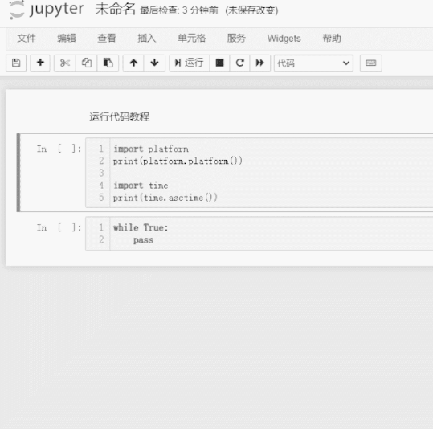

## 前言：开发基础

> 本文为大佬鼠为开发者写下的指导文，希望你可以基于此进入 linux 嵌入式开发的领域。

想要让 MaixPy3 软件体系更合乎你的心意，你需要花一点时间了解一下它的整体架构。

掌握了它后，你就可以得到一个非常巨大的究极缝合怪，里面有开源的大量的代码供你测试和参考。

这一切需要你需要具备以下基础技能：

- 拥有一台 Linux 系统的电脑，至少安装了 Ubuntu20 也可以是你喜欢的桌面操作系统。
- 知道什么是 gcc 、python3 、 opencv 、openmv 等相关软件的基础用法。
- 最好有过 openwrt 、 buildroot 、debian 等 linux 的应用基础。
- 了解 python3 的编译与安装，了解什么是交叉编译安装软件。

如果你完全不知道上面的内容，你可以到网上获取一些资料学习一些基本内容后再继续会好一些。

## 项目架构一览

鼠鼠我设计的这个项目是基于 linux cpython 自顶向下设计的，它受到以下需求约束。

- 用户需要 Python 语言调参验证原型功能，也需要 C / C++ 优化性能和减少内存占用用于开发商业项目。

- 尽可能最大程度的跨平台支持 Python / C++ / C 开发框架。

所以形成了两大 [libmaix](github.com/sipeed/libmaix) [maixpy3](github.com/sipeed/maixpy3) 开发仓库，前者为 C / C++ ，后者为 Python / C / C++ 实现。

对应的系统层级关系如下：

```bash
+----------------------------------------+
|                                        |
|    User develop sipeed all product.    |
|                                        |
+----------------------------------------+

+-----------------+     +----------------+
|                 |     |                |
| Run Python Code |     | Run C/C++ Code |
|                 |     |                |
+--------^--------+     +-------^--------+
         |                      |
   +-----+-----+                |
   |           |                |
   |  maixpy3  |                |
   |           |                |
   +-----^-----+                |
         |                      |
    +----+----+                 |
    |         |                 |
    | libmaix +-----------------+
    |         |
    +----^----+
         |
+----------------------------------------+
|  +-------------+                       |
|  |             |   openwrt   debian    |
|  |    Linux    |                       |
|  |             |   armbian   ubuntu    |
|  +-------------+                       |
+-------------------------+------------+-+
      ^        ^          ^            ^
      |        |          |            |
+-----++ +-----++ +-------++ +---------+-+
|      | |      | | x86/64 | |  AX620A   |
| V83X | | R329 | | debian | |   V85X    |
|      | |      | | ubuntu | |  more...  |
+------+ +------+ +--------+ +-----------+

```

所以项目的目录结构如下：

```bash

juwan@juwan-n85-dls:~/v83x/MaixPy3$ tree -I build -I "source|test|reference|common|CMake|words|waves|utils|asr_lib|tea|assets|tools|inc|src|lib|include|compile|dist|main|example|doc|lvgl" -P . > result.log
juwan@juwan-n85-dls:~/v83x/MaixPy3$ cat result.log
.
├── docs
├── envs
├── ext_modules
│   ├── libi2c
│   │   └── tests
│   ├── libmaix
│   │   ├── components
│   │   │   ├── libmaix
|       |   |   |-- lib
|       |   |   |   -- arch
|       |   |   |       |-- desktop
|       |   |   |       |   |-- libmaix_cam
|       |   |   |       |   |-- libmaix_disp
|       |   |   |       |   |-- libmaix_image
|       |   |   |       |   -- libmaix_utils
|       |   |   |       |-- r329
|       |   |   |       |   |-- opencv4
|       |   |   |       |   -- src
|       |   |   |       |       |-- libmaix_cam
|       |   |   |       |       |   -- src
|       |   |   |       |       |-- libmaix_disp
|       |   |   |       |       |   -- src
|       |   |   |       |       |-- libmaix_image
|       |   |   |       |       |   -- src
|       |   |   |       |       |-- libmaix_nn
|       |   |   |       |       |   -- src
|       |   |   |       |       |-- libmaix_nn_app
|       |   |   |       |       |   |-- libmaix_nn_app_Classifier
|       |   |   |       |       |   -- libmaix_nn_app_FaceRecognize
|       |   |   |       |       |-- libmaix_nn_decoder
|       |   |   |       |       |   |-- libmaix_nn_decoder_retinaface
|       |   |   |       |       |   |   -- src
|       |   |   |       |       |   |-- libmaix_nn_decoder_yolo2
|       |   |   |       |       |   |   -- src
|       |   |   |       |       |   -- src
|       |   |   |       |       -- libmaix_utils
|       |   |   |       |           -- src
|       |   |   |       |-- v831
|       |   |   |       |-- v833
|       |   |   |       -- v83x
|       |   |   |           -- opencv4
│   │   │   ├── maix_cv_image
│   │   │   ├── maix_speech
│   │   │   │   ├── Maix-Speech
│   │   │   │   │   ├── components
│   │   │   │   │   └── projects
│   │   │   │   │       └── maix_asr
│   │   │   │   └── mfcc-with-vad
│   │   │   │       └── alsa
│   │   │   │           └── sound
│   │   │   └── third_party
│   │   │       ├── apriltag
│   │   │       ├── cJSON
│   │   │       ├── imlib
│   │   │       ├── libjpeg
│   │   │       ├── sqlite3
│   │   │       └── zbar
│   │   └── examples
│   │       ├── camera
│   │       ├── display
│   │       ├── hello-world
│   │       ├── imlib_test
│   │       ├── mpp_v83x_vivo
│   │       ├── nn_mask
│   │       ├── nn_r329_mobilenet2
│   │       ├── nn_r329_shufflenet
│   │       ├── nn_resnet
│   │       ├── nn_retinaface
│   │       ├── nn_retinaface_mdsc
│   │       ├── nn_yolo_20class_mdsc
│   │       ├── nn_yolo2_card_mdsc
│   │       ├── nn_yolo2_person_mdsc
│   │       ├── nn_yolo_number
│   │       ├── nn_yolo_person
│   │       ├── nn_yolo_traffic
│   │       ├── self_learn_classifier
│   │       ├── speech_asr
│   │       ├── speech_mfccdo
│   │       └── third_party_demo
│   ├── _maix
│   ├── _maix_camera
│   ├── _maix_display
│   ├── _maix_image
│   ├── _maix_nn
│   ├── _maix_nn_decoder
│   ├── _maix_nn_functional
│   ├── _maix_nn_mdsc
│   ├── _maix_nn_new
│   ├── _maix_speech
│   └── _maix_vivo
├── maix
│   ├── _maix_vision_
│   └── nn
│       ├── app
│       │   ├── classifier
│       │   └── face
│       └── decoder
└── tests
    ├── general
    └── maix_v831

68 directories, 0 files

```

可以得知我们开发的层级关系是对应起来的。

- 在 libmaix 中开发的成果会被转化成 maixpy3 的接口，通过了底层 C/C++ 开发 components 的 examples 测试，这样就不用在 Python 解释器中开发第二遍，因为在 Python 解释器里调试是非常困难的。

- 想要适配 MaixPy3 就需要在 libmaix 中移植新的平台，并且经过适配 display / camera / image / nn 等适配，目前已经适配了 V83X / R329 / desktop （无 nn 模块）等平台，按这个流程来适配一个新的芯片平台。

- 如果有新功能、新的试验代码，不一定会立刻提交提供给社区用户，而是采用 libmaix examples 的方式去验证、测试、合并，这样可以处理一些不好跨平台的实现，直到大多数平台都满足要求了就可以合并回 maixpy3 的仓库代码里。

- 接口采用迭代的方式去实现，比如同样的功能可以使用 C 开发也可以 C++ 开发，但最终链接回特定位置的模块是可以选择的，而这部分的选择交给 MaixPy 的 maix 模块来控制 import 的模块。

目前整体框架的开发内容划分为以下几类板块：

### 系统移植

首先目标芯片要有一个基础的 linux 系统，[参考项目自动构建时安装的依赖](https://github.com/sipeed/MaixPy3/blob/release/.github/workflows/maixpy3_build.yml#L22-L26)。

从上层桌面系统 ubuntu 来说，它至少要准备 libopencv libjpeg python3.8+ pybind11 这几个基础软件包，基于此我们可以得到一个最基础的 MaixPy3 原型开发环境。

它将会协助你完成软件接口的适配与测试，如定义屏幕显示（ display ）、摄像头输入（camera）、图像处理（image）、神经网络（nn）等基础接口的通用设计。

因为图像、音频处理的算法原型验证都是在桌面系统上完成的，这样像下迁移功能的时候只需要注意内存和性能优化就行，而不用考虑算法正确性、功能交互流程的设计。

这里以 v831 cpu 800mhz ram 64mb 的 linux 芯片适配为例吧，回想在 2020 年底的时候我们刚拿到这个芯片是系统都进不去的程度，后来我整理了[这篇开发指导给内部的同学培训使用](https://www.cnblogs.com/juwan/p/15226245.html)，因此要基于此先将 openwrt 系统跑起来，并成功编译 python3.8 和 libopencv 作为基础环境。

有了 python3 后还需要获取一些相关的 python 软件包协助软件原型验证 [envs/maix_v83x.py](https://github.com/sipeed/MaixPy3/blob/ffeb5db56e5a7481526fc6372e0be923251b613b/envs/maix_v83x.py#L245-L252) 。

```
_maix_py_modules = [
    "numpy",
    "rpyc",
    "gpiod",
    "evdev",
    "spidev",
    "pyserial",
]
```

> pillow 现在已经被 imgae + libopencv 彻底取代了，主要就图像处理+屏幕显示相关的接口。

此时 v831 这款芯片就具备了运行 maixpy3 的软件环境，如基础的图像处理算法模块，而其他芯片如 r329 或运行 ubuntu 的树莓派硬件同理，只是选取不同的环境配置。

在继续往下开发之前，我们需要提取 系统依赖环境 gcc 和 python3 的编译环境，这样我们就可以在桌面系统（x86 linux ubuntu）上进行交叉编译了，可以参考项目主页提供的编译链[Toolchain](https://github.com/sipeed/MaixPy3#develop)。

> v831 和 r329 的是从编译后的 sdk 提取出来的，但最早都是从 docker arm 的环境里编译出来的，所以适配初期至少要准备宿主机编译或实机交叉编译二选一，主要就是 linux inclue 和 lib 和 python3 解释器。

### 驱动适配

以上只是软件系统的基础环境，接下来底层还需要具体的硬件接口，否则软件调用接口无法真正作用在实际的硬件接口上，比如屏幕显示和摄像头输入。

这时候就要来到 ext_modules/libmaix/components/libmaix/include/ 这个目录，假设上述的软件系统上不变的，只需要提供好这里所需要的接口即可。

目前在这里 v831 是底层实现是闭源的，所以我们可以参考 r329 和 desktop 这两个开源的硬件实现接口。

```
|-- lib
|   -- arch
|       |-- desktop
|       |   |-- libmaix_cam
|       |   |-- libmaix_disp
|       |   |-- libmaix_image
|       |   -- libmaix_utils
|       |-- r329
|       |   |-- opencv4
|       |       |-- libmaix_cam
|       |       |-- libmaix_disp
|       |       |-- libmaix_image
|       |       |-- libmaix_nn
|       |       |-- libmaix_nn_app
|       |       |   |-- libmaix_nn_app_Classifier
|       |       |   -- libmaix_nn_app_FaceRecognize
|       |       |-- libmaix_nn_decoder
|       |       |   |-- libmaix_nn_decoder_retinaface
|       |       |   |-- libmaix_nn_decoder_yolo2
|       |       -- libmaix_utils
|       |-- v831
|       |-- v833
|       -- v83x
|           -- opencv4
```

在这里，我们可以得知需要底层实现的基础模块有：

- libmaix_cam
- libmaix_disp
- libmaix_image
- libmaix_nn
- libmaix_utils

但并不是每个芯片平台会完整实现所有功能，比如 desktop 就没有实现 libmaix_nn ，但这并不影响它也能使用 maixpy3 的软件包，只是在编译选项的时候取消了这个模块的编译。

所以会看到 desktop 桌面环境的 maixpy3 是不能 `from maix import nn` 模块的，因为没有向 python 环境提供对应的实现。

在实际情况下，我们每个平台的开发者都不是一个时刻共同开发的，对于各个部件的开发我们会进行分工开发，如果是一个新功能新接口，我们会以实现的平台为参考基础给其他平台适配代码，减少重复设计和开发工作，例如鼠鼠在开发桌面环境的 camera 的时候，顺手修复了 r329 的 camera 实现，因为都是同一类接口设计下的模块。

如果这个实现在其他芯片平台发现了设计不合理的情况，出现了一开始设计无法预料的情况，那也不用担心，这时候会围绕这个功能迭代设计出新的模块直到接口仍然保持一致并能够替换上去，而不是在一个设计错误的模块上不断打补丁。

为了继续开发，我们仍然要继续往前走，假设底层硬件开发人员没有提供具体的硬件实现，那我们就需要提前假设好向交互的数据格式和接口，如 bytes 图像数据，又或是 rgb565 图像数据。

例如摄像头会返回 raw10 yuv rgb 等图像数据，但目前我们约束当前图像之间流动的格式为 rgb ，所以在接口定义上就要求输出的是 rgb bytes 图像数据，至于底层（libmaix_cam）如何转换的我们并不关心，哪怕是虚拟的数据也可以。

此时屏幕显示驱动同理，并不是所有屏幕都能吃 rgb888 的图像数据，有的是 rgb565 （r329） 有的是 argb （v831），还有得是 bgr （opencv），但如何转换就是底层（libmaix_disp）的实现问题了，比如是 rgb888 进去了自行转换成 rgb565 显示到 framebuffer 还是 rgb888 输入转换成 rgba 贴到多图层设备上（mpp vo），又或是 rgb888 输入到 cv::mat(bytes) 上 imshow 的实现都可以。

以这两个模块的实现为例，说明了 maixpy3 上如何屏蔽底层的接口实现差异的设计。

所以在开发新的平台和芯片的时候，不妨参考这些已有的开源实现来修改适配，目前已有的典型设计如下：

- 支持硬件加速专用 mpp vivo 多媒体框架，包含显示与输入，如 v83x tina openwrt。

- 通用 v4l2 video 接口，显示驱动 framebuffer 类型，如 r329 mainline armbian。

- 通用 v4l2 video 接口，显示驱动 linux opencv imshow 接口，基于桌面系统（Desktop Environment）。

目前摄像头和屏幕设计是均以对象的方式来设计的，如果想要得到多屏输出多摄像头输入的场合只需要根据需要提供设备路径标示符来区分就行，这只是接口设计的预留，目前还没有用上。

### 图像处理

在这之前已经解决了系统与驱动的适配关系，接着来到了通用的核心软件设计，解决了硬件上图像数据输入输出的问题，才能来到软件算法和数据处理的环境。

在这一层只需要关注纯粹的软件代码，例如 libmaix 的 components 下的其他组件。

```bash
│   ├── libmaix
│   │   ├── components
│   │   │   ├── libmaix
│   │   │   ├── maix_cv_image
│   │   │   ├── maix_gs831
│   │   │   ├── maix_speech
│   │   │   └── third_party
│   │   │       ├── apriltag
│   │   │       ├── cJSON
│   │   │       ├── imlib
│   │   │       ├── libjpeg
│   │   │       ├── sqlite3
│   │   │       └── zbar
│   │   └── examples
│   │       ├── app_gs831
│   │       ├── camera
│   │       ├── display
│   │       ├── hello-world
│   │       ├── imlib_test
│   │       ├── mpp_v83x_vivo
│   │       ├── nn_mask
│   │       ├── nn_r329_mobilenet2
│   │       ├── nn_r329_shufflenet
│   │       ├── nn_resnet
│   │       ├── nn_retinaface
│   │       ├── nn_retinaface_mdsc
│   │       ├── nn_yolo_20class_mdsc
│   │       ├── nn_yolo2_card_mdsc
│   │       ├── nn_yolo2_person_mdsc
│   │       ├── nn_yolo_number
│   │       ├── nn_yolo_person
│   │       ├── nn_yolo_traffic
│   │       ├── self_learn_classifier
│   │       ├── speech_asr
│   │       ├── speech_mfccdo
│   │       └── third_party_demo
```

- maix_cv_image 是基于 opencv 的拓展 image 实现，可以看到 maixpy3 有些接口的底层实现是直接取自 opencv 的接口设计，但 opencv 只能解决一些通用编解码格式与基础图像处理的接口，从实际的开发适配过程中会发现 openmv 的接口设计更实用，并且一些 cv 视觉算法的流程测试函数会通过这个组件使用 C++ 代码完成，对于算法开发人员来说 c++ 代码去验证算法逻辑会方便一些，至少不用到处找基础容器了。

- maix_gs831 这个项目的启动入口在 app_gs831 里，在 main 中将 C 代码跳进 C++ 代码开发环境，用于提供给商业客户开发的典型示例程序，对模块分层实现了串口协议与高速扫码的分时处理，可作为落地商业项目的代码框架参考。

- maix_speech 则是语音相关的接口，在这里大多数模块都是基于 c++ 实现后通过 c 符号暴露给外部调用的，这是因为用户程序如果是 c 代码则比较简单调用，但中大型程序则建议改用 c++ 代码开发。

- third_party 则是引用了外部通用的 linux 库，如 apriltag、cJSON、imlib、libjpeg、sqlite3、zbar 等，可以看到它们都是跨平台通用的代码。

基于此架构设计，进一步可以关注 examples 在这里是具体开发的样例代码入口，可以在这里对 maixpy3 的一些接口做测试。

- camera 是一个摄像头输入输出的示例，可以通过摄像头输入图像，并显示到屏幕上，并且基于此实现了 maixpy3 的跨平台，所以 display 同理。

- 而 imlib_test 是开发 openmv 传统视觉代码的测试，一些算法的移植是在桌面环境上开发完成测试后同步给底层实现的，像一些 openmv 的 find_blobs find_template find_qrcode find_apriltags 之类的函数，这些函数相比 opencv 提供的接口来说更简单更好用，而且性能更好，占用更少。

- third_party_demo 而是一个第三方调用的示例，用于测试 third_party 的代码，比如 apriltag、cJSON、imlib、libjpeg、sqlite3、zbar 标准 linux 库测试。

> 20210723 未来会提交有关于 lvgl + mpp vivo 的 C++ 开发的参考项目代码，满足商业更高性能低内存占用的开发场景需求。

### 神经网络

在一个提供了所有基础代码的开发环境上，开始做 nn 模块的适配，目前 nn 模块都是在目标芯片 + python 开发的基础上进一步向 c/c++ 的适配 load forward decode 三步骤走。

而目前 nn 还处于一个不算很稳定和标准的产物，充满了碎片化，所以在设计的时候忽略了对模型精细化控制的想法，改成采用模块封装的方式，把细节都忽略，只需要调用暴露的接口，用户可以从这个 nn 模块得到某些 app 即可。

拿开源的 r329 作为典型来举例，先在上位机使用 python 完成了上层的算法验证后，就要在目标芯片平台做一下模型适配和代码部署，这个目前被归纳为三个阶段，预处理阶段已经被 camera 模块按原比例 resize 成期望形状的 rgb 图像数据，中间阶段就涉及到模型的定义和推理返回结果，基于这个结果配上对应的 decode 后得到相关的结果或框的坐标，得到我们期望 AI 模型提供的结果。

```bash
|-- r329
|   |-- opencv4
|   -- src
|       |-- libmaix_cam
|       |-- libmaix_disp
|       |-- libmaix_image
|       |-- libmaix_nn
|       |-- libmaix_nn_app
|       |   |-- libmaix_nn_app_Classifier
|       |   -- libmaix_nn_app_FaceRecognize
|       |-- libmaix_nn_decoder
|       |   |-- libmaix_nn_decoder_retinaface
|       |   |-- libmaix_nn_decoder_yolo2
|       -- libmaix_utils
```

这是底层的分层关系，接着看 maixpy3 的 nn 分层关系。

```bash
├── maix
│   └── nn
│       ├── app
│       │   ├── classifier
│       │   └── face
│       └── decoder
```

这时候要先设计好用户的模块调用流程，例如：

```python
from maix import nn, camera, display
model = nn.load("/path/to/model.bin")
decode = nn.app.face()
while True:
      img = camera.camture()
      result = model.forward(img.resize(model.input_shape))
      face_id, box, prob = decode.run(result)
      display.show(img.draw_box(box, prob, face_id))
```

如果上层 python 代码的流程被确定下来了，并且认为是当下最合理的结构，则底层实现需要为了这个设计而提供相应模块。

如 nn.load 需要 libmaix_nn 提供基础接口，而 nn.app.face() 需要 libmaix_nn_app_FaceRecognize 提供功能，最后 decode.run 需要 libmaix_nn_decoder_retinaface 的接口。

但你会发现它们是可以合并的，比如在 v831 的接口中 libmaix_nn_app_FaceRecognize 和 libmaix_nn 是放到同一个 so 下的，但这对上层逻辑是没有影响的，因为最终对同一个套文件接口实现负责就行，至于有几个 so 共同实现并不重要。

因为在 python 接口的时候会被重新映射成理想的调用关系，如果底层发生了改动，也不会影响上层用户的调用逻辑，这个是必须要留意的地方，尤其是在迭代升级接口模块的时候，对用户代码来说也是无感的。

至于目标芯片怎么实现，就是开发人员在 libmaix 上的具体工作了，但只要按这个结构开发，整体的代码交互逻辑就得到的了统一。

可以看到 examples 里做了很多尝试，如今也在逐渐收敛这些接口的参数和用法了。

```bash
│   │   └── examples
│   │       ├── nn_mask
│   │       ├── nn_r329_mobilenet2
│   │       ├── nn_r329_shufflenet
│   │       ├── nn_resnet
│   │       ├── nn_retinaface
│   │       ├── nn_retinaface_mdsc
│   │       ├── nn_yolo_20class_mdsc
│   │       ├── nn_yolo2_card_mdsc
│   │       ├── nn_yolo2_person_mdsc
│   │       ├── nn_yolo_number
│   │       ├── nn_yolo_person
│   │       ├── nn_yolo_traffic
│   │       ├── self_learn_classifier
```

相信未来其他芯片的代码在实现相关 AI 功能的时候都有现成的业务逻辑流程参考实现。

### 开发工具

在完成了底层系统的基础上，我们要回到 python 的开发问题上，我们需要一种可以满足嵌入式设备调用 python 代码并且支持实现返回运行结果（包括图片）的开发工具。

这也是 maixpy3 ide 的来源，在这个开发工具上寻找了很久都没有现成的，索性就做了一个 jupyter kernel 的支持，并打包导出给用户开发和测试，也就是你下图看到的效果。


这套工具内存占用大概在目标芯片中占用 11m 左右，所以要比所谓的 jupyter notebook 运行在嵌入式设备上更实际（大于 48M），就算你安装了也做不了其他事情了。

为什么需要做这个呢？

- 对用户的好处

用户无论在哪个平台都可以使用一键安装（exe or pip）获取整套 maixpy3 python 开发环境。

- 对测试的好处

测试人员做过的操作和结果都可以通过 notebook 文档记录存档，有任何问题都可以向用户索要开发文档，而不是一张毫无意义的手机拍照或电脑截图，能够得到一份可以复现用户问题现场的文档，证据确诊，有图可看，有码可跑。

- 对文档的好处

可以合并测试的工作内容，测完功能后就写成文档，所以目前这个资料站有一半的示例文档都是直接运行文档代码得到的，不再需要人工截图，用户也不用怀疑代码是否可用，运行的代码所见即所得。

- 对开发的好处

有什么问题就直接发文档，其他的都不看，同样开发做了什么东西也同样直接输出文档给其他人员，这样也减少了重复无意义的测试工作，无人配合的情况下，开发可以一人分饰三人的工作内容，从开发、测试、文档提供给用户。

如果没有这些开发工具的基础铺垫，一款产品到底能不能用，用户光看代码和文字描述心里是没底的。



如果文档的所有代码都有运行结果和图像，那么用户会倾向于认为是自己的操作有问题，而不是怀疑代码不能运行，这一定程度上也避开了文档中很多没有意义的提问。

## 一个新功能的设计、验证、开发、测试、发布的流程

鼠鼠我为内部实现一个功能直到公开时定义的开发流程大致如下：

1. 定义一个功能的 python 伪代码，包含加载、循环、释放等要素，确保代码可重入可多例。

2. 将具体的功能代码在标准的桌面系统上经过验证，确保了移植的可行性，定义好必要的接口参数，并包含基础的单元测试，重入、边界、内存泄露等。

3. 经过 libmaix 的 examples 下的开发测试后同步移植给所有 maixpy3 的支持平台，将最初 1 设计的流程代码真实跑起来后，测试的代码归档模块下的 tests 或 examples 存放好 py 的单元测试供后续的开发人员参考，后续有问题也可以翻出来复测。

4. 开发与测试的工作完成后就是文档的工作，基于上述开发测试的结果，文档会分解这些代码流程到每个步骤，一步步通过文档记录和分块代码运行，确保可以复现功能并只向用户提供最简单的用法，最后将得到的所有原料作为资料引用留在文档的最底部供其他开发者参考，而用户只需要看最前面的如何最快的得到功能并调用就行。

至此才会正式公开出来给到用户使用，最好大部分按这个流程来走，不然很大概率会返工。

## 目前文档公开的标准

- 用户文档

向用户传达某个功能的最佳实践的文档，提供最简单的用法和效果，确保用户可以看到效果，建立起产品的信任感。

- 测试文档

针对功能接口的所有输入输出参数的覆盖性测试，方便形成 api 文档，开源软件可能会忽略这一步。

- 开发文档（非必须）

主要记录开发人员在完成开发内容的所有过程，用于归档和统计开发人员的开发成果，不一定可以释放出来。

## 来自社区的开发过程中的参考资料

如果有我没提到的地方可以跟我说，下为我们内部开发人员的一些博客和开发参考资料。

- [juwan 的 linux 系统相关的](https://zzk.cnblogs.com/s?w=blog%3Ajuwan%20linux)

- [neucrack ai nn 模块相关的](https://neucrack.com/c/22?type=popular)

> 如果你也想向其他人分享你的开发资料和文档可以在这下面继续添加喔，
