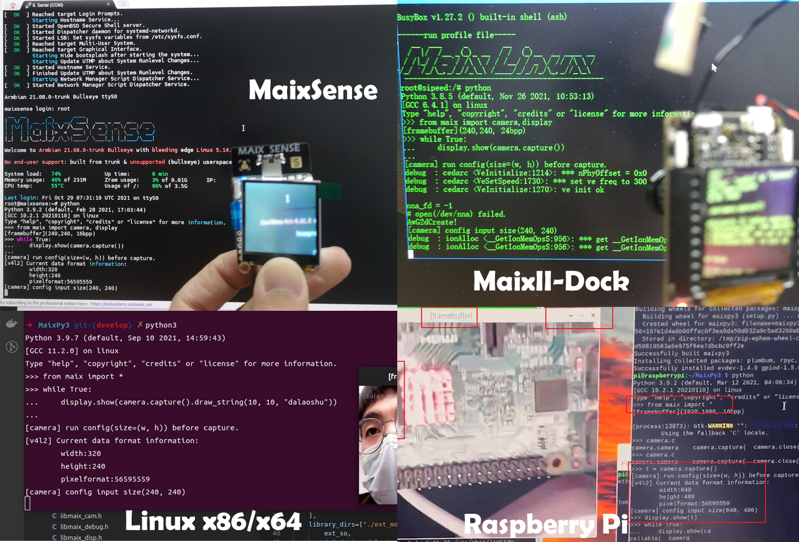
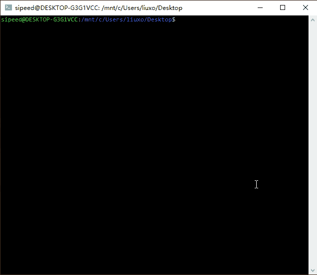
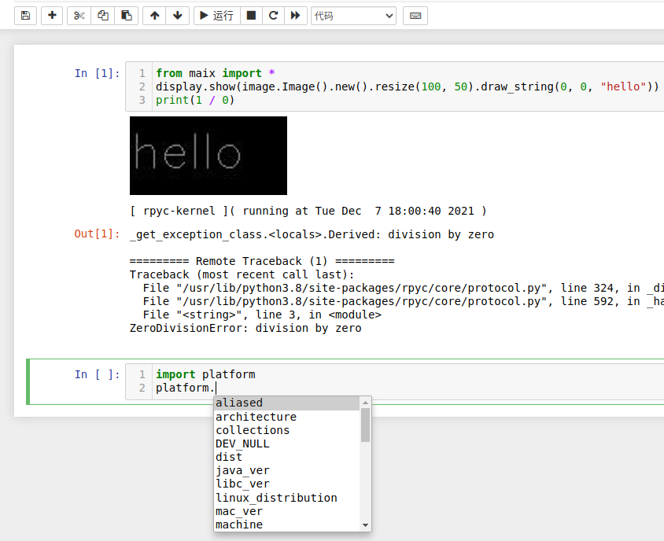
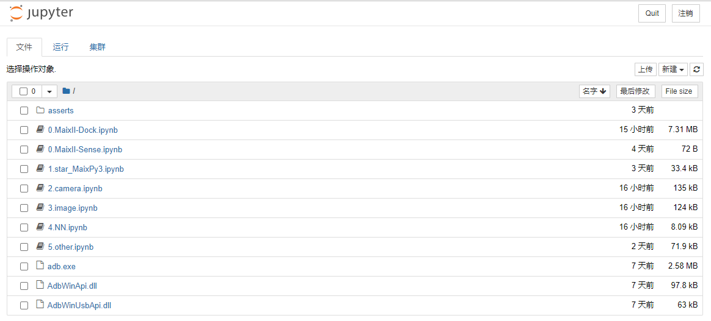
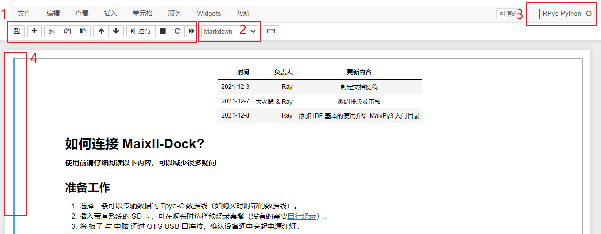
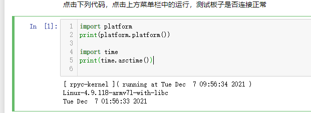
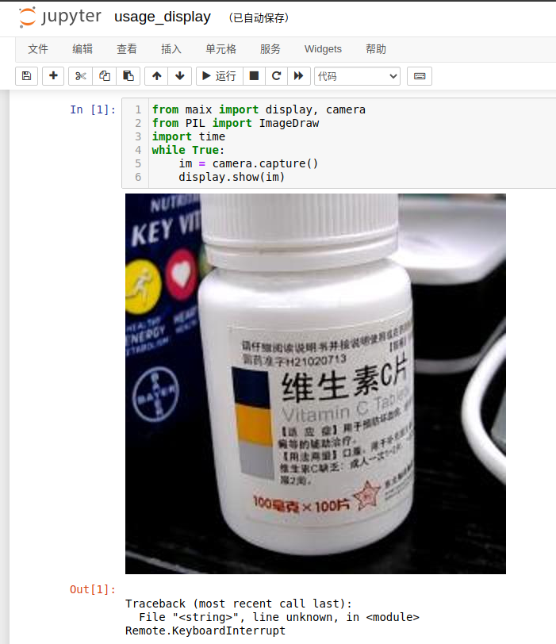
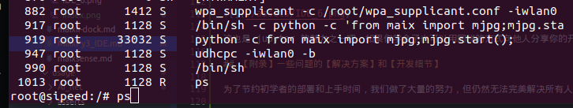

>[下载 MaixPy3 IDE ](https://dl.sipeed.com/shareURL/MaixII/MaixPy3-IDE)
>百度网盘下载链接：链接：https://eyun.baidu.com/s/3cU8YYi 密码：2333

如果百度云链接失效，请使用这个链接 [点我](https://eyun.baidu.com/s/3htTXfaG#sharelink/path=%2F%E4%B8%8B%E8%BD%BD%E7%AB%99%E6%96%87%E4%BB%B6%2FMaixII%2FMaixPy3-IDE&parent_path=%2F%E6%B7%B1%E5%9C%B3%E7%9F%BD%E9%80%9F%E7%A7%91%E6%8A%80%E6%9C%89%E9%99%90%E5%85%AC%E5%8F%B8)

## 为什么要使用 IDE ？

在没有 IDE 的时候，我们是这样编程的，这是每一只远古程序猿都必备的开发技能。



上述命令行的编程方式是上世纪 80 年代流行的开发方式，建议你在有一定 linux 系统的操作基础后再熟练使用会更好。但 2022 现代 IDE 工具的重点应该是向人类传达 Python 代码运行结果或效果。



如果你是一名开发者，你要如何教会初学者使用你的代码？像你一样使用命令行敲出来看实际的效果吗？

> **对初学者来说，这一定是一场灾难，所以我们需要 IDE 来结束这一场悲剧。**

## 那么 MaixPy3 IDE 是什么?

它是一套基于 [jupyter](https://jupyter.org/) 实现的 Python3 集成开发环境（IDE，Integrated Development Environment ），意在帮助用户通过电脑编写 Python 语言代码后，用户运行开发者提供的 jupyter notebook 文档后，接上硬件后点击【▶ 运行】可以实时呈现如下效果图。



为了方便新入门的同学进行学习，在 Jupyter 文档中你可以单步运行代码，并保留输出的结果，还能将屏幕显示的内容保留下来。

软件具备的特点如下：

- 通过 TCP/IP 连接开发板，支持在本机运行 Python 代码，实时反馈开发板的运行结果或图片。
- 通过 jupyter notebook 文档可以保存每一次的运行结果，方便知识的传播。
- 继承 ipython 实现 Python 语法的高亮和补全功能（可以按 tab 进行补全）。

## 如何安装 MaixPy3 IDE ？

> **软件安装方法和注意事项要严格看本文说明（大佬鼠宣）**

MaixPy3 IDE 的构成主要如下：

- 一个在后台运行的托盘程序。
- 一个 jupyter 服务程序。

用户使用与排查流程主要如下：

- 确认所用的系统平台，确定安装方法。
- 确认所用的开发硬件，查看对应的系统配置方法。
- 确认系统防火墙没有阻止 TCP 的 18811 和 18812 端口，不清楚就关闭网络防火墙或安全软件。
- 确认硬件的 MaixPy3 的 Python 包和电脑上的 IDE 版本为 0.4.0 以上。
- 确认 所用硬件的 连接和配置方法，确认没有被杀毒程序给阻止，确认程序权限已给到。
- 若是仍然出现问题，将上述流程打包起来反馈给社区并@管理员解决。

### 关于 Windows 平台的安装方法

**只支持 Windows7 或 Windows10 32位以上的系统。需要自带安装了支持谷歌内核浏览器的系统。Windows11 测试样本极少，需要慎重选用**

为了节约用户自己配置的操作，我们提供了开箱即用的绿色软件，它是借助 pyinstaller 将 ipython 、 jupyter 、 rpyc_ikernel 合并导出的 Python 程序，你可以在[下载站](https://dl.sipeed.com/shareURL/MaixII/MaixPy3-IDE)中获得 MaixPy3 IDE exe 安装包，安装程序结束之后，它会调用系统默认的浏览器以网页的形式打开，运行的浏览器需要 chrome 内核支持，不能是 IE 浏览器，旧版的 Edge 加载 8M 以上的页面会卡死，并不推荐。



> 若是下载站很慢，可以在文章开头处获取百度云链接

2022年1月15日收到用户的反馈点

曾经有自己手动配置过环境的同学，需要在删除你系统的 `C:\Users\（改成你电脑的用户名）\AppData\Roaming\jupyter\kernels\rpyc` 防止调用核心时调用了过去的旧核心导致错误发生。

### 关于 Mac 和 linux 其他平台的安装方法

如果你不喜欢提供的 pyinstaller 打包的版本，可以自行配置 python 、jupyter 、ikernel 等基础环境，自行 pip 手动安装和配置环境，需要你具备一定的 python 开发基础，请阅读 [rpyc_ikernel](https://github.com/sipeed/rpyc_ikernel) 完成安装即可，手动安装脚本的方法如下：

```bash
pip install rpyc_ikernel
python -m rpyc_ikernel.install
```

此时运行 jupyter notebook 或 lab 即可，注意 Windows 的 adb.exe 可以从 IDE 中提取或官方下载得到，然后自行配置到环境变量中，若是其他平台则自带。

## MaixPy3 IDE 界面介绍

下面介绍一下软件的工作区域和环境。

### 程序主界面介绍


1. 为文件选择区，点击即可进入 Jupyter 文档中
2. 为文件上传，是将文件上传到 MaixPy IDE 的工作区当中，并不是将文件上传到开发板中。
3. 为新建文件或者是文件夹
4. 退出 MaixPy3 IDE，直接关闭浏览器 MaixPy IDE 还会在后台中运行。

MaixPy IDE （jupyter） 在创建代码文档的时候，可以选择多个 Python 执行核心。


1. 选择 Python3 此时使用的是本机的 Python 解释器，此时 Python 代码运行在本机上。

2. 选择 RPyc-python ，此时会连接开发板再运行代码并输出结果，此时代码运行在开发板里。

### jupyter notebook 文档界面



1. 单元格工具栏，可以对单元格进行复制、粘贴、运行、停止等操作
2. 当前单元格的属性，可以在代码和 markdown 文件中切换
3. 显示当前文档运行代码属性单元格时所使用的内核
4. 显示蓝色是为选中单元格，绿色为当前处于编辑的单元格


借助 notebook 文档，你可以得到这份代码文档的开发者的调试过程与运行结果。



甚至是运行的图像结果，这样初学者在确保所有环境一致的情况下，照着运行就可以同步真实的开发成果。



这也是 jupyter 的魅力之一吧，如果你学会了也可以用同样的方式向他人分享你的开发成果喔：）。

> 注意 MaixPy3 IDE 的 jupyter notebook 的服务并不在板子上启动，所以里面的文档是存在本机的，而不在板子上的，有得同学会误以为软件里的文件就是板子里的文件。

## 【附录】遇到问题应该如何解决？

为了节约初学者的部署和上手时间，我们做了大量的努力，但仍然无法完全解决每个人因环境差异而可能导致的不同问题。

所以一些常见问题我们已经整理好，阅读过后本文后仍然出现无法解决的问题，就可以从左侧的导航中获取 [MaixPy3 的常见问题与解决办法](/soft/maixpy3/zh/question/maixpy3_faq.md) 。

为了防止一些不了解具体实现，也不看文档，但又自作主张的同学出现的问题，大佬鼠我在这里特别说明一下 IDE 的工作框架和可能遇到的问题，谨记！没有绝对完美且不出错的软件，如果有那一定是我本机上的软件。

这里我们以典型硬件 V83X 和 R329 的为例。

因为 V83X 因为支持 usb adb forward 功能，可以通过转发 TCP/IP 地址进行 IP 映射的端口绑定；而 R329 只能通过 TCP/IP 地址进行连接，但从设计上来说 IDE 只支持 TCP/IP 地址的连接方法，所以要确保 TCP 的远程调用端口 18811 和 18812 图传端口没有被防火墙阻止，那么如何确认呢？

最起码的就是互相 ping 对方的 IP 确保该 IP 下的通路可行。如果 IP 确定是可以连通的，则我们需要确定远程调用的服务是否存在。

通常里面需要一个 rpyc + mjpg 的服务去维持远程调用，如果是 V83X 则会自动经过 adb shell 完成调用 [实现在 github 这里](https://github.com/sipeed/rpyc_ikernel/blob/master/rpyc_ikernel/adb.py#L509-L539)；如果你是 R329 则需要手动启动该服务，或配置成开机自动启动，从而避免下次手动启动。

如果遇到 IDE 链接失败，首先要使用板子所运行的 linux 系统中的 `ps` 命令检查维持 IDE 链接的 Python 程序（`python3 -c from maix import mjpg;mjpg.start();`）是否存在（如 S 表示正在运行）。可以参考下图中的命令



若是通道+服务均正常，那 IDE 就一定可以连上，还需要注意的就是默认连接的 IP 地址是 localhost ；如果你本机的网卡环境比较混乱，可能你需要在 IDE 手动指定一下 IP 才能确保正确连接上，如：`$connect("192.168.0.156")`。

在我设计的 V83X 的使用体验步骤是：

1. 确认使用最新镜像系统，其中的 maixpy3 大于 0.4.0 版本，要准备 烧录系统的SD 卡喔。
2. 确认使用最新的 IDE 工具，其中版本号大于 0.4.0 版本，安装安装软件时提示所需要安装的驱动。
3. 接上 M2DOCK OTG 口，屏幕存在画面，电脑产生 U 盘等行为都表示系统已经成功启动。
4. 打开 IDE 的文档，从列表中选择一份文档运行，在选择其中的代码运行查看效果。

其中 1 可以在购买 TF 卡的时候，解决普通用户到手不需要学习安装和烧录，直接跳到步骤 2 ，其他的板子也是大同小异，要注意给权限和防止杀毒软件杀死，还有防火墙的配置若是不懂就关了，懂得就自行添加过滤规则。

> MaixPy3 IDE 依赖于 [jupyter](https://github.com/jupyter/jupyter)、[rpyc_ikernel](https://github.com/sipeed/rpyc_ikernel)、[MaixPy3](https://github.com/sipeed/MaixPy3) 开源仓库实现，感兴趣的自行了解，其实所谓的 IDE 就是 jupyter 的打包版本，知道了工作机制后，还不赶紧用起来！
