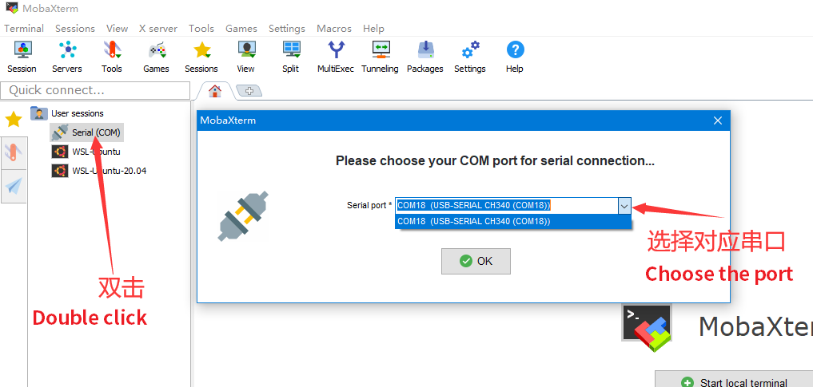
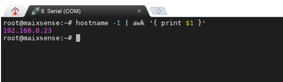
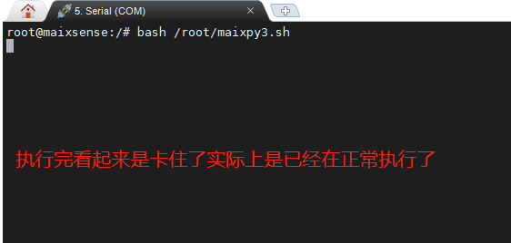
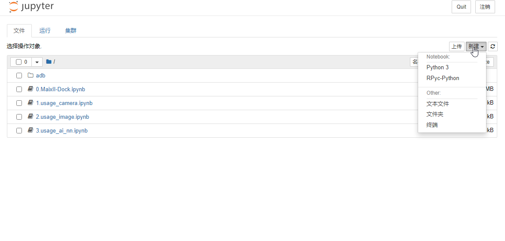
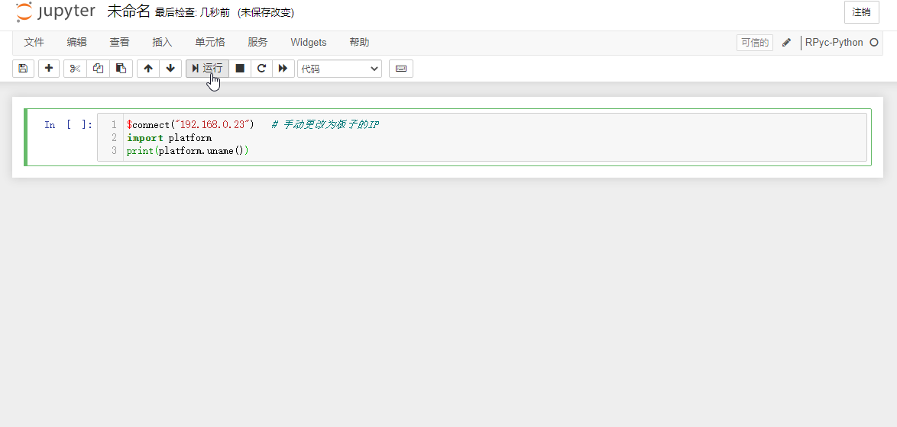

---

|     时间      | 负责人 |   更新内容   |
| :-----------: | :----: | :----------: |
| 2022年4月24日 | wonder | 增加一点细节 |
| 2022年2月28日 |  Rui   | 编写连接文档 |

> Maixsense 仅支持通过网络连接到 maixpy3

在 MaixSense 上使用 MaixPy3 ，需要烧录内置 MaixPy3 的 armbian 系统，并且连接到网络

其中烧录系统可以参考 [点我](./../../../../hardware/zh/maixII/M2A/flash_system.md)。系统用该选择带有maixpy3的armbian镜像。

## 设置wifi

对于新烧录的系统需要先使用串口来设置wifi连接。

使用 串口 连接板子，然后这里以 mobaxterm [[点我查看简述](./../../../../hardware/zh/maixII/M2/tools/mobaxterm.md)]这个软件为例


在「session setting」 对话框里选择【serial】，设置好波特率为115200，点击【OK】后就进到如下页面



> 如果提示用户名和密码的话。那么用户名和密码都是`root`。
> 注意的是输入密码的时候是没有输入显示的，因此只管输入就行。

连接板子后可以参考 [上手使用](./../../../../hardware/zh/maixII/M2A/Usages.md) 来基本用一下。

- 如果连接软件后终端界面没有任何显示，尝试按一下回车，看看有没有信息显示出来。这是因为板子已经启动完毕，串口连接迟了。

## MaixPy3 IDE 连接

### 准备

- 烧录好带有 MaixPy3 的 Armbian 系统
- 连接网络进行 MaixPy3更新，确保 MaixPy3 的版本大于 0.3.4。

在 linux 终端使用 `hostname -I | awk '{ print $1 }'` 来查看连网后的IP地址



从上面收到的信息可以看到本次的 IP 地址为 192.168.0.23 .

- 没有显示IP的话重新设置连接网络

### 连接

在板子终端执行下述命令(需要确认系统镜像是20220516之后的版本)来启动板子上的远程 RPyc 服务。

```bash
maixpy3.sh
```

以后每次使用都执行一次即可

<details>
  <summary><font color="#4F84FF">点开查看正常运行样子</font></summary>
  
</details>

在电脑启动 MaixPy3 IDE，新建代码区，运行下面的连接代码。

- 电脑在 IDE 中新建代码区并执行

```python
$connect("192.168.0.23")   # 手动更改为板子的IP
import platform
print(platform.uname())
```

<details>
  <summary><font color="#4F84FF">点开查看相关操作</font></summary>
  
  
  
  
  
  
</details>

- 启动 MaixPy3 IDE 的时候，会弹出一个 adb 终端窗口。对于 R329 我们是使用串口和板子连接的，因此可以关掉它。

> 今后使用出现 AIPU_load_graph_helper: UMD fails in allocating buffers 错误。
> 重新使用 `maixpy3.sh` 命令就可以了

具体相关使用方法可以参考[使用 MaixPy3 IDE 连接 MaixII-Dock](./0.MaixII-Dock.ipynb),其中的**如何运行代码**和**首次尝试**都可以参考。

- 另外因为板子是使用无线网络连接的IDE，所以在IDE离需要先指定一下板子IP

### 开机自启

目前 R329 镜像是 armbian linux 系统。

用户可以自行搜索配置linux开机脚本方式来启动想要的运行脚本。
