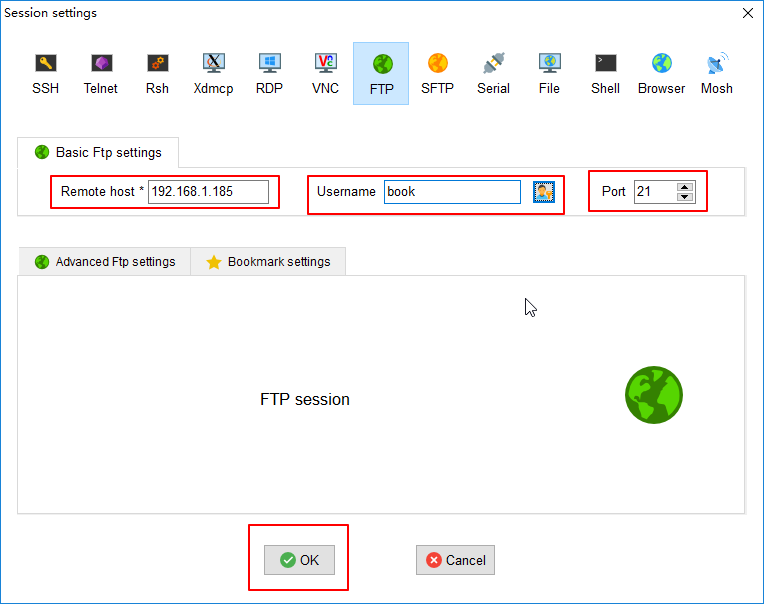
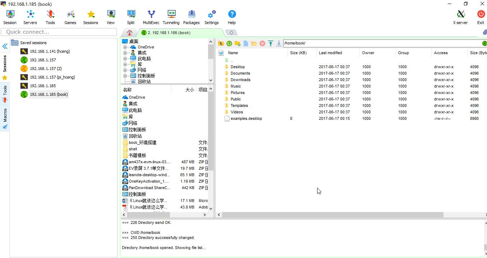

## mobaxterm 是什么？

这是在 Windows 下使用的全能终端管理软件，对开发与运维人员必备，可以在 [mobaxterm.mobatek.net/download](https://mobaxterm.mobatek.net/download.html) 获取免费版本使用，在国内网站上有中文版。


主要通过它提供的下列功能：

- serial 通过串口连接 Linux 系统的终端
- ssh 远程登录 Linux 系统的终端
- ftp 远程访问文件服务上的资源

## 连接 Serial

开源硬件产品大多都会预留串口（Serial）用作 Linux 系统的终端交互接口，下面介绍串口【session】的创建。


在「session setting」 对话框里选择【serial】，再选好串口号及波特率，点击【OK】就完成连接了。


同样【session】会保存在左侧的【session】标签页里，方便下次连接。

## 连接 SSH

除了有线串口的方式，还可以通过无线访问 SSH 登录 Linux 系统，如一般的家用路由器。

在 Linux 系统输入 ifconfig 查看自己 ip 地址（192.168.1.185），然后输入自己名称和密码，常见有 root / root 。


就可以看到 Linux 的登录会话终端了。


## 连接 FTP

与 SSH 同理。



进入后就可以看到文件夹了。



可以拖拽文件上传和下载。


## 如何进行编程

除了使用串口进行 Python 代码的复制粘贴运行，还可以通过在 FTP 文件管理获取下图的代码编辑器，编辑后保存就会自动同步上传（下图为 C 代码参考，其他代码同理）。


这时候再拿到终端里运行 Python 脚本即可。

```bash
python xxxx.py
```
