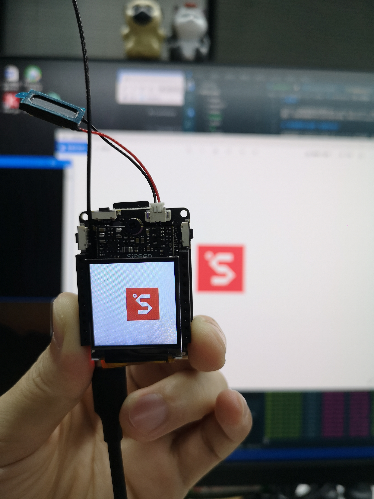

# 摄像头

MaixPy3 目前所兼容的摄像头有 sp2305 和 ov9732，别的摄像头是没有进行兼容配置的，如果有需要的可以进行商务定制，联系方式<support@sipeed.com>

## 使用摄像头拍摄一张图并显示

使用前面所介绍的开发工具进入到 Maixpy3 的环境中，复制并运行一下代码
```python
from maix import display, camera
display.show(camera.capture())
```

屏幕上就会打印出摄像头所拍摄到的第一帧画面


## 屏幕实时显示摄像头拍摄画面
```python
from maix import display, camera
while True:
    display.show(camera.capture())
```


可以通过 Ctrl + C 将其停止下来

## 拍摄图片并保存下来
```python
from PIL import Image, ImageFont, ImageDraw
from maix import display,camera
import os
import time
from evdev import InputDevice
from select import select

class funation:
    pic_number = 0
    def __init__(self,device=None):
      self.event = self.run                                                                 #定义统一调用接口,相当于函数指针           
      self.font = ImageFont.truetype("/home/res/baars.ttf", 20, encoding="unic")
      self.keys = InputDevice('/dev/input/event0')                                          #打开按键设备
    def __del__(self):
      pass        
    def get_key(self):
        r,w,x = select([self.keys], [], [],0)
        if r:
            for event in self.keys.read(): 
                if event.value == 1 and event.code == 0x02:     # 右键
                    return 1
                elif event.value == 1 and event.code == 0x03:   # 左键
                    return 2
                elif event.value == 2 and event.code == 0x03:   # 左键连按
                    return 3
            return 0
    def run(self):
        key_val = self.get_key()
        if key_val == 1:
            print("cap ones...",self.pic_number)
            self.pic_number += 1
            img = camera.capture()
            srcc = "/mnt/UDISK/" + str(int(time.time())) + str(self.pic_number) + ".jpg"
            img.save(srcc, quality=95)
            os.system("sync")
            time.sleep(0.05)
        elif key_val == 3:
            print("cap ones...",self.pic_number)
            self.pic_number += 1
            img = camera.capture()
            srcc = "/mnt/UDISK/" + str(int(time.time())) + str(self.pic_number) + ".jpg"
            img.save(srcc, quality=95)
            os.system("sync")
            time.sleep(0.05)
        else:
            img = camera.read()
        draw = display.get_draw()
        draw.text((10, 10), "push left ,get one", (255, 0, 0), self.font)  # bgr
        draw.text((10, 30), "push right aways,aways get", (255, 0, 0), self.font)  # bgr
        draw.text((10, 50), "you get pic:{}".format(self.pic_number), (255, 0, 0), self.font)  # bgr
        display.show()


if __name__ == "__main__":
    import signal
    def handle_signal_z(signum,frame):
        print("APP OVER")
        exit(0)
    signal.signal(signal.SIGINT,handle_signal_z)
    camera.config(size=(640,480))
    start = funation()
    while True:
        start.event()
```

拍摄后的照片会保存在 /mnt/UDISK 文件下，可以通过 SSH、FTP、ADB 等链接方式将文件取出来。
