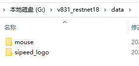
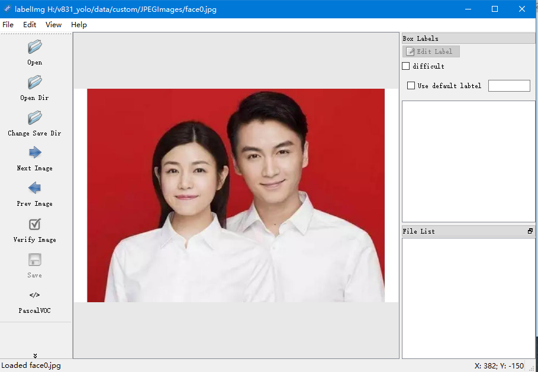
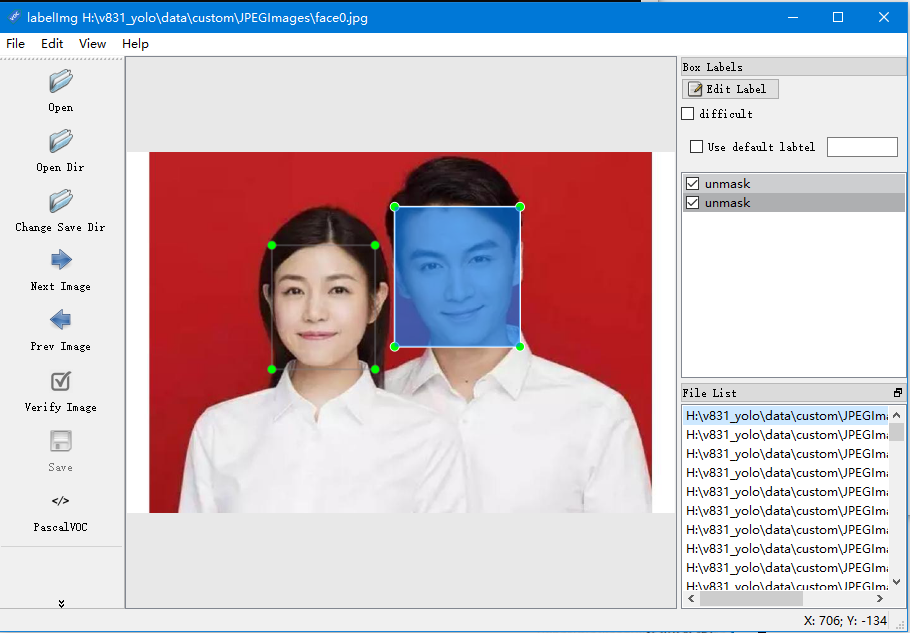

# 制作数据集

目前提供了 Resnet18 和 yolov2 的训练方式，就需要制作这些网络模型的数据集

## Resnet18 数据集

Resnet18 是一个用来分类的网络模型，只能将输入的图像分类到一个类别，所以数据集相对于简单很多。

1. 将需要进行分类识别的物品进行多个角度和多种背景环境下进行拍摄
2. 把图片转换成大小为**224\*224**
3. 新建以类别命名的文件夹
4. 将转换好的图片存放到对应的文件夹中

## YoloV2 数据集

YoloV2是用来目标检测的网络模型结构，所以制作数据集的时候需要对图像做对应的标记。

### 准备
1. 下载[labelImg](https://github.com/tzutalin/labelImg/releases)
2. 把需要标注的图片转换成 **224\*224**，并分类到各自的文件夹中
3. 新建一个文件夹来用于存放标记信息

### 开始标注

将下载的压缩包，解压到任意的位置，但是路径不能有中文，否则会启动不了。运行后界面如下：

选择左边的 `Open Dir` 中打开图片的文件夹，选择 `Change Save Dir` 进行保存标记信息。选择左边的命令按钮 Create nRectBox，也可以用快捷键 W 创建一个新的物体标注包围矩形。

在右边选择所框选的类别，通过快捷键 S 保存标记的内容，会在保存路径下生成一个xml文件，每个图形对应一个文件，里面记录了物体的包围矩形的位置。使用快捷键 D 切换到下一张图片继续标记，同一张图片中，可以同时标记多个类别。

> 如果不能使用 A、D切换图片的时候，这是图片的路径包含了中文导致的。
> 可以通过在 View 中打开自动保存模式，发现不能自动保存的时候，需要手动重启一下自动保存模式
