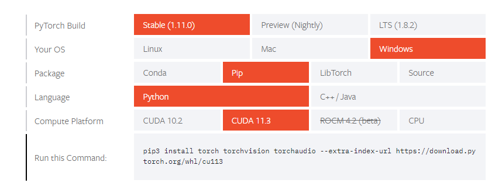

# 本地训练环境搭建

| 时间 | 负责人 | 更新内容 | 备注 |
| --- | --- | --- | :---: |
| 2022年1月22日 | Rui | 编写初稿文档 | ---- |


由于训练需要用到显卡，关于安装显卡驱动、CUDA、CUDNN 请自行百度查阅安装，本文不做详细说明。（ADM 显卡或者无显卡的，可以使用 CPU 进行训练）

## 安装 Python 软件包

本地训练时使用 Python 进行搭建的，需要在电脑上安装 Python，请自行[百度 Python ](https://www.baidu.com/s?ie=UTF-8&wd=python)如何安装。我们所有的训练工程都是使用 PyTorch 框架进行搭建（wsl中同样要安装以下的 Python 软件包） 

需要安装以下 Python 软件包：
- PyTorch
- torchsummary
- pycocotools
- opencv

> 下载安装包，可以通过在安装指令后面添加 `-i https://mirrors.ustc.edu.cn/pypi/web/simple` 来使用中科大 pypi 源进行加速

### 安装 PyToch

进入 Pytorch 下载帮助[页面](https://pytorch.org/get-started/locally/)，根据自己所用系统的环境情况，选择对应的 CUDA 版本和安装包的类型，这里所选用的是 CUDA 10.2、 Linux 系统、稳定版、pip包（30 系列显卡只能使用11.2以上的版本）


    pip3 install torch torchvision torchaudio


### 安装 torchsummary、pycocotools

然后再通过 pip 进行安装 torchsummary

    pip3 install torchsummary pycocotools

### 安装 Opencv

    pip3 install opencv-python opencv-contrib-python

##  onnx2ncnn 模型转换工具

PyTorch 不能直接将模型导出成 ncnn 格式，需要使用 onnx2ncnn 转换工具进行转换，需要用户自行去编译出对应的可执行文件。具体的编译步骤如下

1. 安装编译环境所需要用到的软件

    ```shell
    sudo apt install build-essential git cmake libprotobuf-dev protobuf-compiler libvulkan-dev vulkan-utils libopencv-dev
    ```

    > 下载慢的可以通过更换镜像源或者是使用代理进行下载，但是 wsl 中使用非官方的镜像源可能会导致部分软件不能下载

2. 需要先拉取整个 ncnn 转换工具的工程到任意文件夹下

    ```shell
    git clone https://github.com/Tencent/ncnn.git
    cd ncnn
    git checkout a03c1353193a172bfc22481195704731f75148d9
    ```

3. 工程编译初始化

    ```shell
    cd ncnn
    git submodule update --init
    ```

4. 开始编译

    ```shell
    mkdir build
    cd build
    cmake -DCMAKE_BUILD_TYPE=Release -DNCNN_VULKAN=ON -DNCNN_SYSTEM_GLSLANG=OFF -DNCNN_BUILD_EXAMPLES=ON ..
    make
    ```
    
编译结束之后，可以在 ncnn/build/tools/onnx 目录下，能得到 **onnx2ncnn** 模型转换工具，执行以下命令添加到系统的环境变量中

    sudo nano ~/.bashrc

打开.bashrc文件之后，将下面这句代码添加到最后一行

```shell
export PATH=$PATH:`pwd`/tools/onnx
```

## 文章参考

* 显卡驱动安装：https://neucrack.com/p/252
* opencv 多版本共存：https://neucrack.com/p/349
