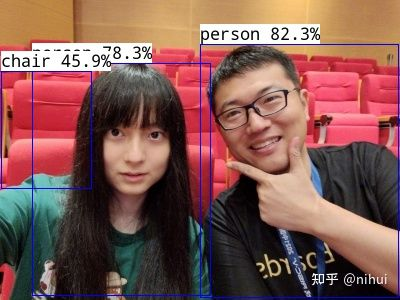

<!-- more -->

转载自知乎用户 [nihui](https://www.zhihu.com/people/nihui-2) [原文链接](https://zhuanlan.zhihu.com/p/386312071)，原文写于 2021-07-03

在全志d1开发板上玩ncnn

**可在不修改本文章内容和banner图前提下，转载本文**
```
这是我最后一次优化 risc-v
这 1.4w 行代码是我最后的倔强
你们不可能再看见我为这个 d1 写一行代码，不可能
这 96 个 cpp 文件，我要用到 2030 年
```
**首先感谢全志科技公司送了我d1开发板，以及sipeed、rvboards在系统底层技术工作和支持，才有了ncnn AI推理库在risc-v架构上更好的优化 qwqwqwq**

## 0x0 ncnn risc-v 优化情况
[ncnn](https://github.com/Tencent/ncnn) 是腾讯开源的神经网络推理框架
- 支持深度学习模型 caffe/mxnet/keras/pytorch(onnx)/darknet/tensorflow(mlir)
- 跨平台：Windows/Linux/MacOS/Android/iOS/WebAssembly/...
- 兼容多种 CPU 架构：x86/arm/mips/risc-v/...
- 支持 GPU 加速：NVIDIA/AMD/Intel/Apple/ARM-Mali/Adreno/...
- 支持各种常见的模型结构，比如 mobilenet/shufflenet/resnet/LSTM/SSD/yolo...
- 很强，qq群请移驾 ncnn github 首页README
_因为据全（某）志（人）说，全志的用户基础都挺一般，可能不知道 ncnn 是什么东西，所以便罗嗦一番..._

从上次发了开箱自拍jpg，到现在一个月了，ncnn risc-v vector 优化情况还算不错，大部分重要的优化都做了，剩下一些会留给社区学生pr，和慢慢变聪明的编译器

ncnn risc-v 目前使用 rvv-1.0 intrinisc 编写优化代码，并支持任意 vlen 的配置，面向未来顺便兼容了 d1开发板

- rvv-0.7.1 某些 intrinisc 转换可能有效率问题
- 有遇到过 0.7.1 intrinisc 行为怪异只能写 C 代码绕过
- gcc 还比较笨，每行 intrinisc 都会加一条无用的 setvli 指令
- 因为没法同时兼容 rvv-1.0 和 rvv-0.7.1，便没有写汇编
- 一些算子，如 hardswish/hardsigmoid/binaryop/eltwise/slice/... 待优化（欢迎pr！！！qaq）
下面这张表只是最近一周多的情况。如果跟最开始比，柱状图就太高了...


## 0x1 准备交叉编译工具链
去平头哥芯片开放社区下载 工具链-900 系列 
https://occ.t-head.cn/community/download?id=3913221581316624384
比如 riscv64-linux-x86_64-20210512.tar.gz，下载后解压缩，设置环境变量
```bash
tar -xf riscv64-linux-x86_64-20210512.tar.gz
export RISCV_ROOT_PATH=/home/nihui/osd/riscv64-linux-x86_64-20210512
```
## 0x2 下载和编译ncnn

为 d1 架构交叉编译 ncnn

**因为编译器 bug，release 编译会导致运行时非法指令错误，必须使用 relwithdebinfo 编译哦**

- ncnn 已支持直接用 simpleocv 替代 opencv 编译出 examples
- **不需要配opencv啦！**
- **不需要配opencv啦！**
- **不需要配opencv啦！（重要，说了三遍）**

```bash
git clone https://github.com/Tencent/ncnn.git
cd ncnn
mkdir build-c906
cd build-c906
cmake -DCMAKE_TOOLCHAIN_FILE=../toolchains/c906.toolchain.cmake -DCMAKE_BUILD_TYPE=relwithdebinfo -DNCNN_OPENMP=OFF -DNCNN_THREADS=OFF -DNCNN_RUNTIME_CPU=OFF -DNCNN_RVV=ON -DNCNN_SIMPLEOCV=ON -DNCNN_BUILD_EXAMPLES=ON ..
make -j32
```
## 0x3 测试benchncnn
**d1 默认的 TinaLinux 执行 ncnn 程序时会发生非法指令错误，必须使用 Debian 系统哦**
- vgg16 这类大型模型在内存不足时会发生 segmentation fault，是 d1开发板硬件条件不够，不管即可
  
将 `ncnn/build-c906/benchmark/benchncnn` 和 `ncnn/benchmark/*.param` 拷贝到 d1开发板上
```bash
./benchncnn 4 1 0 -1 0
```

## 0x4 测试example
将 `ncnn/build-c906/examples/nanodet` 和测试图片拷贝到 d1开发板上
从这里下载 nanodet 模型文件并拷贝到 d1开发板上
https://github.com/nihui/ncnn-assets/tree/master/models
```bash
./nanodet test.jpg
```
输出检测结果信息，并保存在 image.png
```
0 = 0.82324 at 200.04 44.89 198.96 x 253.33
0 = 0.78271 at 32.98 63.45 178.15 x 232.92
56 = 0.45923 at 1.46 71.92 90.14 x 117.85
imshow save image to image.png
waitKey stub
```
把image.png下载到本地查看，结果已经画在图片上了！d1开发板AI目标检测成功 w


## 0x5 mips大概也会安排啦，欢迎关注 ncnn github，加qq群交流！
https://github.com/Tencent/ncnn

qq群在 ncnn github 首页 readme 中～