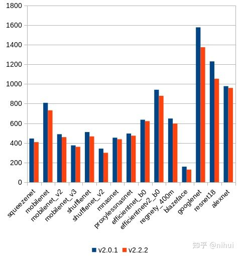
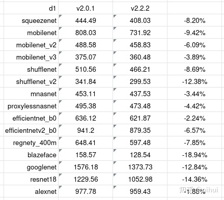

<!-- more -->

转载自知乎用户 [nihui](https://www.zhihu.com/people/nihui-2) [原文链接](https://zhuanlan.zhihu.com/p/441176926)，原文写于 2021-07-03

又在全志d1开发板上玩ncnn

**可在不修改本文章内容和banner图前提下，转载本文**

## 0x0 工具链变得更好了
距上次[在全志d1开发板上玩ncnn](./D1_ncnn.md)，已经过去了5个月

在此期间，ncnn收到perfxlab和腾讯犀牛鸟开源人才的学生有关riscv vector的优化

但更重要的是，平头哥收到了社区的反馈，提供了新版工具链

- 支持了 risc-v vector intrinsic v1.0
- 修复了 release 模式编译 ncnn 时的非法指令问题
https://occ.t-head.cn/community/download?id=3987221940543754240

旧版本工具链的 gcc 比较笨，经常做些负优化，于是试试全新的工具链

## 0x1 配置新的 cmake toolchain
```bash
旧
-march=rv64gcvxtheadc -mabi=lp64d -mtune=c906 -DRVV_SPEC_0_7 -D__riscv_zfh=1 -static

新
-march=rv64gcv0p7_zfh_xtheadc -mabi=lp64d -mtune=c906 -static
```
- arch 参数要用 v0p7，不能用默认的 v，否则会生成非法指令
- 删除 -DRVV_SPEC_0_7，开启 ncnn 的 rvv-1.0 intrinsic 代码
- 删除 -D__riscv_zfh=1，arch 参数的 zfh 中已经指代

放在 ncnn/toolchains/c906-v222.toolchain.cmake

## 0x2 工具链修复

因为 rvv-0.7 缺少某些指令支持，遇到一些 rvv-1.0 的代码会生成 unknown op
```bash
fneg
frec7
frsqrt7
```
因此要修改下工具链头文件

打开 Xuantie-900-gcc-linux-5.10.4-glibc-x86_64-V2.2.2/lib/gcc/riscv64-unknown-linux-gnu/10.2.0/include/riscv_vector.h

- 找到以下三行
```h
_RVV_FLOAT_ITERATOR_ARG (_RVV_FLOAT_UNARY_OP, rec7)
_RVV_FLOAT_ITERATOR_ARG (_RVV_FLOAT_UNARY_OP, rsqrt7)
_RVV_FLOAT_ITERATOR_ARG (_RVV_FLOAT_UNARY_OP, neg)
```
- 注释掉

```h
// _RVV_FLOAT_ITERATOR_ARG (_RVV_FLOAT_UNARY_OP, rec7)
// _RVV_FLOAT_ITERATOR_ARG (_RVV_FLOAT_UNARY_OP, rsqrt7)
// _RVV_FLOAT_ITERATOR_ARG (_RVV_FLOAT_UNARY_OP, neg)
```

- 找到文件末尾的三个 #endif，添加以下兼容代码，保存

```h
#endif

#define vfneg_v_f32m1(x, vl) vfsgnjn_vv_f32m1(x, x, vl)
#define vfneg_v_f32m2(x, vl) vfsgnjn_vv_f32m2(x, x, vl)
#define vfneg_v_f32m4(x, vl) vfsgnjn_vv_f32m4(x, x, vl)
#define vfneg_v_f32m8(x, vl) vfsgnjn_vv_f32m8(x, x, vl)
#define vfneg_v_f16m1(x, vl) vfsgnjn_vv_f16m1(x, x, vl)
#define vfneg_v_f16m2(x, vl) vfsgnjn_vv_f16m2(x, x, vl)
#define vfneg_v_f16m4(x, vl) vfsgnjn_vv_f16m4(x, x, vl)
#define vfneg_v_f16m8(x, vl) vfsgnjn_vv_f16m8(x, x, vl)

#define vfrec7_v_f32m1(x, vl) vfrdiv_vf_f32m1(x, 1.f, vl)
#define vfrec7_v_f32m2(x, vl) vfrdiv_vf_f32m2(x, 1.f, vl)
#define vfrec7_v_f32m4(x, vl) vfrdiv_vf_f32m4(x, 1.f, vl)
#define vfrec7_v_f32m8(x, vl) vfrdiv_vf_f32m8(x, 1.f, vl)
#define vfrec7_v_f16m1(x, vl) vfrdiv_vf_f16m1(x, 1.f, vl)
#define vfrec7_v_f16m2(x, vl) vfrdiv_vf_f16m2(x, 1.f, vl)
#define vfrec7_v_f16m4(x, vl) vfrdiv_vf_f16m4(x, 1.f, vl)
#define vfrec7_v_f16m8(x, vl) vfrdiv_vf_f16m8(x, 1.f, vl)

#define vfrsqrt7_v_f32m1(x, vl) vfrdiv_vf_f32m1(vfsqrt_v_f32m1(x, vl), 1.f, vl)
#define vfrsqrt7_v_f32m2(x, vl) vfrdiv_vf_f32m2(vfsqrt_v_f32m2(x, vl), 1.f, vl)
#define vfrsqrt7_v_f32m4(x, vl) vfrdiv_vf_f32m4(vfsqrt_v_f32m4(x, vl), 1.f, vl)
#define vfrsqrt7_v_f32m8(x, vl) vfrdiv_vf_f32m8(vfsqrt_v_f32m8(x, vl), 1.f, vl)
#define vfrsqrt7_v_f16m1(x, vl) vfrdiv_vf_f16m1(vfsqrt_v_f16m1(x, vl), 1.f, vl)
#define vfrsqrt7_v_f16m2(x, vl) vfrdiv_vf_f16m2(vfsqrt_v_f16m2(x, vl), 1.f, vl)
#define vfrsqrt7_v_f16m4(x, vl) vfrdiv_vf_f16m4(vfsqrt_v_f16m4(x, vl), 1.f, vl)
#define vfrsqrt7_v_f16m8(x, vl) vfrdiv_vf_f16m8(vfsqrt_v_f16m8(x, vl), 1.f, vl)

#endif
#endif
```

## 下载和编译ncnn
这次可以用 release 编译啦！
```bash
git clone https://github.com/Tencent/ncnn.git
cd ncnn
mkdir build-c906
cd build-c906
cmake -DCMAKE_TOOLCHAIN_FILE=../toolchains/c906-v222.toolchain.cmake -DCMAKE_BUILD_TYPE=release -DNCNN_OPENMP=OFF -DNCNN_THREADS=OFF -DNCNN_RUNTIME_CPU=OFF -DNCNN_RVV=ON -DNCNN_SIMPLEOCV=ON -DNCNN_BUILD_EXAMPLES=ON ..
make -j32
```

## 新旧工具链的性能测试对比




## 0x5 欢迎关注 ncnn github，加qq群交流！
https://github.com/Tencent/ncnn
qq群在 ncnn github 首页 readme 中～