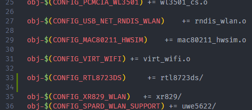
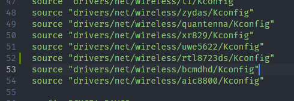
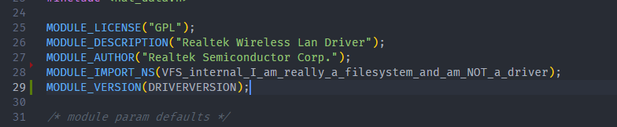
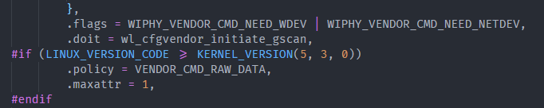
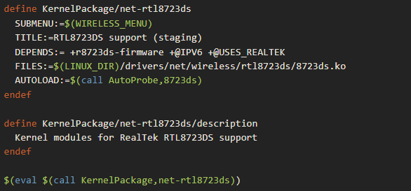
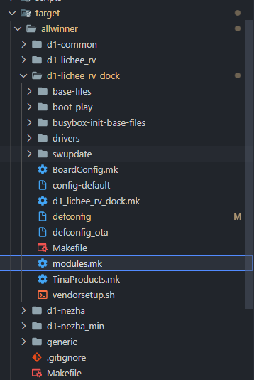
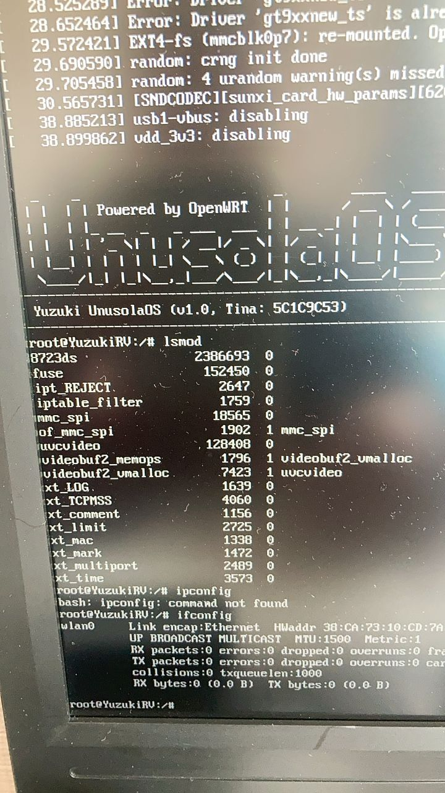

这里讲解怎样自己添加驱动

<!-- more -->

[原文链接](https://bbs.aw-ol.com/topic/994/d1-licheerv-dock-%E7%A7%BB%E6%A4%8Drtl8723ds%E9%A9%B1%E5%8A%A8)

手动焊接RTL8723DS之后，现在开始移植驱动程序。

先获取源码：https://github.com/lwfinger/rtl8723ds

下载完成后，把驱动文件复制到 tina-d1-open\lichee\linux-5.4\drivers\net\wireless\rtl8723ds 里，没有rtl8723ds文件夹记得新建一个。

修改tina-d1-open\lichee\linux-5.4\drivers\net\wireless\Makefile，加一行 
obj-$(CONFIG_RTL8723DS) += rtl8723ds/



修改tina-d1-open\lichee\linux-5.4\drivers\net\wireless\Kconfig，加一行 
source "drivers/net/wireless/rtl8723ds/Kconfig"



修改tina-d1-open\lichee\linux-5.4\drivers\net\wireless\rtl8723ds\os_dep\linux\os_intfs.c；
加一行
MODULE_IMPORT_NS(VFS_internal_I_am_really_a_filesystem_and_am_NOT_a_driver);



修改tina-d1-open\lichee\linux-5.4\drivers\net\wireless\rtl8723ds\os_dep\linux\rtw_cfgvendor.c
在每一行.policy = VENDOR_CMD_RAW_DATA, 下面加上 .maxattr = 1,



修改tina-d1-open\target\allwinner\d1-lichee_rv_dock\modules.mk，增加以下内容：



（其中的d1-lichee_rv_dock 是我的板级配置，请选择自己的板级配置比如d1-nezha，如下图）



进入内核配置，勾选Realtek 8723D SDIO or SPI WiFi为Module（ < M > 不是 < * > ）

```menuconfig
make kernel_menuconfig

Device Drivers ->
     Network device support -> 
           Wireless LAN -> 
                  <M>   Realtek 8723D SDIO or SPI WiFi
```

进入Tina配置，勾选相关驱动

```bash
make menuconfig

Firmware  ->
     <*> r8723ds-firmware.............................. RealTek RTL8723DS firmware

Kernel modules -> 
     Wireless Drivers  ->
        <*> kmod-net-rtl8723ds........................... RTL8723DS support (staging)
```

保存，编译，打包

```bash
make -j8
pack
```

烧录后就能看到


