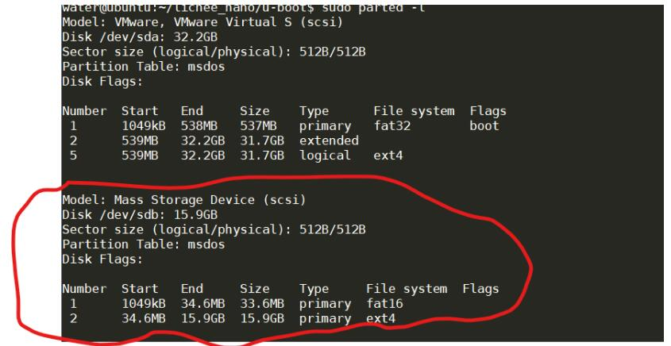
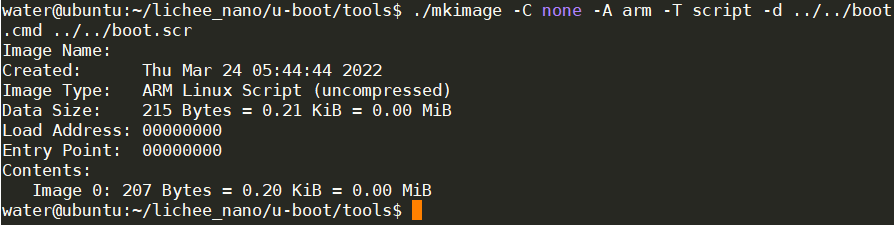
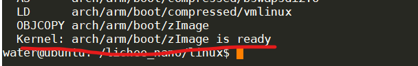
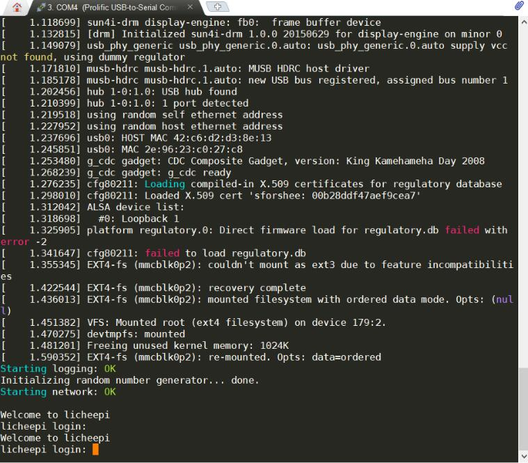
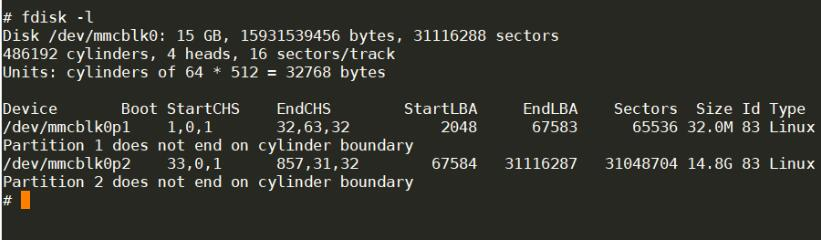

原文链接：[嵌入式 linux 入门 4-1-荔枝派 nano 使用 TF 卡运行 linux](https://codinglover.top/2022/03/25/%E5%B5%8C%E5%85%A5%E5%BC%8Flinux%E5%85%A5%E9%97%A84-1-%E8%8D%94%E6%9E%9D%E6%B4%BEnano%E4%BD%BF%E7%94%A8tf%E5%8D%A1%E8%BF%90%E8%A1%8Clinux/) 有改动

<!-- more -->

## \[简易\]使用一键脚本构建系统到 TF 卡

1. 去如下位置下载 Lichee Nano 文件夹的所有内容：https://pan.baidu.com/s/1smzuGS9

2. 进入 Lichee Nano/镜像/寻找自己需要的固件，我这里用的 Nano_pub_V4.zip

3. 解压，进入其下的 image 文件找自己需要的镜像，我这里使用 Nano_tf_800480.dd

4. 插上 TF 卡，使用 dd 命令将镜像复制到 TF 卡（windows 用户使用 balenaEtcher 软件烧录）

```bash
sudo dd of=tf卡路径 if=镜像文件路径
```

完成，如果只是为了简单使用，那下面的流程不用看了，用这种方法有个问题，那就是根目录的可用空间只有不到 200M，并不能使用 TF 卡的所有空间，不过对于简单应用也足够了。具体解决方法可以前往 [github](https://github.com/sipeed/Nano-Doc-Backup/blob/master/build_sys/onekey.md#%E8%84%9A%E6%9C%AC%E7%9A%84%E4%BD%BF%E7%94%A8) 查看。

## \[复杂\]手动构建荔枝派 TF 卡内的系统

本次编译用的宿主机为 ubuntu20.04

### 安装交叉编译链

\# 此处为获取 7.2.1 版本，您可获取其他版本或者通过链接直接下载

```bash
wget http://releases.linaro.org/components/toolchain/binaries/7.2-2017.11/arm-linux-gnueabi/gcc-linaro-7.2.1-2017.11-x86_64_arm-linux-gnueabi.tar.xz
tar -vxJf gcc-linaro-7.2.1-2017.11-x86_64_arm-linux-gnueabi.tar.xz
sudo cp -r ./gcc-linaro-7.2.1-2017.11-x86_64_arm-linux-gnueabi /opt/
sudo vi /etc/bash.bashrc


# 在文件末尾 添加以下内容

PATH="$PATH:/opt/gcc-linaro-7.2.1-2017.11-x86_64_arm-linux-gnueabi/bin"

# 添加完毕

# 使路径生效

source /etc/bash.bashrc

#查询版本进行测试，如果成功会打印版本信息
arm-linux-gnueabi-gcc -v
```

### 获取并编译 u-boot

1. 获取 u-boot

```bash
sudo apt-get install git
git clone https://github.com/Lichee-Pi/u-boot.git
cd u-boot

# 查看分支

git branch -a

# 切换到 Nano 分支

git checkout nano-v2018.01
```

2. 编译 u-boot

```bash
# 此处告知 make 采用 arm-linux-gnueabi 下的所有交叉编译工具，目标架构为 Arm，设定各项默认配置为 nano 的 spiflash 支持版

make ARCH=arm CROSS_COMPILE=arm-linux-gnueabi- licheepi_nano_spiflash_defconfig

# 若不带 spi-flash 的板子，请换成 licheepi_nano_defconfig

# 进行可视化配置，我没有配置，直接按默认就行了

make ARCH=arm menuconfig

# 开始编译

make ARCH=arm CROSS_COMPILE=arm-linux-gnueabi- -j8
```

编译完成后在 u-boot 目录下找到 u-boot-sunxi-with-spl.bin 文件即为可烧录的文件

附一些错误的解决办法（都是本次遇到的）

```bash
# 如果在可视化配置时提示 : fatal error: curses.h: No such file or directory，进行如下一步来安装支持环境

sudo apt-get install libncurses5-dev libncursesw5-dev

# 如果在编译时提示/bin/sh: 1: python: not found，安装 python 即可

sudo apt-get install python

# 如果编译时提示 unable to execute 'swig': No such file or directory，安装 swig 即可

sudo apt-get install swig

# 如果编译时提示 fatal error: Python.h: No such file or directory，安装 python-dev

sudo apt-get install python-dev
```

### 烧录 u-boot

荔枝派 nano 使用的是全志的 F1C100s，官方提供了烧录工具 sunxi-tools，用来对处于 fel 模式下的芯片进行程序烧录。

首先需要获取并编译安装烧录工具:

```bash
# 如果提示缺少 libusb.h，要先安装 libusb 库

sudo apt-get install libusb-1.0-0-dev

# 如果提示缺少 zlib.h，要先安装 libusb 库

sudo apt-get install zlib1g-dev libssl-dev

# 获取并编译安装 sunxi-tools

git clone -b f1c100s-spiflash https://github.com/Icenowy/sunxi-tools.git
cd sunxi-tools
make && sudo make install
```

拉低板子上 spi1 外设的 cs 引脚之后连接 usb 以进入 fel 模式，此时执行以下流程烧录 u-boot：

```bash
# 2.烧进 spi-flash （开机自启）

sudo sunxi-fel -p spiflash-write 0 u-boot-sunxi-with-spl.bin 所在路径
```

烧录成功后，通过核心板的 U0RX 和 U0TX 串口引脚来连接串口调试期进行 u-boot 命令行交互，默认的波特率为 115200。

### 构建 TF 卡系统分区

**需要在 TF 卡上构建两个分区**

分区 1 用于存放系统启动和内核相关文件，格式化为 FAT，一般只需要分配 32MiB 空间

- boot.scr (指引 u-boot 加载内核的文件)
- zImage (系统内核)
- suniv-f1c100s-licheepi-nano.dtb (设备树文件)

分区 2 用于存放根文件系统，格式化为 ext4 格式，分配所有剩余的空间

**使用 fdisk 工具进行格式化**

```bash
sudo fdisk -l # 首先查看电脑上已插入的 TF 卡的设备号
sudo umount /dev/sdXx # 若自动挂载了 TF 设备，请先卸载
sudo fdisk /dev/sdX # 进行分区操作

# 若已存分区即按 d 删除各个分区

# 通过 n 新建分区，第一分区暂且申请为 32M(足够大了...)，剩下的空间都给第二分区

# w 保存写入并退出

sudo mkfs.vfat /dev/sdX1 # 将第一分区格式化成 FAT
sudo mkfs.ext4 /dev/sdX2 # 将第一分区格式化成 EXT4
```

使用 parted 命令查看格式化后的结果

```bash
sudo parted -l
```



### 配置 u-boot 的启动脚本

提前打开 nano 板子 u-boot 的输出命令行对应的串口，在板子上电时按 enter 键进入 u-boot 命令行，然后输入**printenv**指令查看环境变量信息，我显示的信息如下，#号后是我添加的对关键信息的说明：

```bash
arch=arm                              # 板子的架构
baudrate=115200                       # 命令行串口波特率
board=sunxi
board_name=sunxi
#略去中间大段信息
boot_scripts=boot.scr.uimg boot.scr   # 启动时寻找名为boot.scr.uimg或boot.scr的启动脚本
boot_targets=fel mmc0 usb0 pxe dhcp   # 启动介质的优先级优先从排在前面的介质引导系统
bootcmd=run distro_bootcmd            # 启动时要执行的指令？唔。。。不太明白
#略去后面信息
```

根据 boot_scripts 变量我们知道我们要编写一个名为 boot.scr 的启动脚本，然后将这个脚本放到 TF 卡的第一个分区（FAT 分区），u-boot 启动时就会去找这个脚本执行了。

还记得我们编译 u-boot 时获取的 u-boot 源码吗，在其下的 tools 目录中有一个 mkimage 工具可以用于生成 boot.scr，为了生成 boot.scr，首先需要编写 boot.cmd 脚本用来指导 mkimage 进行生成，脚本内容如下：

```bash
setenv bootargs console=tty0 console=ttyS0,115200 panic=5 rootwait root=/dev/mmcblk0p2 rw
load mmc 0:1 0x80C00000 suniv-f1c100s-licheepi-nano.dtb
load mmc 0:1 0x80008000 zImage
bootz 0x80008000 - 0x80C00000
```

- 第一行 setenv 命令，设定了变量 bootargs(启动参数)为：通过 tty0 和 ttyS0 串口输出启动信息；启动失败延迟 5 秒重启，根文件在 TF 卡的第二分区，可读写；

- 第二行指定了从 TF 中将设备树的 dtb 文件加载到 0x80C00000 的位置(地址参考自官方 SDK)

- 第三行指定了将压缩后的内核 zImage 加载到 0x80008000 的位置

- 第四行为从加载地址启动内核的命令

然后就可以生成 boot.scr 文件了，进入 mkimage 所在目录，然后执行如下指令：

```bash
mkimage -C none -A arm -T script -d
```

结果如下：



将生成的 boot.scr 拷贝到 TF 卡的 FAT 分区中即可。

### 编译 Linux 内核

1. 下载 Linux 源码

   完整的下载命令为：

   ```bash
   git clone https://github.com/Icenowy/linux.git
   ```

   git 拉取有时速度很慢，建议做如下配置：

   ```bash
   sudo vim /etc/hosts
   # 添加下面两行
   192.30.253.112  github.com
   151.101.73.194 github.global.ssl.fastly.net
   # 添加完成
   # 可自行通过dns检测网站检测github.global.ssl.fastly.net，更换为更快的ip地址
   ```

   完整拉取 linux 极大，建议只拉取单层分支，减少等待时间：

   ```bash
   git clone --depth=1 -b f1c100s-480272lcd-test https://github.com/Icenowy/linux.git
   ```

   这里只拉取了单层分支

2. 配置源码

   ```bash
   wget dl.sipeed.com/LICHEE/Nano/SDK/config # 下载配置文件
   mv config /linux源码目录/.config           # 移动到linux源码主目录并重命名为.config

   # 也可以使用以下指令进行进一步的配置
   make ARCH=arm menuconfig
   ```

3. 编译源码

   进入 linux 源码主目录后，进行如下操作

   ```bash
   #配置架构，然后使用可视化配置工具对源码进行配置
   make ARCH=arm menuconfig # 这里可以直接退出配置界面，我们用默认配置就行了

   #配置编译用的工具链前缀
   make ARCH=arm CROSS_COMPILE=arm-linux-gnueabi- -j4 #请自行修改编译线程数
   ```

4. 编译过程中碰到的问题记录

   1. 编译过程中提示是否需要使能某些配置
      这是因为配置文件中没有对应的配置项，根据情况选择，我一律选择了 n，不需要它们。

   2. 提示 fatal error: openssl/bio.h: No such file or directory
      ```bash
      sudo apt install libssl-dev # 缺少这个库
      ```

编译要挺长的时间，这取决于机器性能。编译成功后，显示如下信息：



这时到 linux 源码目录下的 arch/arm/boot/目录中可以找到内核镜像 zImage，将其拷贝到 TF 卡的 FAT 第一分区。

### 配置设备树

[设备树添加节点](https://wiki.sipeed.com/soft/Lichee/zh/Nano-Doc-Backup/build_sys/devicetree.html)这一章节有详细介绍，有需要的可以自行查看。由于本次只使用核心板，所以不用配置 dts 文件，直接编译生成 dtb 就行了。

荔枝派 Nano 对应的 dts 文件为 Linux 源码主目录下的 arch/arm/boot/dts/suniv-f1c100s-licheepi-nano.dts

进入 Linux 源码的主目录，之后执行以下指令编译 dtb 文件：

```bash
make ARCH=arm CROSS_COMPILE=arm-linux-gnueabi- dtbs -j4
```

编译成功后，在 Linux 源码的主目录的 arch/arm/boot/dts/下可以找到 suniv-f1c100s-licheepi-nano.dtb 文件（这个文件的文件名和前面生成 boot.scr 时在 boot.cmd 中设置的文件名一致），将其复制到 TF 卡的 FAT 第一分区。

### 构建根文件系统

使用 buildroot 构建根文件系统，流程如下：

1. 下载安装

```bash
# 获取所需的头文件
sudo apt install linux-headers-$(uname -r) #uname -r用于获取内核版本号

# 下载、解压、进入目录（这个国外链接下载有点慢）
wget https://buildroot.org/downloads/buildroot-2017.08.tar.gz
tar xvf buildroot-2017.08.tar.gz
cd buildroot-2017.08/
```

2. 配置 buildroot 工具

```bash
# 进入配置界面
make menuconfig

以下选项为基础配置：

- Target options
 - Target Architecture (ARM (little endian))
 - Target Variant arm926t
- Toolchain
 - C library (musl) # 使用musl减小最终体积
- System configuration
 - Use syslinks to /usr .... # 启用/bin, /sbin, /lib的链接
 - Enable root login # 启用root登录
 - Run a getty after boot # 启用登录密码输入窗口
 - (licheepi) Root password #　默认账户为root 密码为licheepi
另可自行添加或删除指定的软件包
```

3. 编译

```bash
make
```

由于编译过程中需要下载软件包以及不支持多线程编译，编译需要很长时间（晚上丢那编译，一觉醒来就好了），编译完成后的文件为 buildroot 目录下的 output/images/rootfs.tar

- tips：

  若编译时，buildroot 下载软件包速度太慢，请下载 dl.zip ，将其中的软件包解压至 buildroot 的 dl 下目录（官方文档的解决方法）；

  或者也可以考虑使用 vi 打开 buildroot 的.config 文件，将其中的对应配置切换为以下内容以切换到国内镜像站进行下载（个人推荐此方法）：

  ```
  BR2_BACKUP_SITE="http://sources.buildroot.net"
  BR2_KERNEL_MIRROR="https://mirror.bjtu.edu.cn/kernel/"
  BR2_GNU_MIRROR="http://mirrors.nju.edu.cn/gnu/"
  BR2_LUAROCKS_MIRROR="https://luarocks.cn"
  BR2_CPAN_MIRROR="http://mirrors.nju.edu.cn/CPAN/"
  ```

4. 编译过程中的问题解决记录

   1. error "Please port gnulib freadahead.c to your platform!类似的错误

   ```bash
   # 进入buildroot下的如下目录
   cd output/build/host-m4-1.4.18/

   # 执行如下指令（查了半天，没搞懂是干嘛的）
   sed -i 's/IO_ftrylockfile/IO_EOF_SEEN/' lib/*.c

   # 在lib/stdio-impl.h文件最后新增一行#define _IO_IN_BACKUP 0x100
   echo "#define _IO_IN_BACKUP 0x100" >> lib/stdio-impl.h

   # 之后返回buildroot主目录执行make继续编译

   # stackoverflow上一位老哥说了出现这个问题的原因，不知道是不是对的
   # This was an interoperability problem between GNU m4 1.4.18 and
   # newer glibc header files.
   # It is fixed in GNU m4 1.4.19, available from
   # https://ftp.gnu.org/gnu/m4/ and the GNU mirrors.
   ```

编译完成后，文件为 buildroot 下的 output/images/rootfs.tar，将其复制到 TF 卡的 ext4 第二分区并解压。

### 验证

将 TF 卡插入荔枝派 nano，使用 USB 转 TTL 模块连接荔枝派的 U0TX 和 U0RX 这对串口，应该就正常上电进入登录界面了。



使用用户名 root，密码 licheepi 进行登录即可。

使用 fdisk 指令，根文件系统已经可以识别 TF 卡中的所有空闲空间


